# Oracle Database 19c Installation Guide — AlmaLinux 8.10 (Cerulean Leopard)

> **Platform:** AlmaLinux 8.10 (Cerulean Leopard) on VMware Workstation 16.0.0 | **Purpose:** Install Oracle Database 19c software and create a Container Database (CDB) with one Pluggable Database (PDB)

| | |
|---|---|
| **Document** | Installation Guide |
| **OS Version** | AlmaLinux 8.10 (Cerulean Leopard) |
| **Platform** | VMware Workstation 16.0.0 |
| **Oracle Version** | Oracle Database 19c (19.3.0.0.0) |
| **Patch Level** | Release Update 19.28.0.0.0 |
| **Kernel** | Linux 4.18.0-553.el8_10.x86_64 |
| **Architecture** | x86-64 |

---

## Table of Contents

1. [Overview](#1-overview)
2. [Prerequisites](#2-prerequisites)
   - [2.1 System Assumptions](#21-system-assumptions)
   - [2.2 Installer Files Required](#22-installer-files-required)
   - [2.3 Target Database Configuration](#23-target-database-configuration)
3. [Part 1 — Prepare the Installer Files](#part-1--prepare-the-installer-files)
   - [1.1 Connect via VNC and Open Terminal](#11-connect-via-vnc-and-open-terminal)
   - [1.2 Navigate to the Installer Directory](#12-navigate-to-the-installer-directory)
   - [1.3 Verify Installer Files](#13-verify-installer-files)
   - [1.4 Verify ORACLE_HOME](#14-verify-oracle_home)
   - [1.5 Extract Oracle Database Software](#15-extract-oracle-database-software)
   - [1.6 Extract the Release Update Patch](#16-extract-the-release-update-patch)
   - [1.7 Update OPatch Utility](#17-update-opatch-utility)
   - [1.8 Set AlmaLinux Compatibility Variable](#18-set-almalinux-compatibility-variable)
   - [1.9 Launch the Installer with Release Update](#19-launch-the-installer-with-release-update)
4. [Part 2 — Oracle Database Software Installation (OUI)](#part-2--oracle-database-software-installation-oui)
   - [Step 1: Select Installation Configuration](#step-1-select-installation-configuration)
   - [Step 2: Select Database Installation Option](#step-2-select-database-installation-option)
   - [Step 3: Select a Database Edition](#step-3-select-a-database-edition)
   - [Step 4: Specify Installation Location](#step-4-specify-installation-location)
   - [Step 5: Create Inventory](#step-5-create-inventory)
   - [Step 6: Root Script Execution Configuration](#step-6-root-script-execution-configuration)
   - [Step 7: Prerequisite Checks](#step-7-prerequisite-checks)
   - [Step 8: Installation Summary](#step-8-installation-summary)
   - [Install Progress](#install-progress)
   - [Execute Configuration Scripts](#execute-configuration-scripts)
   - [Installation Complete](#installation-complete)
5. [Part 3 — Create Oracle Net Listener (netca)](#part-3--create-oracle-net-listener-netca)
   - [3.1 Default Port 1521 Walkthrough](#31-default-port-1521-walkthrough)
   - [3.2 Alternative Port Configuration](#32-alternative-port-configuration)
6. [Part 4 — Verify Listener Status](#part-4--verify-listener-status)
7. [Part 5 — Create Oracle Database (DBCA)](#part-5--create-oracle-database-dbca)
   - [Step 1: Select Database Operation](#step-1-select-database-operation)
   - [Step 2: Select Creation Mode](#step-2-select-creation-mode)
   - [Step 3: Select Deployment Type](#step-3-select-deployment-type)
   - [Step 4: Specify Database Identification Details](#step-4-specify-database-identification-details)
   - [Step 5: Select Database Storage Option](#step-5-select-database-storage-option)
   - [Step 6: Select Fast Recovery Option](#step-6-select-fast-recovery-option)
   - [Step 7: Specify Network Configuration](#step-7-specify-network-configuration)
   - [Step 8: Specify Configuration Options](#step-8-specify-configuration-options)
   - [Step 9: Specify Management Options](#step-9-specify-management-options)
   - [Step 10: Specify Database User Credentials](#step-10-specify-database-user-credentials)
   - [Step 11: Select Database Creation Option](#step-11-select-database-creation-option)
   - [Step 12: Summary](#step-12-summary)
   - [Database Creation Progress](#database-creation-progress)
   - [Database Creation Complete](#database-creation-complete)
8. [Part 6 — Verify Database Connection](#part-6--verify-database-connection)
9. [Summary of Installation](#summary-of-installation)
10. [Next Steps](#next-steps)
11. [References](#references)

---

## 1. Overview

This guide covers the complete **Oracle Database 19c** installation on **AlmaLinux 8.10** following a two-phase approach:

| Phase | Tool | Purpose |
|-------|------|---------|
| **Phase 1** | Oracle Universal Installer (OUI) | Install Oracle Database software binaries to `$ORACLE_HOME` with Release Update applied |
| **Phase 2** | Oracle Net Configuration Assistant (netca) | Create the Oracle Net Listener |
| **Phase 3** | Database Configuration Assistant (DBCA) | Create the Container Database (CDB) and first Pluggable Database (PDB) |

**Why "Software Only" + DBCA instead of the combined installation?**
Installing the software separately from creating the database gives you full control over each phase. You can apply patches (Release Updates) as part of the software installation before any database exists, and configure the database with exact parameters using DBCA. This is the recommended approach for production and staging environments.

**Installed version:** Oracle Database **19c (19.3.0.0.0)** with Release Update **19.28.0.0.0** applied during installation via `./runInstaller -applyRU`.

> **Important:** All commands in this guide run as the **`oracle`** OS user from a VNC terminal, except where explicitly noted.

---

## 2. Prerequisites

### 2.1 System Assumptions

| Item | Status |
|------|--------|
| AlmaLinux 8.10 OS installed and configured | ✅ Complete — see [AlmaLinux 8.10 OS Installation Guide](https://github.com/seeomkus/linux-installation/blob/main/almalinux-8-for-oracle-database/almalinux_8_10_os_installation_guide.md) |
| Oracle 19c pre-installation steps completed | ✅ Complete — see [Oracle Database 19c Pre-Installation Guide](oracle_database_19c_pre_installation_guide_almalinux_8_10.md) |
| Oracle environment variables set (`setEnv.sh` sourced) | ✅ Required |
| VNC Server running on display `:2` (port 5902) | ✅ Required for GUI installer |
| Storage volumes `/u01`–`/u04` mounted | ✅ Required |
| Oracle directory structure created with correct ownership | ✅ Required |

---

### 2.2 Installer Files Required

Download all three files from the Oracle Software Delivery portal and upload them to `/u04/installer/` before starting. See the [Pre-Installation Guide References](oracle_database_19c_pre_installation_guide_almalinux_8_10.md#1-oracle-database-19c-installer--how-to-download) for download instructions.

| File | Description | Approx. Size |
|------|-------------|-------------|
| `LINUX.X64_193000_db_home.zip` | Oracle Database 19c (19.3.0.0.0) base software | ~3.0 GB |
| `p37960098_190000_Linux-x86-64.zip` | Release Update 19.28.0.0.0 (patch for 19c) | ~500 MB |
| `p6880880_190000_Linux-x86-64.zip` | OPatch utility (latest version) | ~250 MB |

> **Why three files?**
> - The base `LINUX.X64_193000_db_home.zip` contains Oracle 19.3 (the initial release). It is several years old.
> - `p37960098` is the **Release Update (RU)** — Oracle's quarterly cumulative patch bundle. Applying it during installation (`-applyRU`) means the software is installed already at the latest patch level, avoiding a separate OPatch step after installation.
> - `p6880880` is the latest **OPatch** utility. OPatch is Oracle's patching tool. The version bundled inside the installer ZIP may be too old to apply the latest RU, so it must be replaced before running the installer.

---

### 2.3 Target Database Configuration

| Parameter | Value |
|-----------|-------|
| **Oracle Edition** | Standard Edition 2 (SE2) |
| **Database Type** | Container Database (CDB) with one PDB |
| **Global Database Name** | `orcl19c.company.com` |
| **Oracle SID** | `orcl19c` |
| **Pluggable Database (PDB) Name** | `orclpdb` |
| **Database Character Set** | `AL32UTF8` |
| **National Character Set** | `AL16UTF16` |
| **Oracle Home** | `/u01/app/oracle/product/19c/dbhome_1` |
| **Oracle Base** | `/u01/app/oracle` |
| **Oracle Inventory** | `/u01/app/oraInventory` |
| **Data Files** | `/u02/oradata` |
| **Index Files** | `/u03/oraindx` |
| **Flash Recovery Area (FRA)** | `/u04/orafra` |
| **Listener Name** | `LISTENER` |
| **Listener Port** | `1521` |
| **EM Express Port** | `5500` |

---

## Part 1 — Prepare the Installer Files

### 1.1 Connect via VNC and Open Terminal

Connect to the server via **RealVNC Viewer** at `192.168.159.134:2` and log in as the `oracle` user. Open a **Terminal** from the GNOME desktop (right-click desktop → Open Terminal, or use Activities → Terminal).

---

### 1.2 Navigate to the Installer Directory

```bash
$ cd /u04/installer/
```

---

### 1.3 Verify Installer Files

Confirm all three required files are present in the staging directory:

```bash
$ ls
```

**Expected output:**

```
LINUX.X64_193000_db_home.zip       p6880880_190000_Linux-x86-64.zip
p37960098_190000_Linux-x86-64.zip
```

---

### 1.4 Verify ORACLE_HOME

Confirm the `ORACLE_HOME` environment variable is set correctly (sourced from `setEnv.sh`):

```bash
$ echo $ORACLE_HOME
/u01/app/oracle/product/19c/dbhome_1
```

If the variable is empty, source the environment script manually:

```bash
$ . /home/oracle/scripts/setEnv.sh
```

---

### 1.5 Extract Oracle Database Software

Unzip the Oracle Database 19c base software into `$ORACLE_HOME`:

```bash
$ unzip LINUX.X64_193000_db_home.zip -d $ORACLE_HOME
```

> **Duration:** Extraction takes approximately 5–10 minutes. The archive expands to approximately 6 GB inside `$ORACLE_HOME`.

---

### 1.6 Extract the Release Update Patch

Unzip the Release Update patch. The archive extracts to a directory named after the patch number (`37960098`):

```bash
$ unzip p37960098_190000_Linux-x86-64.zip
```

After extraction, a directory `/u04/installer/37960098` will be created containing the patch files.

---

### 1.7 Update OPatch Utility

The OPatch version bundled inside the installer ZIP may be too old to apply the latest Release Update. Replace it with the downloaded latest version:

**Step 1 — Back up the existing OPatch:**

```bash
$ mv $ORACLE_HOME/OPatch $ORACLE_HOME/OPatch-old
```

**Step 2 — Extract the new OPatch into `$ORACLE_HOME`:**

```bash
$ unzip p6880880_190000_Linux-x86-64.zip -d $ORACLE_HOME
```

This creates a new `/u01/app/oracle/product/19c/dbhome_1/OPatch/` directory with the updated utility.

---

### 1.8 Set AlmaLinux Compatibility Variable

Oracle's installer performs OS distribution checks and does not officially list AlmaLinux in its supported platform list. Setting `CV_ASSUME_DISTID=OEL8` tells the installer to treat this system as **Oracle Enterprise Linux 8**, which is binary-compatible with AlmaLinux 8.10:

```bash
$ export CV_ASSUME_DISTID=OEL8
```

> This variable only needs to be set for the current session and is not persistent across logins.

---

### 1.9 Launch the Installer with Release Update

Navigate to `$ORACLE_HOME` and launch Oracle Universal Installer with the `-applyRU` flag to install the software and apply the Release Update patch in a single operation:

```bash
$ cd $ORACLE_HOME
$ ./runInstaller -applyRU /u04/installer/37960098
```

The installer begins patching the Oracle Home before the graphical OUI window appears:

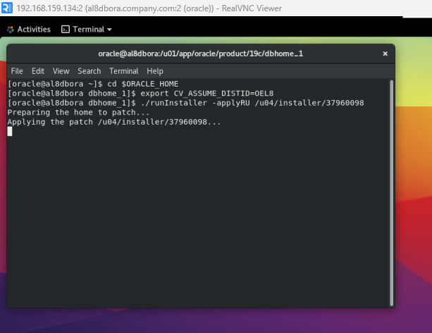

> **What `-applyRU` does:** Before displaying the OUI graphical interface, the installer applies the specified Release Update patch directly into `$ORACLE_HOME`. This means the installed Oracle software is immediately at patch level 19.28.0.0.0 — no separate OPatch step is required after installation. The process typically takes 5–10 minutes before the OUI window appears.

---

## Part 2 — Oracle Database Software Installation (OUI)

After the patching phase completes, the **Oracle Database 19c Installer** (OUI) graphical window opens. The installation is divided into 9 steps for "Set Up Software Only".

---

### Step 1: Select Installation Configuration

The first OUI screen presents three installation configuration options.

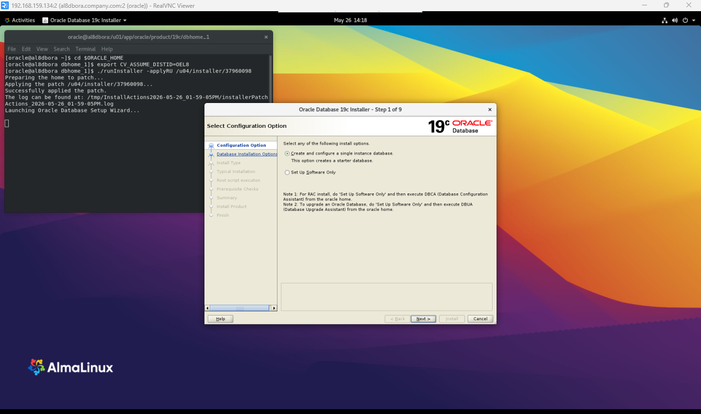

| Option | Description |
|--------|-------------|
| **Create and Configure a Single Instance Database** | Installs software AND creates a database in one combined wizard — less control over individual steps |
| **Set Up Software Only** *(select this)* | Installs Oracle software binaries only — database is created separately using DBCA |
| **Upgrade an Oracle Database** | For upgrading an existing Oracle installation |

Select **"Set Up Software Only"** and click **"Next"**.

> **Why Software Only?** This two-step approach (install software, then create database separately) gives full control over database creation parameters via DBCA. It also allows you to apply patches between the software install and database creation, and supports creating multiple databases from one Oracle Home.

---

### Step 2: Select Database Installation Option

Choose the type of database installation.

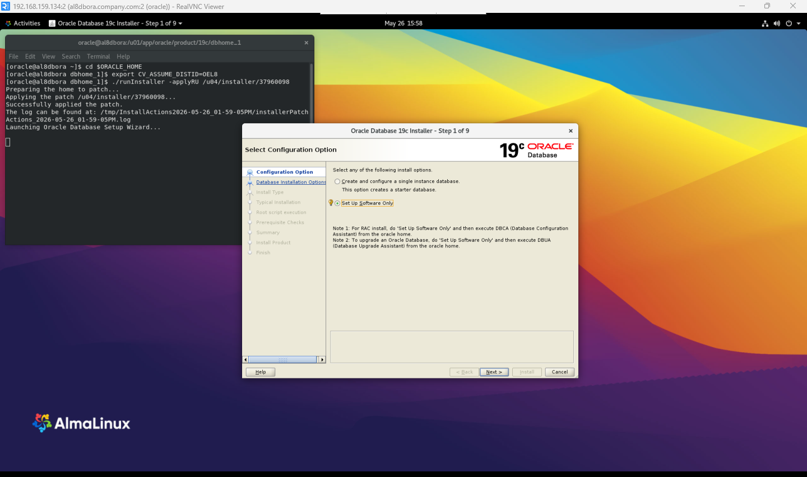

| Option | Description |
|--------|-------------|
| **Single Instance Database Installation** *(select this)* | Standalone database on a single server |
| Oracle Real Application Clusters database installation | Multi-node clustered database — requires Oracle Clusterware |

Select **"Single Instance Database Installation"** and click **"Next"**.

---

### Step 3: Select a Database Edition

Select the Oracle Database edition to install.


| Edition | Description |
|---------|-------------|
| **Standard Edition 2 (SE2)** *(select this)* | For servers with up to 2 sockets. Includes core database features — suitable for most business applications |
| Enterprise Edition (EE) | Full feature set including Advanced Security, partitioning, RAC, and more — requires Enterprise license |

Select **"Standard Edition 2"** and click **"Next"**.

---

### Step 4: Specify Installation Location

This screen shows the **Oracle Base** and **Oracle Home** paths. If the environment variables (`$ORACLE_BASE`, `$ORACLE_HOME`) were set correctly in `setEnv.sh`, the fields are pre-populated and no changes are needed.

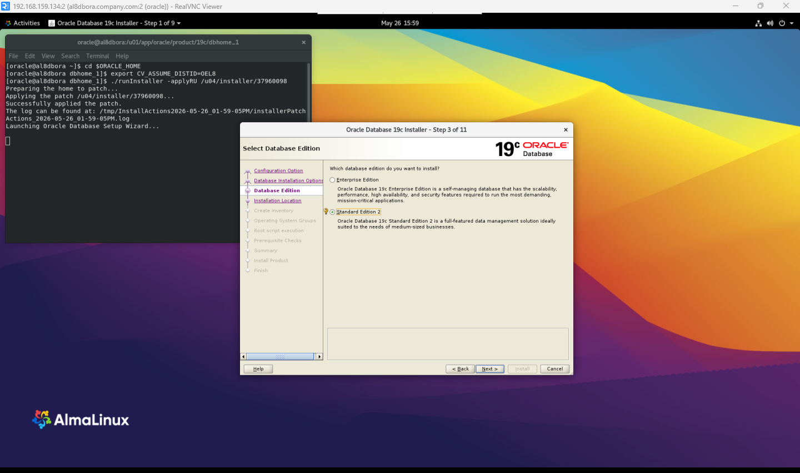

| Field | Value |
|-------|-------|
| **Oracle Base** | `/u01/app/oracle` |
| **Software Location (Oracle Home)** | `/u01/app/oracle/product/19c/dbhome_1` |

Verify the values match the expected paths. Click **"Next"** — no changes required.

---

### Step 5: Create Inventory

On first-time installation on this host, OUI creates the **Oracle Central Inventory** — a registry that tracks all Oracle products installed on the system.

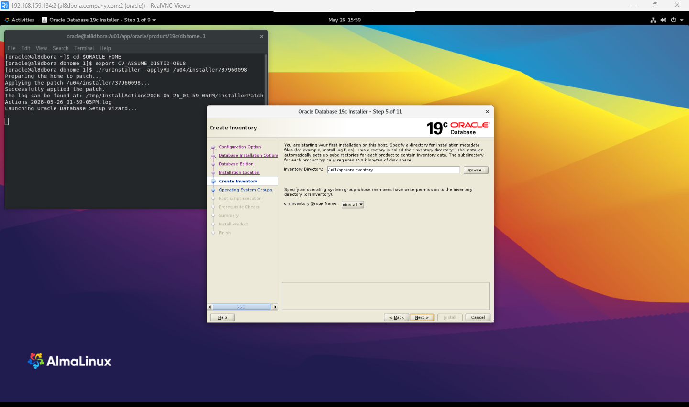

| Field | Value |
|-------|-------|
| **Inventory Directory** | `/u01/app/oraInventory` |
| **oraInventory Group Name** | `oinstall` |

The values are pre-populated from the system configuration. Click **"Next"** — no changes required.

---

### Step 6: Root Script Execution Configuration

This screen configures how OUI will execute the post-installation root scripts (`root.sh` and `orainstRoot.sh`) that configure system-level Oracle settings.

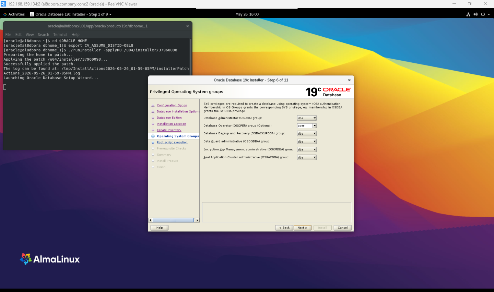

**Configuration:**

- Check **"Automatically run configuration scripts"**
- Select **"Use root user credential"**
- Enter the `root` OS user password in the **Password** field

| Option | Description |
|--------|-------------|
| **Automatically run configuration scripts** | OUI executes the root scripts automatically — no manual intervention needed during installation |
| **Use root user credential** | Authenticates directly as `root` using the OS password |
| Use "sudo" to run the scripts | Alternative for environments where sudo is configured for the oracle user |

Click **"Next"**.

> If you prefer not to enter the root password in OUI, leave this unchecked. OUI will pause during installation and prompt you to manually run the scripts in a separate terminal.

---

### Step 7: Prerequisite Checks

OUI verifies that the system meets all Oracle Database installation requirements. Each check is run automatically and the results are displayed.

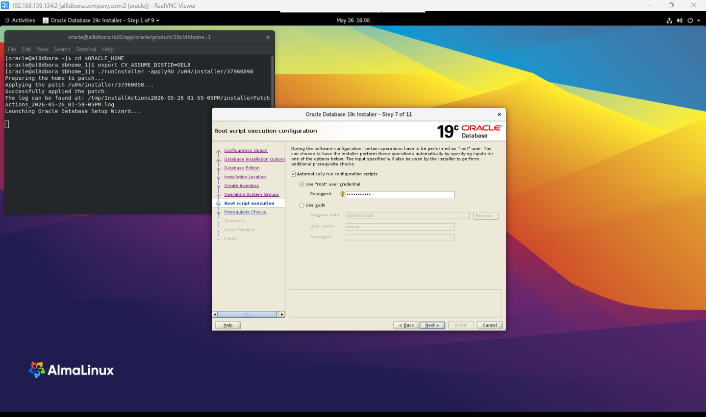

> If any check fails with a **warning**, you can typically proceed by checking "Ignore All". If a check shows a **failure** (not warning), resolve it before continuing. Common failures include insufficient swap space, missing packages, or kernel parameter values below the minimum.

When all checks pass (or warnings are acknowledged), click **"Next"**.

---

### Step 8: Installation Summary

The Summary screen shows a complete overview of everything that will be installed. Review the configuration before proceeding.

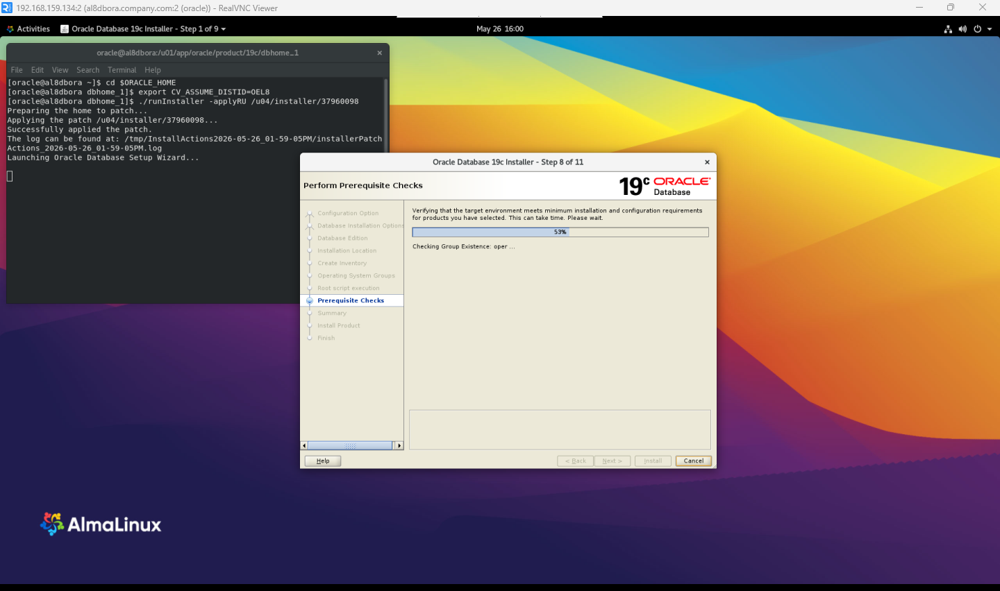

**Key items to verify:**

| Item | Expected Value |
|------|---------------|
| Oracle Home | `/u01/app/oracle/product/19c/dbhome_1` |
| Oracle Base | `/u01/app/oracle` |
| Edition | Standard Edition 2 |
| Installation type | Software Only |
| Database inventory | `/u01/app/oraInventory` |

If everything is correct, click **"Install"** to begin the installation.

---

### Install Progress

The installation progress screen shows real-time status as Oracle copies binaries, links libraries, and applies the Release Update patch to the Oracle Home.

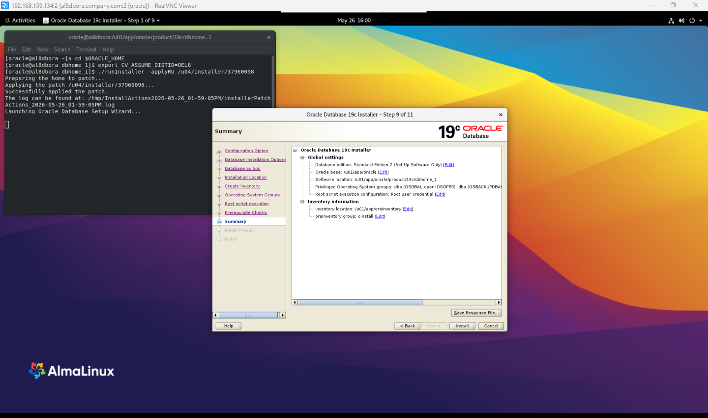

The installer performs the following operations sequentially:

1. Preparing the Oracle Home
2. Copying Oracle Database files
3. Linking Oracle Database binaries
4. Applying the Release Update (19.28.0.0.0)
5. Setting up the Oracle Home

> **Duration:** Approximately 15–30 minutes depending on VM disk I/O performance.

---

### Execute Configuration Scripts

During installation, OUI will trigger the execution of root configuration scripts. If **"Automatically run configuration scripts"** was selected in Step 6 with the root password, OUI authenticates and runs these scripts automatically. A confirmation dialog appears:

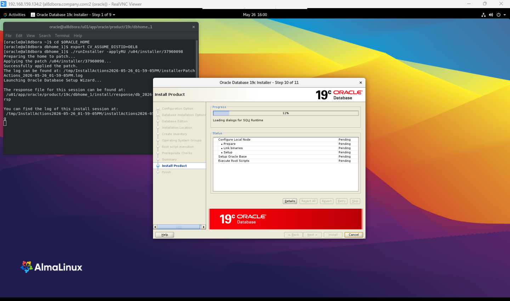

Click **"Yes"** to authorize OUI to execute the scripts as `root`.

> The scripts run are:
> - `/u01/app/oraInventory/orainstRoot.sh` — registers the Oracle Inventory at the OS level
> - `/u01/app/oracle/product/19c/dbhome_1/root.sh` — configures Oracle-related OS settings, creates `/etc/oratab`, and sets up the Oracle trace directory

---

### Installation Complete

When all steps finish, the OUI Finish screen confirms that the Oracle Database 19c software has been installed successfully.

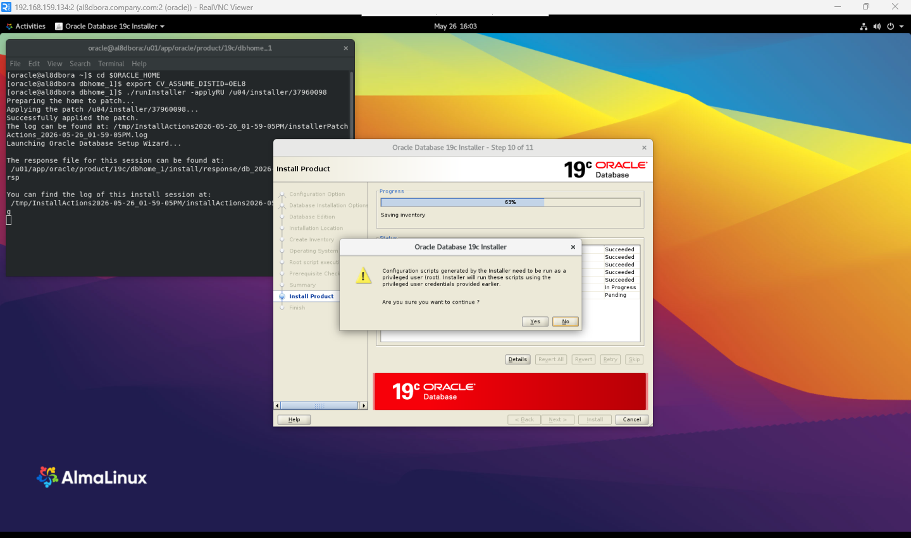

The screen confirms:

- **"The operation is now successfully!"**
- Oracle Database 19c software is installed at `$ORACLE_HOME`
- Release Update 19.28.0.0.0 has been applied

Click **"Close"** to exit the Oracle Universal Installer.

---

## Part 3 — Create Oracle Net Listener (netca)

The **Oracle Net Listener** is a network service that accepts incoming client connections and routes them to the appropriate Oracle database instance. It must be created before the database can accept remote connections.

Oracle provides the **Oracle Net Configuration Assistant (netca)** — a graphical utility for creating and managing listeners.

Run netca from the terminal (as the `oracle` user):

```bash
$ netca
```

---

### 3.1 Default Port 1521 Walkthrough

The following steps create a listener named `LISTENER` on the default Oracle port **1521**.

---

**netca Step 1 — Welcome Screen**

The netca Welcome screen presents four configuration options.


| Option | Description |
|--------|-------------|
| **Listener configuration** *(select this)* | Create, modify, or delete a database listener |
| Naming Methods configuration | Configure how Oracle resolves database service names |
| Local Net Service Name configuration | Configure `tnsnames.ora` connection descriptors |
| Directory Usage configuration | Configure LDAP directory for Oracle Net |

Select **"Listener configuration"** and click **"Next"**.

---

**netca Step 2 — Listener Configuration Type**

Choose the configuration action for the listener.


Select **"Add"** to create a new listener. Click **"Next"**.

---

**netca Step 3 — Listener Name**

Enter the name for the new listener.

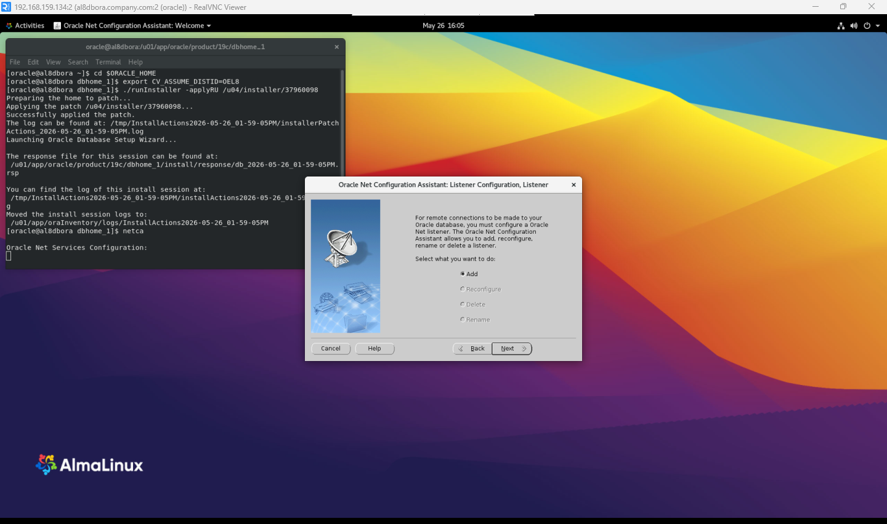

| Field | Value |
|-------|-------|
| **Listener Name** | `LISTENER` |

The default name `LISTENER` is the standard convention for Oracle databases. Multiple databases on the same host register with this single listener. Click **"Next"**.

---

**netca Step 4 — Select Protocols**

Select the network protocol the listener will accept connections on.

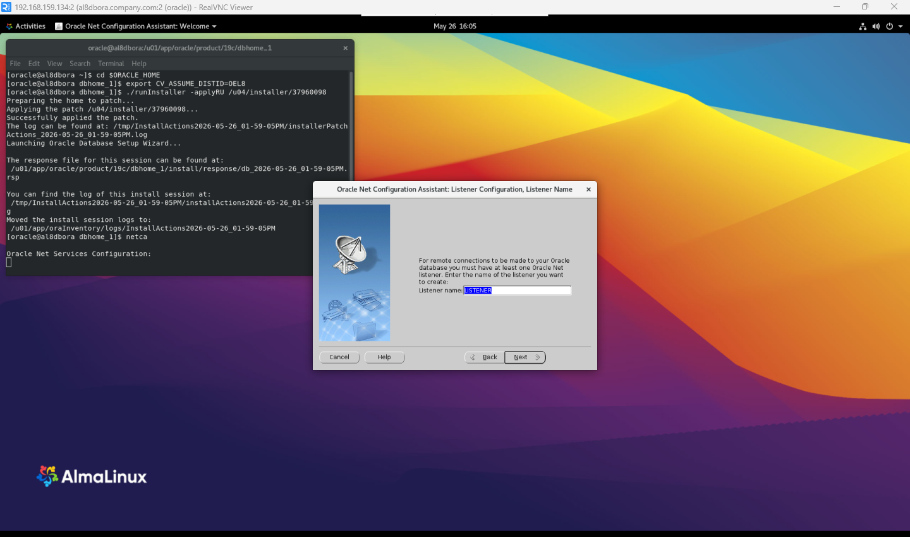

Select **"TCP"** (standard TCP/IP) in the "Selected Protocols" list. Click **"Next"**.

---

**netca Step 5 — TCP/IP Port Number**

Specify the port the listener will monitor for incoming connections.


| Option | Port | Usage |
|--------|------|-------|
| **Use the standard port number of 1521** *(select this)* | 1521 | Default Oracle listener port — used by nearly all Oracle client tools by default |
| Use another port number | Custom | Required if port 1521 is already in use by another service |

Select **"Use the standard port number of 1521"** and click **"Next"**.

---

**netca Step 6 — More Listeners?**

netca asks whether you want to configure an additional listener.


Select **"No"** and click **"Next"**.

---

**netca Step 7 — Listener Configuration Done**

The listener has been created successfully.

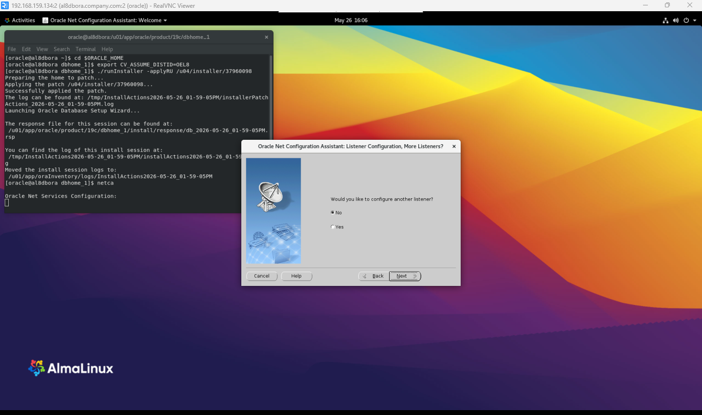

**"Listener configuration complete!"** is displayed. Click **"Next"** → **"Finish"** to close netca.

---

### 3.2 Alternative Port Configuration

If port 1521 is already occupied by another service on your host, select **"Use another port number"** in netca Step 5 and enter the desired port (e.g., `15210`).


After completing the alternate port configuration, the wizard closes and returns to the netca Welcome screen, which can be dismissed.

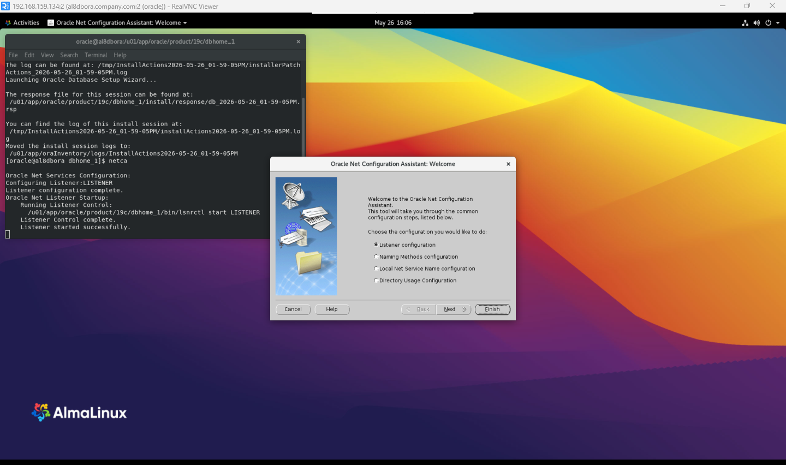

> If you use a non-default port, update your `tnsnames.ora` and any application connection strings accordingly. Also ensure the `firewalld` rule (or future firewall policy) allows the custom port.

---

## Part 4 — Verify Listener Status

After netca completes, verify that the listener is running and accepting connections:

```bash
$ lsnrctl status
```

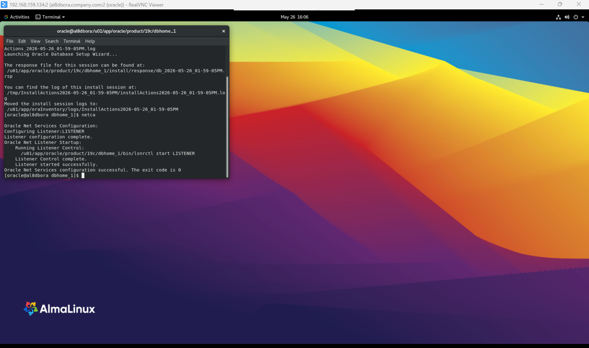

**Expected output confirms:**

| Field | Expected Value |
|-------|---------------|
| Alias | LISTENER |
| Version | TNSLSNR for Linux x86_64: Version 19.0.0.0.0 |
| Start Date | Current date/time |
| Status | Ready |
| Listening Endpoints | `(DESCRIPTION=(ADDRESS=(PROTOCOL=tcp)(HOST=al8dbora.company.com)(PORT=1521)))` |

> At this point, no database services are registered with the listener (the database has not been created yet). After DBCA creates the database in Part 5, the instance will automatically register its services with the listener.

---

## Part 5 — Create Oracle Database (DBCA)

The **Database Configuration Assistant (DBCA)** is a graphical wizard for creating, configuring, and managing Oracle databases. It creates the **Container Database (CDB)** `orcl19c` and the first **Pluggable Database (PDB)** `orclpdb`.

Launch DBCA from the terminal:

```bash
$ dbca
```

---

### Step 1: Select Database Operation

The first DBCA screen presents available operations.

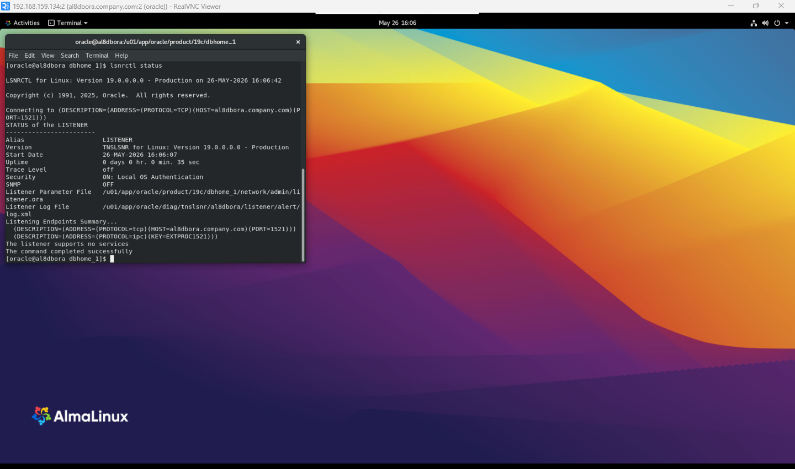

| Operation | Description |
|-----------|-------------|
| **Create a Database** *(select this)* | Create a new Oracle database instance |
| Configure an Existing Database | Modify parameters of an existing database |
| Manage Pluggable Databases | Add, remove, or clone PDBs |
| Delete a Database | Remove an existing database |

Select **"Create a Database"** and click **"Next"**.

---

### Step 2: Select Creation Mode

Choose between the Quick and Advanced creation modes.

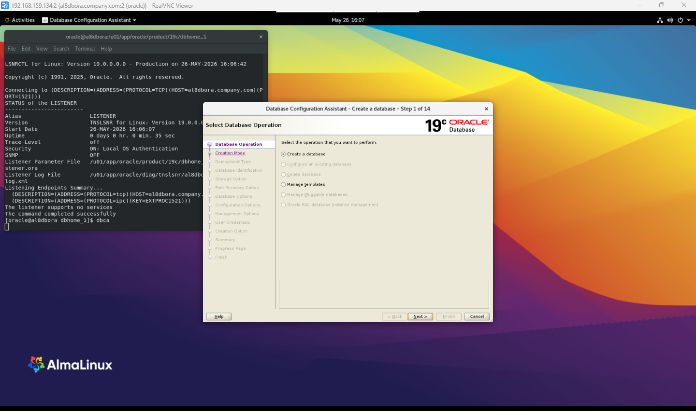

| Mode | Description |
|------|-------------|
| **Advanced Configuration** *(select this)* | Full control over all database parameters — storage, memory, character sets, network, EM, passwords |
| Typical Configuration | Creates a database with pre-set defaults — minimal interaction, less control |

Select **"Advanced Configuration"** and click **"Next"**.

> Advanced mode is recommended for production and staging environments because it allows you to specify exact memory limits, file locations, character sets, and archive log settings that match your capacity plan.

---

### Step 3: Select Deployment Type

Choose the database deployment type and creation template.


**Database Type:**

| Option | Description |
|--------|-------------|
| **Oracle Single Instance Database** *(select this)* | Standalone database on this host |
| Oracle Real Application Clusters (RAC) | Multi-node clustered database |

**Database Template:**

| Template | Description |
|----------|-------------|
| **General Purpose or Transaction Processing** *(select this)* | Pre-tuned for mixed OLTP workloads — suitable for most applications |
| Data Warehouse | Pre-tuned for analytical/reporting workloads |
| Custom Database | Completely blank configuration — all parameters manual |

Select **"Oracle Single Instance Database"** and **"General Purpose or Transaction Processing"**. Click **"Next"**.

---

### Step 4: Specify Database Identification Details

Define the database name, SID, and pluggable database details.

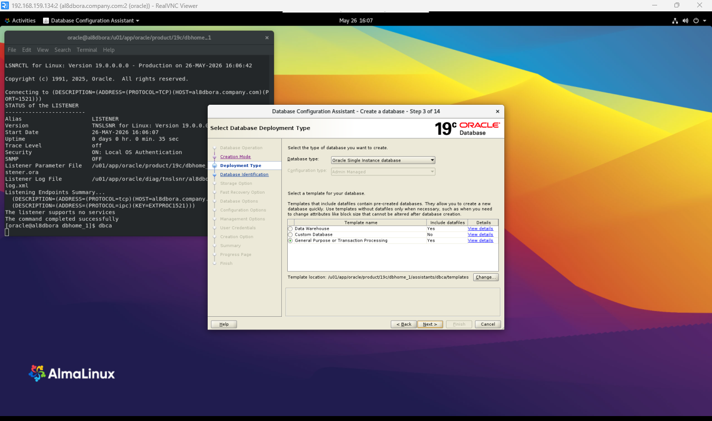

| Field | Value | Description |
|-------|-------|-------------|
| **Global Database Name** | `orcl19c.company.com` | Fully qualified name: SID + domain. Used in `tnsnames.ora` and network connections |
| **Oracle SID** | `orcl19c` | Instance identifier — must be unique per host |
| **Create as Container Database** | ✅ Checked | Creates a CDB — the modern Oracle multi-tenant architecture |
| **Create an Empty Container Database** | ✅ Checked | Alternatively, use "Create a Container Database with one or more PDBs" |
| **Number of PDBs** | `1` | Create one pluggable database |
| **PDB Name** | `orclpdb` | Name of the first pluggable database |

Click **"Next"**.

> **CDB vs non-CDB:** Oracle 19c defaults to the multi-tenant Container Database (CDB) architecture. A CDB can host multiple pluggable databases (PDBs), each with its own schema space. Non-CDB creation is deprecated in Oracle 19c and desupported in Oracle 21c.

---

### Step 5: Select Database Storage Option

Choose where the database files will be stored.


| Option | Description |
|--------|-------------|
| **Use template file for the database storage attributes** | Uses locations defined in the selected template. Choose this to use `/u02/oradata` and `/u03/oraindx` |
| Use the following for the database storage attributes | Manually specify storage location |

Select the first option and verify the database file location resolves to `/u02/oradata`. Click **"Next"**.

---

### Step 6: Select Fast Recovery Option

Configure the Flash Recovery Area (FRA) and archive log mode.


| Field | Value | Description |
|-------|-------|-------------|
| **Specify Fast Recovery Area** | ✅ Checked | Enables the FRA for backup and recovery |
| **Fast Recovery Area** | `/u04/orafra` | Dedicated partition for RMAN backups, archive logs, and flashback logs |
| **Fast Recovery Area Size** | `30720 MB` (30 GB) | Initial FRA size — can be expanded as backup history grows |
| **Enable Archiving** | ✅ Checked | Enables `ARCHIVELOG` mode — mandatory for online backups with RMAN |

Click **"Next"**.

> **Why enable archiving?** `ARCHIVELOG` mode ensures that all redo log changes are archived before the redo log files are overwritten. This is a prerequisite for online (hot) backups with RMAN and for Oracle Data Guard (standby database). It is strongly recommended for any database that holds important data.

---

### Step 7: Specify Network Configuration

Register the database with the Oracle Net Listener.


The `LISTENER` created by netca in Part 3 should appear in the available listeners list. Verify it shows:

| Field | Value |
|-------|-------|
| **Listener** | `LISTENER` |
| **Port** | `1521` |

Ensure `LISTENER` is selected/checked. Click **"Next"**.

---

### Step 8: Specify Configuration Options

DBCA provides five sub-tabs for detailed database configuration. Review and set each tab.

---

**Tab 1 — Memory**

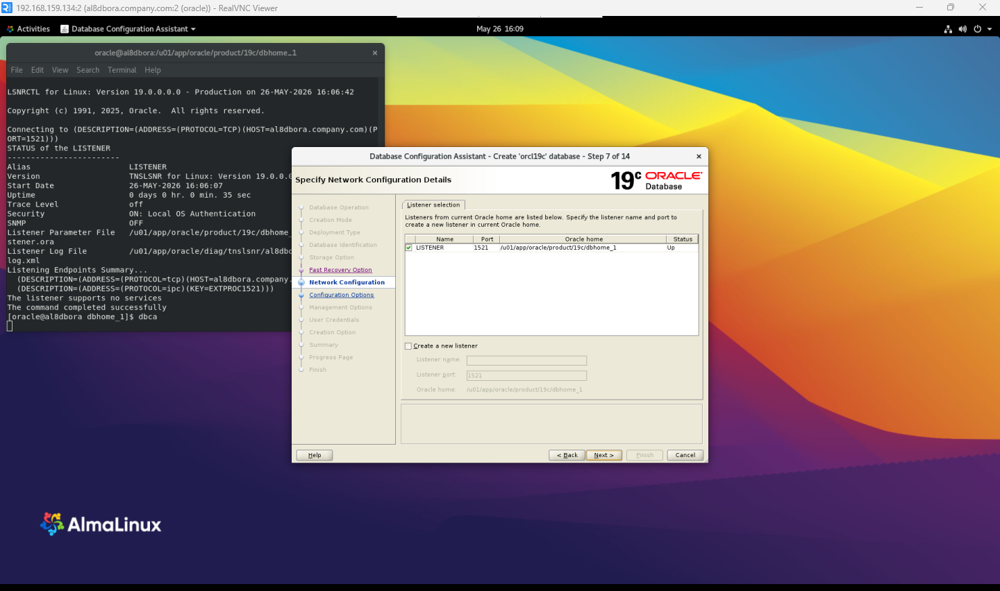

| Setting | Value | Description |
|---------|-------|-------------|
| **Enable Automatic Memory Management** | ✅ | Oracle automatically manages SGA and PGA allocation within the total memory target |
| **Memory Target** | Based on available RAM | Oracle uses this as the upper bound for total memory (SGA + PGA combined) |

> With 6 GB RAM and a shared system, set the Memory Target to approximately 2–3 GB to leave room for the OS and other processes.

---

**Tab 2 — Sizing**


| Parameter | Value | Description |
|-----------|-------|-------------|
| **Block Size** | `8192` (8 KB) | Standard Oracle block size — cannot be changed after database creation |
| **Processes** | `320` | Maximum concurrent OS processes that can connect to the database |

---

**Tab 3 — Character Sets**


| Parameter | Value | Description |
|-----------|-------|-------------|
| **Database Character Set** | `AL32UTF8` | Unicode UTF-8 — supports all languages and characters. Strongly recommended for all new databases |
| **National Character Set** | `AL16UTF16` | Unicode UTF-16 — used for `NCHAR`, `NVARCHAR2`, and `NCLOB` columns |
| **Default Language** | `AMERICAN` | Sets `NLS_LANGUAGE` |
| **Default Territory** | `AMERICA` | Sets `NLS_TERRITORY` (date/number format conventions) |

> `AL32UTF8` is the recommended character set for all new Oracle databases. It supports the full Unicode character set (including multi-byte characters for Asian languages, emoji, and special symbols), and is required for Oracle's globalization best practices.

---

**Tab 4 — Connection Mode**


| Mode | Description |
|------|-------------|
| **Dedicated Server Mode** *(select this)* | Each client connection gets a dedicated server process — best for applications with long-running sessions |
| Shared Server Mode | Multiple clients share server processes — reduces process count for systems with many short connections |

Select **"Dedicated Server Mode"**. Click **"Next"** to proceed.

---

**Tab 5 — Sample Schemas**

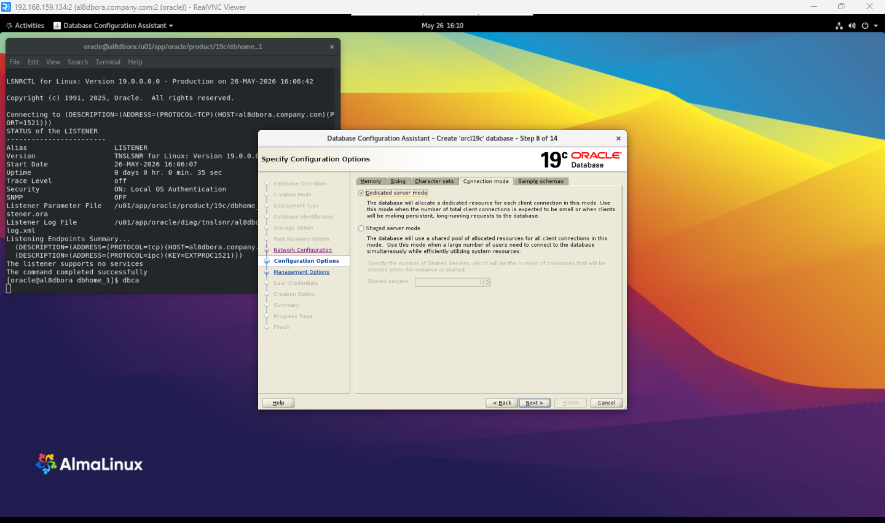

Sample schemas (HR, OE, SH, etc.) are pre-built demonstration schemas. Leave this unchecked for a clean production database. Click **"Next"**.

---

### Step 9: Specify Management Options

Configure Oracle Enterprise Manager Database Express (EM Express), a browser-based management console bundled with Oracle Database.


| Setting | Value | Description |
|---------|-------|-------------|
| **Configure Enterprise Manager (EM) Database Express** | ✅ Checked | Enables the lightweight web-based management console |
| **EM Database Express Port** | `5500` | Access EM Express at `https://al8dbora.company.com:5500/em` after database creation |

Click **"Next"**.

> EM Express is a lightweight read/write management console included with all Oracle Database editions. It provides performance monitoring, SQL worksheet, schema browsing, and basic administration — no additional license required.

---

### Step 10: Specify Database User Credentials

Set passwords for the built-in Oracle database administrative accounts.

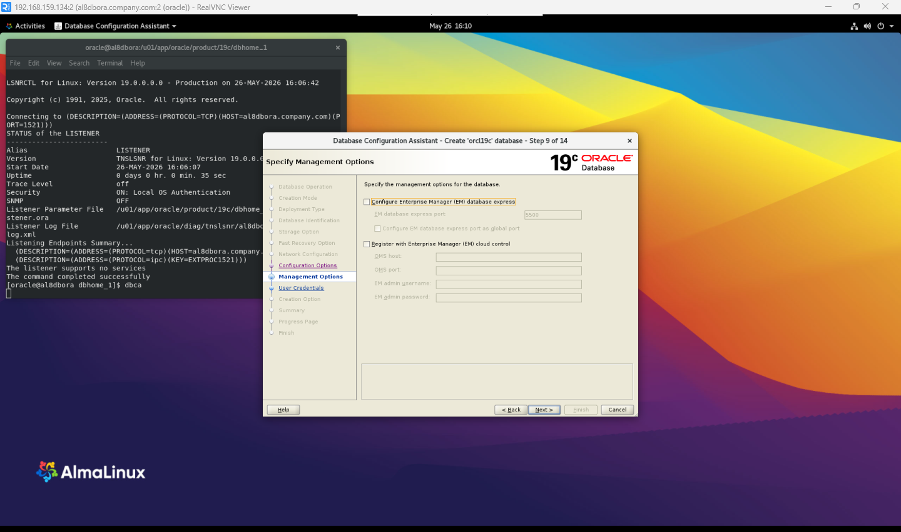

| Option | Description |
|--------|-------------|
| **Use the same administrative password for all accounts** *(recommended)* | Sets a single password for SYS, SYSTEM, DBSNMP, and PDBADMIN |
| Specify different passwords for each account | Individual passwords per account — more secure for production |

Enter a strong password and confirm it. Click **"Next"**.

> **Oracle built-in accounts:**
> - **SYS** — Most privileged account; owns the data dictionary; connects as `SYSDBA`
> - **SYSTEM** — DBA account for general administration; owns auxiliary data dictionary tables
> - **DBSNMP** — Used by Oracle Enterprise Manager monitoring agents
> - **PDBADMIN** — Administrative account for the PDB (`orclpdb`)
>
> **Password requirements:** Minimum 8 characters; must include at least one uppercase letter, one lowercase letter, one digit, and one special character. The password must not start with a digit.

---

### Step 11: Select Database Creation Option

Choose what DBCA should do after configuration is complete.


| Option | Description |
|--------|-------------|
| **Create database** *(check this)* | DBCA creates the database immediately after summary confirmation |
| Generate database creation scripts | DBCA generates SQL scripts but does not execute them — useful for review or offline creation |
| All initialization parameters... | Optionally review/modify `init.ora` parameters before creation |

Ensure **"Create database"** is checked and click **"Next"**.

---

### Step 12: Summary

The Summary screen displays the complete database configuration. Review every item carefully — once you click **"Finish"**, the database creation process begins and cannot be easily reversed without dropping the database.


**Pre-creation checklist:**

| Item | Expected Value |
|------|---------------|
| Global Database Name | `orcl19c.company.com` |
| SID | `orcl19c` |
| Edition | Standard Edition 2 |
| Character Set | AL32UTF8 |
| Container Database | Yes |
| PDB Name | `orclpdb` |
| FRA | `/u04/orafra` |
| Archive Mode | ARCHIVELOG |
| Listener | LISTENER:1521 |
| EM Express Port | 5500 |

Click **"Finish"** to begin database creation.

---

### Database Creation Progress

DBCA creates the database in multiple sequential stages. The Progress Page shows each step with its real-time status.


**Creation stages performed by DBCA:**

| Stage | Description |
|-------|-------------|
| Prepare for database creation | Validates configuration and prepares the Oracle Home |
| Copy database files | Creates the physical datafiles, control files, and redo logs in `/u02/oradata` |
| Create and start Oracle instance | Starts the Oracle background processes (PMON, SMON, DBWR, LGWR, CKPT, etc.) |
| Completing database creation | Runs Oracle catalog and catproc scripts, creates the data dictionary |
| Create pluggable database | Creates `orclpdb` inside the CDB |
| Execute post database creation scripts | Applies finishing configuration scripts |
| Create Enterprise Manager Express | Configures EM Express on port 5500 |

> **Duration:** Database creation typically takes **15–30 minutes**. The largest single stage is "Create and start Oracle instance" which builds the full data dictionary.

---

### Database Creation Complete

When all stages complete, DBCA displays the finish screen with a summary of the newly created database.


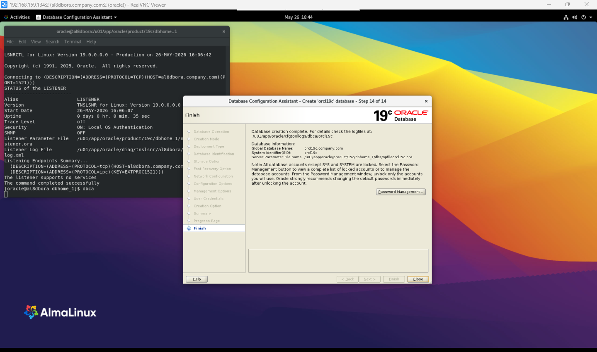

**Database creation results:**

| Item | Value |
|------|-------|
| **Database Name** | `orcl19c` |
| **Oracle Home** | `/u01/app/oracle/product/19c/dbhome_1` |
| **Database files location** | `/u02/oradata/ORCL19C/` |
| **FRA location** | `/u04/orafra/` |
| **EM Express URL** | `https://al8dbora.company.com:5500/em` |
| **PDB** | `orclpdb` |

Click **"Close"** to exit DBCA.

---

## Part 6 — Verify Database Connection

After DBCA completes, verify that the Oracle Database instance is running and accessible using SQL*Plus.

Connect to the database as SYSDBA from the terminal (as the `oracle` user):

```bash
$ sqlplus / as sysdba
```

**Expected output:**

```
SQL*Plus: Release 19.0.0.0.0 - Production on Tue May 26 16:45:10 2026
Version 19.28.0.0.0

Copyright (c) 1982, 2025, Oracle.  All rights reserved.

Connected to:
Oracle Database 19c Standard Edition 2 Release 19.0.0.0.0 - Production
Version 19.28.0.0.0

SQL>
```

Exit SQL*Plus:

```bash
SQL> exit
Disconnected from Oracle Database 19c Standard Edition 2 Release 19.0.0.0.0 - Production
Version 19.28.0.0.0
```

**Verification checklist:**

| Check | Expected Result |
|-------|----------------|
| SQL*Plus connects without error | `Connected to: Oracle Database 19c...` |
| Edition | `Standard Edition 2` |
| Base version | `19.0.0.0.0` |
| Patch level | `19.28.0.0.0` |

> The `Version 19.28.0.0.0` in the output confirms the Release Update was applied successfully during installation.

---

## Summary of Installation

| Category | Item | Value |
|----------|------|-------|
| **Software** | Oracle Database Version | 19c (19.3.0.0.0) |
| **Software** | Patch Level | Release Update 19.28.0.0.0 |
| **Software** | Edition | Standard Edition 2 |
| **Software** | Oracle Home | `/u01/app/oracle/product/19c/dbhome_1` |
| **Software** | Oracle Base | `/u01/app/oracle` |
| **Software** | Oracle Inventory | `/u01/app/oraInventory` |
| **Database** | Global DB Name | `orcl19c.company.com` |
| **Database** | Oracle SID | `orcl19c` |
| **Database** | Type | Container Database (CDB) |
| **Database** | PDB Name | `orclpdb` |
| **Database** | Character Set | `AL32UTF8` |
| **Database** | Archive Mode | `ARCHIVELOG` |
| **Database** | Connection Mode | Dedicated Server |
| **Storage** | Data Files | `/u02/oradata` |
| **Storage** | Index Files | `/u03/oraindx` |
| **Storage** | Flash Recovery Area | `/u04/orafra` |
| **Network** | Listener Name | `LISTENER` |
| **Network** | Listener Port | `1521` |
| **Management** | EM Express URL | `https://al8dbora.company.com:5500/em` |
| **Management** | EM Express Port | `5500` |

---

## Next Steps

Oracle Database 19c is now installed and the initial database is created. Proceed to the post-installation phase:

| Stage | Document | Status | Description |
|-------|----------|--------|-------------|
| **1** | [AlmaLinux 8.10 OS Installation Guide](https://github.com/seeomkus/linux-installation/blob/main/almalinux-8-for-oracle-database/almalinux_8_10_os_installation_guide.md) | ✅ Complete | Operating system installation |
| **2** | [Oracle Database 19c Pre-Installation Guide](oracle_database_19c_pre_installation_guide_almalinux_8_10.md) | ✅ Complete | OS pre-configuration |
| **3** | **Oracle Database 19c Installation Guide** *(this document)* | ✅ Complete | Software installation and database creation |
| **4** | [Oracle Database 19c Post-Installation Guide](oracle_database_19c_post_installation_guide_almalinux_8_10.md) | ⬜ Next | Auto-start via systemd, PDB persistence, EM Express verification, initial RMAN backup |

**Recommended post-installation tasks:**

1. Configure database auto-startup on system boot via `/etc/oratab` and `dbstart`/`dbshut` scripts
2. Verify all PDB services are registered with the listener: `lsnrctl services`
3. Open the PDB and save its open state: `ALTER PLUGGABLE DATABASE orclpdb OPEN; ALTER PLUGGABLE DATABASE orclpdb SAVE STATE;`
4. Connect to EM Express at `https://al8dbora.company.com:5500/em` to verify the management console
5. Run an initial RMAN backup to establish a recovery baseline
6. Review and adjust `init.ora` parameters (memory, processes, undo) for your workload

---

## References

### 1. Oracle Database 19c — Official Documentation

| Document | URL |
|----------|-----|
| **Oracle DB 19c Installation Guide for Linux** | https://docs.oracle.com/en/database/oracle/oracle-database/19/ladbi/ |
| **Oracle Universal Installer Concepts Guide** | https://docs.oracle.com/en/database/oracle/oracle-database/19/ouici/ |
| **Oracle DBCA Guide** | https://docs.oracle.com/en/database/oracle/oracle-database/19/admin/creating-and-configuring-an-oracle-database.html |
| **Oracle Net Services Administrator's Guide** | https://docs.oracle.com/en/database/oracle/oracle-database/19/netag/ |
| **Oracle Database 19c Patch Downloads** | https://support.oracle.com (My Oracle Support — Oracle account required) |
| **Oracle Database Release Update Notes** | https://docs.oracle.com/en/database/oracle/oracle-database/19/rnrdm/ |

### 2. Oracle Database Administration

| Document | URL |
|----------|-----|
| **Oracle Multitenant Administrator's Guide (CDB/PDB)** | https://docs.oracle.com/en/database/oracle/oracle-database/19/multi/ |
| **Oracle Database Administrator's Guide** | https://docs.oracle.com/en/database/oracle/oracle-database/19/admin/ |
| **Oracle Database Backup and Recovery (RMAN)** | https://docs.oracle.com/en/database/oracle/oracle-database/19/bradv/ |
| **Oracle EM Express Guide** | https://docs.oracle.com/en/database/oracle/oracle-database/19/admqs/getting-started-with-database-administration.html |

### 3. Supporting Tools

| Tool | Purpose | URL |
|------|---------|-----|
| **RealVNC Viewer** | VNC client — access GNOME desktop for OUI and DBCA | https://www.realvnc.com/en/connect/download/viewer/ |
| **PuTTY** | SSH terminal access | https://www.putty.org/ |
| **WinSCP** | SFTP/SCP file transfer — upload Oracle ZIP files | https://winscp.net/ |
| **MobaXterm** | All-in-one SSH + SFTP + X11 forwarding | https://mobaxterm.mobatek.net/ |
