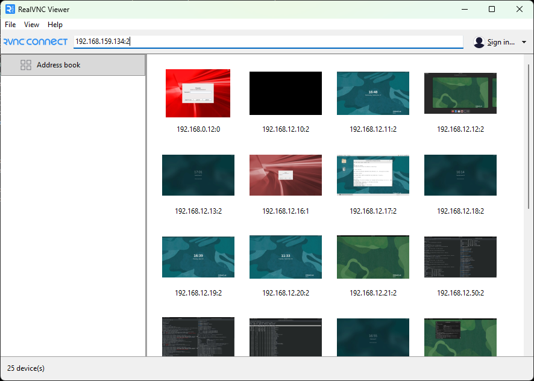
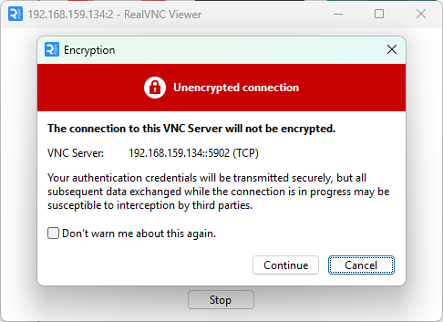
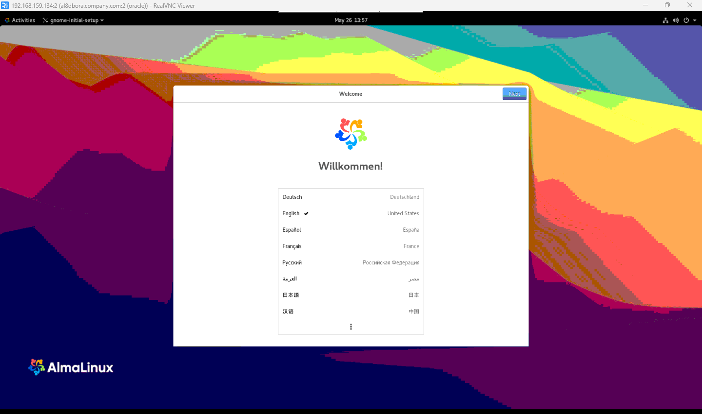
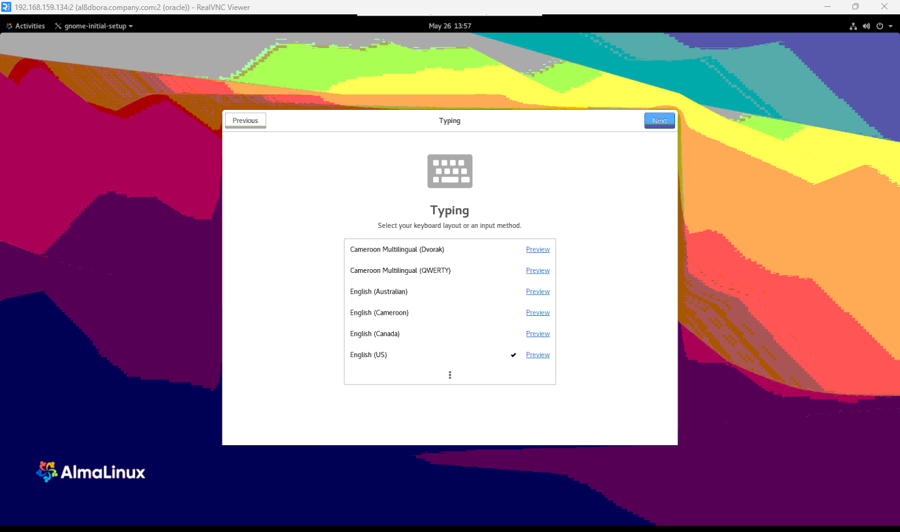
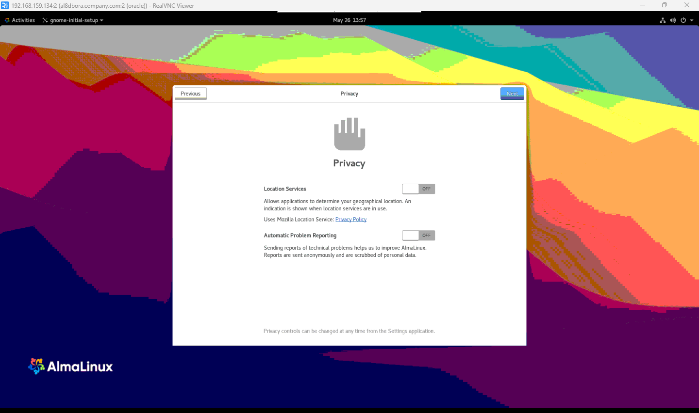
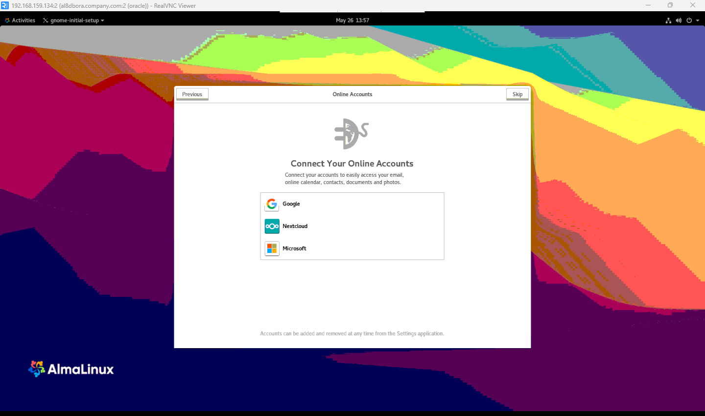
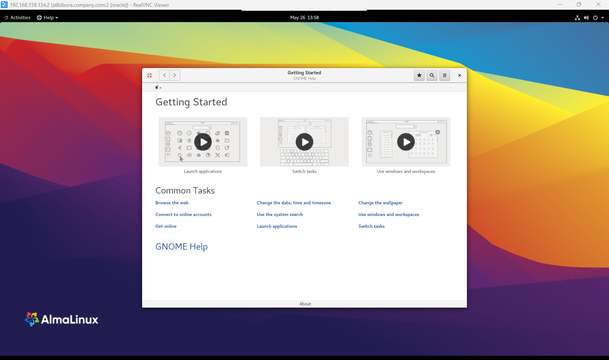

# Oracle Database 19c Pre-Installation Guide — AlmaLinux 8.10 (Cerulean Leopard)

> **Platform:** AlmaLinux 8.10 (Cerulean Leopard) on VMware Workstation 16.0.0 | **Purpose:** System preparation before Oracle Database 19c installation

| | |
|---|---|
| **Document** | Pre-Installation Guide |
| **OS Version** | AlmaLinux 8.10 (Cerulean Leopard) |
| **Platform** | VMware Workstation 16.0.0 |
| **Oracle Version** | Oracle Database 19c (19.3) |
| **Kernel** | Linux 4.18.0-553.el8_10.x86_64 |
| **Architecture** | x86-64 |

---

## Table of Contents

1. [Overview](#1-overview)
2. [Prerequisites](#2-prerequisites)
   - [2.1 System Assumptions](#21-system-assumptions)
   - [2.2 Server Storage Layout](#22-server-storage-layout)
3. [Part 1 — Install Required OS Dependencies (Quick Method)](#part-1--install-required-os-dependencies-quick-method)
4. [Part 2 — Disable SELinux](#part-2--disable-selinux)
5. [Part 3 — Configure Kernel Parameters](#part-3--configure-kernel-parameters)
6. [Part 4 — Configure OS Resource Limits](#part-4--configure-os-resource-limits)
7. [Part 5 — Install Complete Oracle Package Dependencies (Detailed Method)](#part-5--install-complete-oracle-package-dependencies-detailed-method)
8. [Part 6 — Create Oracle OS Groups and User](#part-6--create-oracle-os-groups-and-user)
9. [Part 7 — Disable Firewall](#part-7--disable-firewall)
10. [Part 8 — Update Operating System](#part-8--update-operating-system)
11. [Part 9 — Storage Configuration](#part-9--storage-configuration)
    - [9.1 Verify Current Disk Layout](#91-verify-current-disk-layout)
    - [9.2 Create Mount Points](#92-create-mount-points)
    - [9.3 Format Additional Filesystems (XFS)](#93-format-additional-filesystems-xfs)
    - [9.4 Mount Filesystems](#94-mount-filesystems)
    - [9.5 Retrieve Disk UUIDs](#95-retrieve-disk-uuids)
    - [9.6 Configure /etc/fstab for Persistent Mounts](#96-configure-etcfstab-for-persistent-mounts)
    - [9.7 Verify Final Storage Layout](#97-verify-final-storage-layout)
12. [Part 10 — Create Oracle Directory Structure](#part-10--create-oracle-directory-structure)
13. [Part 11 — Set Directory Permissions and Ownership](#part-11--set-directory-permissions-and-ownership)
14. [Part 12 — Configure Oracle Environment Variables](#part-12--configure-oracle-environment-variables)
15. [Part 13 — Create Oracle Startup and Shutdown Scripts](#part-13--create-oracle-startup-and-shutdown-scripts)
16. [Part 14 — Install and Configure VNC Server](#part-14--install-and-configure-vnc-server)
17. [Summary of Pre-Installation Configurations](#summary-of-pre-installation-configurations)
18. [Next Steps](#next-steps)
19. [References](#references)
    - [Oracle Database 19c Installer — How to Download](#1-oracle-database-19c-installer--how-to-download)
    - [Oracle Database 19c — Official Installation Documentation](#2-oracle-database-19c--official-installation-documentation)
    - [Oracle Database 19c — Administrator & Reference Documentation](#3-oracle-database-19c--administrator--reference-documentation)
    - [AlmaLinux 8 — Related Documentation](#4-almalinux-8--related-documentation)
    - [Supporting Tools](#5-supporting-tools)

---

## 1. Overview

This guide provides detailed, step-by-step instructions for preparing an **AlmaLinux 8.10 (Cerulean Leopard)** system to host **Oracle Database 19c**. All steps described in this document must be completed **before** running the Oracle Universal Installer (OUI).

The pre-installation phase covers:

- Installing required OS packages and libraries
- Disabling SELinux and the system firewall
- Configuring kernel parameters and OS resource limits
- Preparing and mounting dedicated storage volumes
- Creating the Oracle OS user, groups, and directory structure
- Setting up Oracle environment variables and automation scripts
- Installing and configuring a VNC Server for graphical installer access

> **Important:** All commands in this guide must be executed as the **`root`** user unless explicitly stated otherwise. Always verify the output of each step before proceeding to the next.

---

## 2. Prerequisites

### 2.1 System Assumptions

This guide assumes the following conditions are already in place before starting:

| Item | Status |
|------|--------|
| AlmaLinux 8.10 installed and booted successfully | ✅ Complete — see [AlmaLinux 8.10 OS Installation Guide](https://github.com/seeomkus/linux-installation/blob/main/almalinux-8-for-oracle-database/almalinux_8_10_os_installation_guide.md) |
| Network interface `ens160` configured with IP `192.168.159.134/24` | ✅ Complete |
| Hostname set to `al8dbora.company.com` | ✅ Complete |
| `/etc/hosts` updated with server FQDN and short hostname | ✅ Complete |
| Internet connectivity verified (`ping 8.8.8.8`) | ✅ Verified |
| Logged in to the server as `root` | Required |

---

### 2.2 Server Storage Layout

This server is equipped with **five NVMe disks**. The first disk (`nvme0n1`) was partitioned during OS installation. The four remaining raw disks are reserved exclusively for Oracle Database storage.

| Device | Size | Purpose | Mount Point |
|--------|------|---------|-------------|
| `nvme0n1` | 300 GB | OS disk — partitioned during OS installation | `/`, `/boot`, `/home`, `/tmp`, `[SWAP]` |
| `nvme0n2` | 300 GB | Oracle software and binaries | `/u01` |
| `nvme0n3` | 300 GB | Oracle database data files | `/u02` |
| `nvme0n4` | 300 GB | Oracle database index files | `/u03` |
| `nvme0n5` | 1 TB | Oracle FRA, dumps, installer staging, backups | `/u04` |

> **Storage separation rationale:** Distributing Oracle software, data files, index files, and recovery area across separate physical volumes follows Oracle best practices. It isolates I/O workloads, prevents a full data disk from impacting software or recovery operations, and simplifies capacity management.

---

## Part 1 — Install Required OS Dependencies (Quick Method)

Oracle Database requires a set of operating system libraries and utilities to be present before the installer runs. This section installs the minimum core dependencies in a single command.

```bash
# dnf install -y bc binutils elfutils-libelf elfutils-libelf-devel \
  glibc glibc-common glibc-devel ksh libaio libaio-devel \
  libgcc libstdc++ libstdc++-devel make sysstat \
  unixODBC unixODBC-devel libnsl
```

Then install the OpenSSL 1.0 compatibility library separately:

```bash
# dnf install -y compat-openssl10
```

> **Why `compat-openssl10`?**
> AlmaLinux 8 ships with OpenSSL 1.1 by default. Several Oracle Database 19c binaries were compiled against OpenSSL 1.0 and require the backward-compatibility library (`libssl.so.10`, `libcrypto.so.10`) provided by this package.

> **See also:** [Part 5](#part-5--install-complete-oracle-package-dependencies-detailed-method) provides the complete package list installed individually with purpose explanations. Use Part 5 when you need to verify each dependency or troubleshoot missing libraries.

---

## Part 2 — Disable SELinux

**SELinux (Security-Enhanced Linux)** enforces mandatory access control policies over processes, files, and system calls. While important for production security hardening, SELinux in `enforcing` mode blocks Oracle Database installation scripts and runtime IPC mechanisms.

### Step 1: View the Current SELinux Configuration

```bash
# cat /etc/selinux/config
```

**Expected output (before change):**

```
SELINUX=enforcing
SELINUXTYPE=targeted
```

### Step 2: Edit the SELinux Configuration

Open the file for editing:

```bash
# vi /etc/selinux/config
```

Change `SELINUX=enforcing` to `SELINUX=disabled`:

```
SELINUX=disabled
SELINUXTYPE=targeted
```

> **Vi quick reference:** Press `i` to enter insert mode → make the change → press `Esc` → type `:wq` → press `Enter` to save and exit.

### Step 3: Apply Permissive Mode Immediately (No Reboot Required)

```bash
# setenforce 0
```

This switches SELinux to `permissive` mode for the **current session** without rebooting. The `disabled` value in the config file takes full effect after the next reboot.

### Step 4: Verify the SELinux Status

```bash
# getenforce
Permissive
```

### Step 5: Verify the Configuration File

```bash
# cat /etc/selinux/config
SELINUX=disabled
SELINUXTYPE=targeted
```

> **Why disable SELinux?**
> Oracle Database 19c requires:
> - Unrestricted access to IPC mechanisms: shared memory segments, semaphore arrays, and message queues
> - Execution of Oracle-managed scripts and binaries from non-standard paths
> - Write access to `/tmp`, `/dev/shm`, and Oracle-specific directories without policy violations
>
> SELinux can be re-enabled after Oracle Database is successfully installed and validated, using Oracle-specific SELinux policy modules (`oracle-rdbms-server-19c-preinstall`) if compliance requirements mandate it.

---

## Part 3 — Configure Kernel Parameters

Oracle Database relies on kernel parameters to support large shared memory segments, semaphore arrays, asynchronous I/O, and sufficient network buffer sizes. These values must be configured in `/etc/sysctl.conf` and applied to the running kernel before the Oracle installer executes.

### Step 1: View the Current sysctl.conf

```bash
# cat /etc/sysctl.conf
```

### Step 2: Edit sysctl.conf

```bash
# vi /etc/sysctl.conf
```

Append the following block to the end of the file:

```
fs.file-max = 6815744
kernel.sem = 250 32000 100 128
kernel.shmmni = 4096
kernel.shmall = 1073741824
kernel.shmmax = 4398046511104
kernel.panic_on_oops = 1
net.core.rmem_default = 262144
net.core.rmem_max = 4194304
net.core.wmem_default = 262144
net.core.wmem_max = 1048576
net.ipv4.conf.all.rp_filter = 2
net.ipv4.conf.default.rp_filter = 2
fs.aio-max-nr = 1048576
net.ipv4.ip_local_port_range = 9000 65500
```

### Step 3: Apply the Kernel Parameters

```bash
# sysctl -p
```

**Expected output:**

```
fs.file-max = 6815744
kernel.sem = 250 32000 100 128
kernel.shmmni = 4096
kernel.shmall = 1073741824
kernel.shmmax = 4398046511104
kernel.panic_on_oops = 1
net.core.rmem_default = 262144
net.core.rmem_max = 4194304
net.core.wmem_default = 262144
net.core.wmem_max = 1048576
net.ipv4.conf.all.rp_filter = 2
net.ipv4.conf.default.rp_filter = 2
fs.aio-max-nr = 1048576
net.ipv4.ip_local_port_range = 9000 65500
```

> **`sysctl -p`** reads `/etc/sysctl.conf` and applies all values to the running kernel immediately. Because the values are stored in the file, they are automatically re-applied on every system reboot.

### Kernel Parameter Reference

| Parameter | Value | Purpose |
|-----------|-------|---------|
| `fs.file-max` | 6,815,744 | Maximum number of open file descriptors the kernel can allocate system-wide |
| `kernel.sem` | 250 32000 100 128 | Semaphore limits: SEMMSL (max per array), SEMMNS (max total), SEMOPM (max ops/call), SEMMNI (max arrays) — Oracle uses semaphores for inter-process coordination |
| `kernel.shmmni` | 4,096 | Maximum number of shared memory segments system-wide |
| `kernel.shmall` | 1,073,741,824 | Total shared memory available in 4 KB pages (~4 TB addressable) |
| `kernel.shmmax` | 4,398,046,511,104 | Maximum size of a single shared memory segment (~4 TB) — Oracle SGA is allocated as one segment |
| `kernel.panic_on_oops` | 1 | Forces a kernel panic and reboot on kernel oops — prevents silent data corruption |
| `net.core.rmem_default` | 262,144 | Default socket receive buffer size: 256 KB |
| `net.core.rmem_max` | 4,194,304 | Maximum socket receive buffer size: 4 MB |
| `net.core.wmem_default` | 262,144 | Default socket send buffer size: 256 KB |
| `net.core.wmem_max` | 1,048,576 | Maximum socket send buffer size: 1 MB |
| `net.ipv4.conf.all.rp_filter` | 2 | Loose reverse path filtering — prevents packet drops on systems with multiple network paths |
| `net.ipv4.conf.default.rp_filter` | 2 | Applies loose reverse path filtering to all new network interfaces |
| `fs.aio-max-nr` | 1,048,576 | Maximum concurrent asynchronous I/O requests — Oracle uses AIO for high-throughput direct I/O to data files |
| `net.ipv4.ip_local_port_range` | 9000–65500 | Ephemeral port range for outbound connections — Oracle client-server and inter-process connections use this range |

---

## Part 4 — Configure OS Resource Limits

Linux enforces per-user resource limits through the **PAM (Pluggable Authentication Module)** limits facility. Oracle Database processes — particularly the server processes, background processes, and shared memory allocator — require limits that exceed the default system values. These are configured in `/etc/security/limits.conf`.

### Step 1: View the Current limits.conf

```bash
# cat /etc/security/limits.conf
```

### Step 2: Edit limits.conf

```bash
# vi /etc/security/limits.conf
```

Append the following block to the end of the file:

```
oracle   soft   nofile    1024
oracle   hard   nofile    65536
oracle   soft   nproc    16384
oracle   hard   nproc    16384
oracle   soft   stack    10240
oracle   hard   stack    32768
oracle   hard   memlock    134217728
oracle   soft   memlock    134217728
oracle   soft   data    unlimited
oracle   hard   data    unlimited
```

### Step 3: Verify the Saved Changes

```bash
# cat /etc/security/limits.conf
```

Confirm the `oracle` entries appear at the end of the file.

### Resource Limits Reference

| Parameter | Soft Limit | Hard Limit | Unit | Purpose |
|-----------|-----------|-----------|------|---------|
| `nofile` | 1,024 | 65,536 | file descriptors | Maximum open file descriptors per Oracle process — Oracle opens many data files, redo logs, trace files, and network sockets simultaneously |
| `nproc` | 16,384 | 16,384 | processes | Maximum number of processes/threads the `oracle` user can create — Oracle spawns many server and background processes |
| `stack` | 10,240 | 32,768 | KB | Per-thread stack size — Oracle requires a minimum of 10 MB stack per thread |
| `memlock` | 134,217,728 | 134,217,728 | KB | Amount of memory lockable in RAM — enables Oracle HugePages support; the high value is a ceiling, not a reservation |
| `data` | unlimited | unlimited | — | Maximum data segment size per process — Oracle's SGA and PGA allocations must not be capped |

> **Soft vs. Hard limits:**
> - **Soft limit:** The default enforced value for a new session. The process can raise it up to the hard limit at any time.
> - **Hard limit:** The absolute ceiling. Only `root` can raise the hard limit. Oracle startup processes automatically raise their soft limits to the hard limit values.
>
> **Note on `memlock`:** The value `134217728` is in kilobytes (≈ 128 TB). This is intentionally set to a large value so it does not restrict Oracle's use of Locked Memory (HugePages). The OS will only allow locking up to the amount of physically available RAM — this setting does not pre-allocate or reserve memory.

> **These limits take effect at the start of the next login session.** After completing all pre-installation steps and before running the Oracle installer, log out and log back in as the `oracle` user to ensure the limits are active. You can verify with:
> ```bash
> $ ulimit -a
> ```

---

## Part 5 — Install Complete Oracle Package Dependencies (Detailed Method)

This section installs each Oracle-required package individually. This approach is recommended when you need to confirm package availability one by one, or when troubleshooting missing library errors during the Oracle installer preflight checks.

> **Note on 32-bit packages:** Several packages must be installed in both 64-bit and 32-bit variants. The `.i686` suffix identifies the 32-bit version. Oracle's installer and some utilities link against both architectures on x86-64 systems.

> **Package not available?** If a package is not found in the default AlmaLinux 8 repositories, it may reside in the **PowerTools** (also known as *CodeReady Linux Builder*) repository. Enable it with:
> ```bash
> # dnf config-manager --set-enabled powertools
> ```

```bash
# dnf install -y bc
# dnf install -y binutils
# dnf install -y elfutils-libelf
# dnf install -y elfutils-libelf-devel
# dnf install -y fontconfig-devel
# dnf install -y glibc
# dnf install -y glibc-devel
# dnf install -y ksh
# dnf install -y libaio
# dnf install -y libaio-devel
# dnf install -y libXrender
# dnf install -y libXrender-devel
# dnf install -y libX11
# dnf install -y libXau
# dnf install -y libXi
# dnf install -y libXtst
# dnf install -y libgcc
# dnf install -y librdmacm-devel
# dnf install -y libstdc++
# dnf install -y libstdc++-devel
# dnf install -y libxcb
# dnf install -y make
# dnf install -y net-tools
# dnf install -y nfs-utils
# dnf install -y smartmontools
# dnf install -y sysstat
# dnf install -y gcc
# dnf install -y unixODBC
# dnf install -y libnsl
# dnf install -y libnsl.i686
# dnf install -y libnsl2
# dnf install -y libnsl2.i686
```

### Package Purpose Reference

| Package | Purpose |
|---------|---------|
| `bc` | Command-line arbitrary precision calculator — used by Oracle shell installation scripts |
| `binutils` | Binary utilities (`ld`, `as`, `objdump`) — required for Oracle binary linking during installation and OPatch |
| `elfutils-libelf` | Library for reading and writing ELF binary format — Oracle inspects its own shared libraries at install time |
| `elfutils-libelf-devel` | Development headers for ELF library — needed by Oracle's build/link steps |
| `fontconfig-devel` | Font configuration and rendering library — required by Oracle GUI components (OUI, SQL Developer) |
| `glibc` | GNU C Library (64-bit) — the fundamental C runtime library; all Oracle binaries link against it |
| `glibc-devel` | Development headers and static libraries for glibc — required for Oracle's final link steps |
| `ksh` | Korn Shell — Oracle installation and management scripts (`dbstart`, `dbshut`, `oraenv`) are written in ksh |
| `libaio` | Linux Asynchronous I/O library (64-bit) — Oracle uses AIO for direct I/O to data files, bypassing the page cache for maximum throughput |
| `libaio-devel` | Development headers for Linux AIO — required during Oracle home configuration |
| `libXrender` | X Rendering Extension library — required by Oracle's Swing-based GUI components |
| `libXrender-devel` | Development headers for XRender extension |
| `libX11` | Core X11 protocol client library — base dependency for all Oracle GUI windows |
| `libXau` | X11 authorization library — required for X display authentication |
| `libXi` | X Input Extension library — enables mouse/keyboard input in Oracle GUI |
| `libXtst` | X Test Extension library — required by Oracle's Java GUI for event handling |
| `libgcc` | GCC runtime library — Oracle C++ shared objects depend on this |
| `librdmacm-devel` | RDMA Connection Manager library — Oracle uses for optimized network communication in clustered configurations |
| `libstdc++` | C++ Standard Library (64-bit) — Oracle C++ binaries link against it |
| `libstdc++-devel` | Development headers for C++ Standard Library |
| `libxcb` | X protocol C-language Binding library — low-level X11 communication used by GUI components |
| `make` | Build automation tool — used during Oracle home configuration and OPatch operations |
| `net-tools` | Legacy network utilities (`ifconfig`, `netstat`, `route`) — used by Oracle configuration and diagnostic scripts |
| `nfs-utils` | NFS client and server utilities — required when Oracle shared storage or Oracle RAC uses NFS-mounted file systems |
| `smartmontools` | Hard disk self-monitoring (`smartctl`) — Oracle uses for storage diagnostics and health checks |
| `sysstat` | System statistics utilities (`iostat`, `sar`, `mpstat`) — used by Oracle performance monitoring and AWR storage analysis |
| `gcc` | GNU C Compiler — required for Oracle binary relinking and `make` operations during home configuration |
| `unixODBC` | UNIX ODBC driver manager — Oracle Heterogeneous Services and external data connectivity rely on ODBC |
| `libnsl` | Network Services Library, 64-bit — Oracle network layer (replacement for deprecated `libnsl` in glibc) |
| `libnsl.i686` | Network Services Library, 32-bit — some Oracle utilities require the 32-bit variant |
| `libnsl2` | Modern NIS/TIRPC library, 64-bit — newer glibc replacement for legacy NSL functions |
| `libnsl2.i686` | Modern NIS/TIRPC library, 32-bit |

> **Packages NOT required for Oracle Database 19c on AlmaLinux 8:**
>
> The following packages should **not** be included in the Oracle 19c dependency list for this platform:
>
> | Package | Reason to Exclude |
> |---------|------------------|
> | `compat-libstdc++-33` | Removed in RHEL 8 / AlmaLinux 8; not in Oracle 19c requirements for RHEL 8 x86-64 |
> | `python` | Python 2 is deprecated on AlmaLinux 8; Oracle 19c does not require Python 2 |
> | `python-configshell` | iSCSI/SCSI target management tool — unrelated to Oracle Database |
> | `python-rtslib` | iSCSI target library — unrelated to Oracle Database |
> | `python-six` | Python 2/3 compatibility library for iSCSI tools — unrelated to Oracle Database |
> | `targetcli` | Linux iSCSI target configuration tool — unrelated to Oracle Database |

---

## Part 6 — Create Oracle OS Groups and User

Oracle Database uses a set of dedicated Linux OS groups for **privilege separation**. Each group maps to a specific Oracle system privilege, allowing fine-grained control over who can perform which administrative operations on the database.

### Step 1: Create Oracle OS Groups

```bash
# groupadd -g 54321 oinstall
# groupadd -g 54322 dba
# groupadd -g 54323 oper
# groupadd -g 54324 backupdba
# groupadd -g 54325 dgdba
# groupadd -g 54326 kmdba
# groupadd -g 54327 asmdba
# groupadd -g 54328 asmoper
# groupadd -g 54329 asmadmin
# groupadd -g 54330 racdba
```

### Oracle Group Reference

| Group | GID | Oracle Privilege | Purpose |
|-------|-----|-----------------|---------|
| `oinstall` | 54321 | Oracle Inventory | Primary group for the `oracle` user — controls ownership of the Oracle Central Inventory and installation directories |
| `dba` | 54322 | SYSDBA | Full database administration — connect as SYSDBA, startup/shutdown, create/drop databases |
| `oper` | 54323 | SYSOPER | Limited DBA rights — startup/shutdown and basic maintenance without access to user data |
| `backupdba` | 54324 | SYSBACKUP | RMAN backup and recovery operations — grants `sysbackup` privilege for backup tasks |
| `dgdba` | 54325 | SYSDG | Oracle Data Guard management — standby database administration |
| `kmdba` | 54326 | SYSKM | Oracle Transparent Data Encryption — encryption key management operations |
| `asmdba` | 54327 | ASM Database Access | Allows the database instance to access Automatic Storage Management (ASM) |
| `asmoper` | 54328 | ASM Operator | Limited ASM administration — startup/shutdown of ASM instances |
| `asmadmin` | 54329 | SYSASM | Full ASM instance administration — disk group creation and management |
| `racdba` | 54330 | SYSRAC | Oracle Real Application Clusters — DBA operations in a RAC environment |

> **GID range 54321–54330** is a widely-used Oracle convention. These values are chosen to avoid conflicts with standard Linux system GIDs (typically < 1000) and general-purpose user GIDs (1000–9999). Using explicit, fixed GIDs ensures consistent ownership if the server is rebuilt or the user database is migrated.

---

### Step 2: Create the Oracle OS User

```bash
# useradd -u 54321 -g oinstall -G dba,oper oracle
```

| Option | Value | Meaning |
|--------|-------|---------|
| `-u 54321` | UID 54321 | Assigns a fixed, explicit UID to the oracle user for consistency |
| `-g oinstall` | Primary group | `oinstall` is the primary group — all Oracle-installed files will be group-owned by `oinstall` |
| `-G dba,oper` | Supplementary groups | Grants the `oracle` user SYSDBA and SYSOPER database privileges via OS group membership |

> For a standalone single-instance database (non-RAC, non-ASM), the `oracle` user typically needs membership in `dba` and `oper` as supplementary groups. The remaining groups (`backupdba`, `dgdba`, etc.) can be added to the `oracle` user later if those features are enabled.

---

### Step 3: Set the Oracle User Password

```bash
# passwd oracle
```

Enter and confirm a strong password when prompted. The OS password for the `oracle` user is required for:
- SSH login as `oracle` directly
- VNC session authentication (configured in Part 14)
- Switching to the `oracle` user via `su - oracle`

---

## Part 7 — Disable Firewall

The Linux firewall (`firewalld`) blocks all inbound TCP/IP connections that are not explicitly permitted. During Oracle Database installation and initial configuration, it is necessary to disable the firewall to prevent it from blocking Oracle Net listener traffic (default port 1521) and other database communication.

```bash
# systemctl stop firewalld
```

```bash
# systemctl disable firewalld
```

```bash
# systemctl status firewalld
```

**Expected output:**

```
● firewalld.service - firewalld - dynamic firewall daemon
   Loaded: loaded (/usr/lib/systemd/system/firewalld.service; disabled; vendor preset: enabled)
   Active: inactive (dead)
```

> **Production recommendation:** After Oracle Database is installed and validated, re-enable `firewalld` and add specific rules to permit only the required ports:
>
> | Port | Protocol | Service |
> |------|----------|---------|
> | 1521 | TCP | Oracle Net Listener (SQL*Net) |
> | 5500 | TCP | Oracle Enterprise Manager Express (HTTPS) |
>
> Permanently disabling the firewall is acceptable only in isolated development and test environments.

---

## Part 8 — Update Operating System

Before proceeding with the Oracle installation, update all installed OS packages to the latest available versions. This ensures that security patches are applied, library versions are current, and potential dependency conflicts between installed and expected package versions are resolved.

```bash
# dnf update -y
```

> **Duration:** This operation may take 10–30 minutes depending on internet speed and the number of pending updates.

> **Recommended:** After the update completes, reboot the system to apply any kernel updates and to ensure the `SELinux=disabled` setting takes full effect:
>
> ```bash
> # reboot
> ```
>
> After the reboot, log back in as `root` before continuing with Part 9.

---

## Part 9 — Storage Configuration

Oracle Database 19c requires dedicated, purpose-built storage volumes for its software installation, data files, index files, and recovery area. This section formats the four additional NVMe disks and integrates them into the OS so they are automatically available after each reboot.

---

### 9.1 Verify Current Disk Layout

Confirm that all five NVMe disks are recognized by the OS:

```bash
# lsblk
```

**Expected output:**

```
NAME        MAJ:MIN RM  SIZE RO TYPE MOUNTPOINT
sr0          11:0    1 1024M  0 rom
nvme0n1     259:0    0  300G  0 disk
├─nvme0n1p1 259:1    0    1G  0 part /boot
├─nvme0n1p2 259:2    0   50G  0 part /home
├─nvme0n1p3 259:3    0   25G  0 part /tmp
├─nvme0n1p4 259:4    0    1K  0 part
├─nvme0n1p5 259:5    0   12G  0 part [SWAP]
└─nvme0n1p6 259:6    0  212G  0 part /
nvme0n2     259:7    0  300G  0 disk
nvme0n3     259:8    0  300G  0 disk
nvme0n4     259:9    0  300G  0 disk
nvme0n5     259:10   0    1T  0 disk
```

Verify that `nvme0n2`, `nvme0n3`, `nvme0n4`, and `nvme0n5` appear as raw unpartitioned disks with no active `MOUNTPOINT`.

Check the current disk space utilization before adding the new volumes:

```bash
# df -h
```

**Expected output (OS disk only, before Oracle disks are added):**

```
Filesystem      Size  Used Avail Use% Mounted on
devtmpfs        2.9G     0  2.9G   0% /dev
tmpfs           2.9G     0  2.9G   0% /dev/shm
tmpfs           2.9G   18M  2.9G   1% /run
tmpfs           2.9G     0  2.9G   0% /sys/fs/cgroup
/dev/nvme0n1p6  212G   13G  200G   6% /
/dev/nvme0n1p2   50G  390M   50G   1% /home
/dev/nvme0n1p3   25G  211M   25G   1% /tmp
/dev/nvme0n1p1 1014M  307M  708M  31% /boot
tmpfs           594M   32K  594M   1% /run/user/0
```

---

### 9.2 Create Mount Points

Create the four top-level directory mount points for the Oracle storage volumes:

```bash
# mkdir /u01 /u02 /u03 /u04
```

| Mount Point | Oracle Role |
|-------------|------------|
| `/u01` | Oracle Base (`$ORACLE_BASE`) and Oracle Home (`$ORACLE_HOME`) |
| `/u02` | Oracle data files (`$DATA_DIR`) |
| `/u03` | Oracle index tablespace files |
| `/u04` | Flash Recovery Area (FRA), diagnostic dumps, installer staging, and backup automation |

---

### 9.3 Format Additional Filesystems (XFS)

Format each of the four additional NVMe disks with the **XFS** filesystem. XFS is the default and recommended filesystem for RHEL/AlmaLinux 8. It provides:
- High performance for large sequential and random I/O typical of database workloads
- Support for very large files and filesystems (up to 8 exabytes)
- Online filesystem growing (no unmount needed to extend)
- Journal-based recovery that minimizes downtime after a crash

> **Warning:** This operation **permanently destroys all existing data** on the target disks. Double-check the device names from the `lsblk` output before proceeding.

```bash
# mkfs.xfs /dev/nvme0n2
# mkfs.xfs /dev/nvme0n3
# mkfs.xfs /dev/nvme0n4
# mkfs.xfs /dev/nvme0n5
```

---

### 9.4 Mount Filesystems

Mount each newly formatted disk to its corresponding mount point:

```bash
# mount /dev/nvme0n2 /u01
# mount /dev/nvme0n3 /u02
# mount /dev/nvme0n4 /u03
# mount /dev/nvme0n5 /u04
```

> These mounts are **temporary** — they exist only for the current boot session. The disks must be registered in `/etc/fstab` (Step 9.6) to remount automatically after every reboot.

---

### 9.5 Retrieve Disk UUIDs

**UUIDs (Universally Unique Identifiers)** are stable filesystem identifiers assigned when a filesystem is created. Unlike device names (e.g., `/dev/nvme0n2`), UUIDs do not change if the hardware slot order changes or a disk is replaced. Always use UUIDs in `/etc/fstab` for reliable, reboot-persistent mounts.

```bash
# blkid /dev/nvme0n2
# blkid /dev/nvme0n3
# blkid /dev/nvme0n4
# blkid /dev/nvme0n5
```

**Sample output — UUIDs on your system will differ:**

```
/dev/nvme0n2: UUID="a67455c0-8792-4666-8f78-3e4237f8a6f9" BLOCK_SIZE="512" TYPE="xfs"
/dev/nvme0n3: UUID="bcbc1644-a2b2-48af-aaa6-0725c92de435" BLOCK_SIZE="512" TYPE="xfs"
/dev/nvme0n4: UUID="9de8d38c-78e7-4117-9f31-10503b139689" BLOCK_SIZE="512" TYPE="xfs"
/dev/nvme0n5: UUID="e25fccd0-52e8-4469-b2ba-9eefe87ee45f" BLOCK_SIZE="512" TYPE="xfs"
```

> **Record these UUID values carefully** — they are required in the next step.

---

### 9.6 Configure /etc/fstab for Persistent Mounts

`/etc/fstab` is the system table that defines which filesystems the OS mounts automatically at boot time. Add the four Oracle disk entries using the UUIDs retrieved in the previous step.

View the current fstab (OS partitions only):

```bash
# cat /etc/fstab
```

**Current state:**

```
UUID=6775d5fb-a2fe-4f25-938a-d39ad0c3a1d2 /      xfs  defaults  0 0
UUID=a4ca41e4-053d-4ce6-abfd-c0ccfa9fd63f /boot  xfs  defaults  0 0
UUID=bf049e54-eb54-40b1-bcf3-2e500ef589df /home  xfs  defaults  0 0
UUID=1122fefd-bd31-486c-aacc-9fa329e20ddc /tmp   xfs  defaults  0 0
UUID=d7dbf299-3da2-4d83-bafd-a95814524c85 none   swap defaults  0 0
```

Open the file for editing:

```bash
# vi /etc/fstab
```

Append the four Oracle disk entries at the end, using the UUIDs from your `blkid` output:

```
UUID=a67455c0-8792-4666-8f78-3e4237f8a6f9 /u01  xfs  defaults  0 0
UUID=bcbc1644-a2b2-48af-aaa6-0725c92de435 /u02  xfs  defaults  0 0
UUID=9de8d38c-78e7-4117-9f31-10503b139689 /u03  xfs  defaults  0 0
UUID=e25fccd0-52e8-4469-b2ba-9eefe87ee45f /u04  xfs  defaults  0 0
```

> **Replace the UUID values above with the actual UUIDs from your system's `blkid` output.** Using incorrect UUIDs will cause a boot failure or failed mounts.

Verify the updated fstab:

```bash
# cat /etc/fstab
UUID=6775d5fb-a2fe-4f25-938a-d39ad0c3a1d2 /      xfs  defaults  0 0
UUID=a4ca41e4-053d-4ce6-abfd-c0ccfa9fd63f /boot  xfs  defaults  0 0
UUID=bf049e54-eb54-40b1-bcf3-2e500ef589df /home  xfs  defaults  0 0
UUID=1122fefd-bd31-486c-aacc-9fa329e20ddc /tmp   xfs  defaults  0 0
UUID=d7dbf299-3da2-4d83-bafd-a95814524c85 none   swap defaults  0 0
UUID=a67455c0-8792-4666-8f78-3e4237f8a6f9 /u01  xfs  defaults  0 0
UUID=bcbc1644-a2b2-48af-aaa6-0725c92de435 /u02  xfs  defaults  0 0
UUID=9de8d38c-78e7-4117-9f31-10503b139689 /u03  xfs  defaults  0 0
UUID=e25fccd0-52e8-4469-b2ba-9eefe87ee45f /u04  xfs  defaults  0 0
```

Test that all fstab entries are valid without rebooting:

```bash
# mount -a
```

If `mount -a` completes without errors, all entries in `/etc/fstab` are correct.

---

### 9.7 Verify Final Storage Layout

Confirm all Oracle volumes are mounted and the expected disk space is available:

```bash
# df -h
```

**Expected output (with all Oracle disks mounted):**

```
Filesystem      Size  Used Avail Use% Mounted on
devtmpfs        2.9G     0  2.9G   0% /dev
tmpfs           2.9G     0  2.9G   0% /dev/shm
tmpfs           2.9G   18M  2.9G   1% /run
tmpfs           2.9G     0  2.9G   0% /sys/fs/cgroup
/dev/nvme0n1p6  212G   13G  200G   6% /
/dev/nvme0n1p2   50G  390M   50G   1% /home
/dev/nvme0n1p3   25G  211M   25G   1% /tmp
/dev/nvme0n1p1 1014M  307M  708M  31% /boot
tmpfs           594M   32K  594M   1% /run/user/0
/dev/nvme0n2    300G  2.2G  298G   1% /u01
/dev/nvme0n3    300G  2.2G  298G   1% /u02
/dev/nvme0n4    300G  2.2G  298G   1% /u03
/dev/nvme0n5    1.0T  7.2G 1017G   1% /u04
```

Verify available physical memory (the Oracle installer checks minimum RAM):

```bash
# free -h
```

**Expected output:**

```
              total        used        free      shared  buff/cache   available
Mem:          5.8Gi       1.3Gi       1.5Gi        19Mi       3.0Gi       4.2Gi
Swap:          11Gi       150Mi        11Gi
```

---

## Part 10 — Create Oracle Directory Structure

Create the complete directory hierarchy that Oracle Database 19c will use for software installation, database files, recovery, diagnostics, installer staging, and backup automation.

```bash
# mkdir -p /u01/app/oracle/product/19c/dbhome_1
# mkdir -p /u02/oradata
# mkdir -p /u03/oraindx
# mkdir -p /u04/orafra
# mkdir -p /u04/dump
# mkdir -p /u04/installer
# mkdir -p /u04/backup/scripts
# mkdir -p /u04/backup/logs
# mkdir -p /u04/backup/daily
# mkdir /home/oracle/scripts
```

### Oracle Directory Reference

| Directory | Environment Variable | Purpose |
|-----------|---------------------|---------|
| `/u01/app/oracle` | `$ORACLE_BASE` | Oracle Base — root of all Oracle software and configuration on this host |
| `/u01/app/oracle/product/19c/dbhome_1` | `$ORACLE_HOME` | Oracle Home — the actual Oracle 19c software installation directory |
| `/u01/app/oraInventory` | `$ORA_INVENTORY` | Oracle Central Inventory — automatically created by the installer; records all Oracle products on this system |
| `/u02/oradata` | `$DATA_DIR` | Oracle database data files, control files, and online redo log files |
| `/u03/oraindx` | — | Oracle index tablespace files — separating indexes from data on a different physical disk improves read I/O throughput |
| `/u04/orafra` | — | Flash Recovery Area (FRA) — stores RMAN backups, archived redo logs, flashback logs, and control file autobackups |
| `/u04/dump` | — | Oracle diagnostic destination — alert log, trace files, and ADR (Automatic Diagnostic Repository) dumps |
| `/u04/installer` | — | Upload and extract the Oracle 19c installation ZIP file (`LINUX.X64_193000_db_home.zip`) here before running OUI |
| `/u04/backup/scripts` | — | Shell scripts for scheduled RMAN backup jobs |
| `/u04/backup/logs` | — | Execution logs from backup jobs |
| `/u04/backup/daily` | — | Daily backup output files |
| `/home/oracle/scripts` | — | Oracle environment script (`setEnv.sh`) and database automation scripts |

---

## Part 11 — Set Directory Permissions and Ownership

All Oracle directories must be owned by the `oracle` user with group `oinstall`. Incorrect ownership or permissions is one of the most frequent causes of Oracle installation failures and access errors.

```bash
# chown -R oracle:oinstall /u01 /u02 /u03 /u04
# chmod -R 775 /u01 /u02 /u03 /u04
# chown oracle:oinstall /home/oracle/scripts
# chmod 775 /home/oracle/scripts
```

### Permission Detail

| Command | Effect |
|---------|--------|
| `chown -R oracle:oinstall /u01 /u02 /u03 /u04` | Recursively transfers ownership: user = `oracle`, group = `oinstall`, for all Oracle volumes and their subdirectories |
| `chmod -R 775 /u01 /u02 /u03 /u04` | Sets permissions: owner (rwx), group (rwx), others (r-x) — group write access allows `oinstall` group members to work in these directories |
| `chown oracle:oinstall /home/oracle/scripts` | Sets ownership of the oracle user's scripts directory |
| `chmod 775 /home/oracle/scripts` | Grants group write access so `oinstall` group members can create and modify scripts |

> **Verify ownership after setting permissions:**
> ```bash
> # ls -ld /u01 /u02 /u03 /u04
> drwxrwxr-x. 2 oracle oinstall 6 May 26 14:00 /u01
> drwxrwxr-x. 2 oracle oinstall 6 May 26 14:00 /u02
> drwxrwxr-x. 2 oracle oinstall 6 May 26 14:00 /u03
> drwxrwxr-x. 2 oracle oinstall 6 May 26 14:00 /u04
> ```

---

## Part 12 — Configure Oracle Environment Variables

The Oracle environment configuration script (`setEnv.sh`) centralizes all critical environment variables required by Oracle processes, utilities, and automation scripts. It is sourced by the `oracle` user's `.bash_profile` on every login, ensuring all Oracle commands and paths are always available in any session.

### Step 1: Create setEnv.sh

```bash
# cat > /home/oracle/scripts/setEnv.sh <<EOF
export TMP=/tmp
export TMPDIR=\$TMP

export ORACLE_HOSTNAME=al8dbora.company.com
export ORACLE_UNQNAME=orcl19c
export ORACLE_BASE=/u01/app/oracle
export ORACLE_HOME=\$ORACLE_BASE/product/19c/dbhome_1
export ORA_INVENTORY=/u01/app/oraInventory
export ORACLE_SID=orcl19c
export PDB_NAME=orclpdb
export DATA_DIR=/u02/oradata

export PATH=/usr/sbin:/usr/local/bin:\$PATH
export PATH=\$ORACLE_HOME/bin:\$PATH
export LD_LIBRARY_PATH=\$ORACLE_HOME/lib:/lib:/usr/lib
export CLASSPATH=\$ORACLE_HOME/jlib:\$ORACLE_HOME/rdbms/jlib
EOF
```

### Step 2: Source setEnv.sh from Oracle's Login Profile

```bash
# echo ". /home/oracle/scripts/setEnv.sh" >> /home/oracle/.bash_profile
```

This appends a source command to `/home/oracle/.bash_profile`. The script is executed automatically every time the `oracle` user starts a login shell — whether via SSH, VNC, or `su - oracle`.

### Environment Variable Reference

| Variable | Value | Purpose |
|----------|-------|---------|
| `TMP` / `TMPDIR` | `/tmp` | Temporary working directory — Oracle installer and processes use this for staging files; the partition is 25 GB (see Part 9) |
| `ORACLE_HOSTNAME` | `al8dbora.company.com` | FQDN of the database server — used by the Oracle Listener and database connection descriptors |
| `ORACLE_UNQNAME` | `orcl19c` | Oracle Database unique name — used by Oracle Enterprise Manager and Oracle Data Guard configurations |
| `ORACLE_BASE` | `/u01/app/oracle` | Root of Oracle software installation — all Oracle products and log files are located relative to this path |
| `ORACLE_HOME` | `/u01/app/oracle/product/19c/dbhome_1` | Oracle 19c Home directory — contains all Oracle binaries, libraries, and configuration files |
| `ORA_INVENTORY` | `/u01/app/oraInventory` | Oracle Central Inventory location — the installer writes to this directory to track installed Oracle products |
| `ORACLE_SID` | `orcl19c` | Oracle System Identifier — the unique name for the Container Database (CDB) instance on this host |
| `PDB_NAME` | `orclpdb` | Pluggable Database name — the first PDB to be created inside the CDB during database configuration |
| `DATA_DIR` | `/u02/oradata` | Storage path for Oracle data files — passed to DBCA during database creation |
| `PATH` | `...$ORACLE_HOME/bin:...` | Ensures Oracle executables (`sqlplus`, `rman`, `lsnrctl`, `dbca`, `emctl`) are accessible without full paths |
| `LD_LIBRARY_PATH` | `$ORACLE_HOME/lib:/lib:/usr/lib` | Shared library search path — Oracle binaries look here for their dynamic libraries at runtime |
| `CLASSPATH` | `$ORACLE_HOME/jlib:$ORACLE_HOME/rdbms/jlib` | Java class path — used by Oracle Java-based components and utilities |

---

## Part 13 — Create Oracle Startup and Shutdown Scripts

These scripts automate Oracle Database startup and shutdown. They use the Oracle utilities `dbstart` and `dbshut`, which read the `/etc/oratab` file to determine which databases to start or stop.

### Step 1: Create start_all.sh

```bash
# cat > /home/oracle/scripts/start_all.sh <<EOF
#!/bin/bash
. /home/oracle/scripts/setEnv.sh

export ORAENV_ASK=NO
. oraenv
export ORAENV_ASK=YES

dbstart \$ORACLE_HOME
EOF
```

### Step 2: Create stop_all.sh

```bash
# cat > /home/oracle/scripts/stop_all.sh <<EOF
#!/bin/bash
. /home/oracle/scripts/setEnv.sh

export ORAENV_ASK=NO
. oraenv
export ORAENV_ASK=YES

dbshut \$ORACLE_HOME
EOF
```

### Step 3: Set Execute Permissions

```bash
# chown -R oracle:oinstall /home/oracle/scripts
# chmod u+x /home/oracle/scripts/*.sh
```

### Script Reference

| Script | Usage | Description |
|--------|-------|-------------|
| `setEnv.sh` | `. /home/oracle/scripts/setEnv.sh` | Sources all Oracle environment variables — must be loaded before any Oracle command |
| `start_all.sh` | `$ /home/oracle/scripts/start_all.sh` | Starts the Oracle Listener and all database instances listed in `/etc/oratab` with the autostart flag set to `Y` |
| `stop_all.sh` | `$ /home/oracle/scripts/stop_all.sh` | Gracefully shuts down all Oracle instances and the listener |

> **How `dbstart` and `dbshut` work:**
> These Oracle-provided utilities read `/etc/oratab`, which is created automatically during Oracle installation and database creation (DBCA). Each line in `/etc/oratab` follows this format:
>
> ```
> orcl19c:/u01/app/oracle/product/19c/dbhome_1:Y
> ```
>
> The trailing flag controls automation:
> - `Y` — database is included in `dbstart` / `dbshut` automatic operations
> - `N` — database is excluded (manual management only)
>
> These scripts are intended for use **after** Oracle Database is installed and a database instance has been created. They have no effect at this pre-installation stage.

---

## Part 14 — Install and Configure VNC Server

Oracle Universal Installer (OUI) is a Java-based graphical application. To run it interactively on a remote headless server, a **VNC Server** provides a virtual GNOME desktop that can be accessed from any VNC client on the network.

This guide uses **TigerVNC**, the VNC server included in the AlmaLinux 8 repositories. The Oracle user's VNC session is configured on **display `:2`** (TCP port **5902**).

---

### Step 1: Install TigerVNC Server

```bash
# yum install -y tigervnc-server
# yum install -y tigervnc-server-module
```

---

### Step 2: Set Password for Oracle User

Ensure the `oracle` OS user has a password set before initializing the VNC session:

```bash
# passwd oracle
```

---

### Step 3: Initialize VNC Session for Oracle User

Switch to the `oracle` user and start `vncserver` for the first time to initialize the VNC configuration and password:

```bash
# su - oracle
$ vncserver
$ exit
```

When `vncserver` runs for the first time, it prompts you to create a **VNC password**. This password authenticates VNC client connections and is **separate** from the OS login password. A view-only password is optional.

---

### Step 4: Configure VNC User Mapping

Map VNC display `:2` to the `oracle` OS user:

```bash
# vi /etc/tigervnc/vncserver.users
```

Add the following line:

```
:2=oracle
```

Verify:

```bash
# cat /etc/tigervnc/vncserver.users
:2=oracle
```

> **Display-to-port mapping:** VNC display numbers map to TCP ports as `5900 + display number`.
> Display `:1` = port 5901, display `:2` = port **5902**, and so on.
> Display `:1` is typically reserved for the `root` or first desktop user. Display `:2` is used here for `oracle` to avoid conflicts.

---

### Step 5: Configure VNC Display Settings

```bash
# vi /etc/tigervnc/vncserver-config-defaults
```

Set the virtual desktop resolution and session type:

```
geometry=1920x1080
session=gnome
```

Verify:

```bash
# cat /etc/tigervnc/vncserver-config-defaults
geometry=1920x1080
session=gnome
```

| Setting | Value | Reason |
|---------|-------|--------|
| `geometry` | `1920x1080` | Virtual desktop resolution — set to match your client screen for the best Oracle Installer experience |
| `session` | `gnome` | Starts a full GNOME desktop session — required to run Oracle Universal Installer and DBCA graphically |

---

### Step 6: Enable and Start the VNC Service

Reload systemd unit files and enable the VNC service for display `:2`:

```bash
# systemctl daemon-reload
# systemctl enable --now vncserver@:2.service
# systemctl status vncserver@:2.service
```

If the service needs to be restarted after configuration changes:

```bash
# systemctl stop vncserver@:2.service
# systemctl start vncserver@:2.service
```

---

### Step 7: Connect Using RealVNC Viewer

From your client machine (Windows, macOS, or Linux), open **RealVNC Viewer** to connect to the virtual desktop.

---

**7.1 — Open RealVNC Viewer and Enter the Server Address**

In the address bar at the top of RealVNC Viewer, type the server IP address followed by the display number:

```
192.168.159.134:2
```

Then press **Enter** or click **Connect**.



---

**7.2 — Accept the Unencrypted Connection Warning**

RealVNC Viewer displays an encryption warning because TigerVNC uses unencrypted connections by default. Click **"Continue"** to proceed.



> **Security note:** For production environments, encrypt VNC traffic by tunneling it through SSH:
> ```
> ssh -L 5902:localhost:5902 root@192.168.159.134
> ```
> Then connect RealVNC Viewer to `localhost:2` instead. For an isolated development/lab environment, proceeding without encryption is acceptable.

---

**7.3 — GNOME Initial Setup: Welcome / Language**

On the very first VNC login as the `oracle` user, the **GNOME Initial Setup wizard** starts automatically. Select **"English"** (marked with ✓) and click **"Next"**.



---

**7.4 — GNOME Initial Setup: Typing / Keyboard Layout**

Verify that **"English (US)"** is selected (marked with ✓). Click **"Next"** to continue.



---

**7.5 — GNOME Initial Setup: Privacy Settings**

Set both privacy toggles to **"OFF"** and click **"Next"**:

| Setting | Value | Reason |
|---------|-------|--------|
| **Location Services** | OFF | Not required on a database server |
| **Automatic Problem Reporting** | OFF | Prevents anonymous diagnostic data from being sent to external services |



---

**7.6 — GNOME Initial Setup: Online Accounts**

Click **"Skip"** — online account integrations (Google, Nextcloud, Microsoft) are not needed on a database server.



---

**7.7 — GNOME Initial Setup: Ready to Go**

Click **"Start Using AlmaLinux"** to complete the GNOME initial setup wizard.


---

**7.8 — Close the Getting Started Window**

A GNOME Help "Getting Started" window opens automatically after the wizard completes. **Close** this window to dismiss it and access the full GNOME desktop.

The VNC session for the `oracle` user is now fully operational. This virtual desktop will be used to run the Oracle Universal Installer in the next stage.



---

## Summary of Pre-Installation Configurations

| Category | Item | Configured Value / Status |
|----------|------|--------------------------|
| **SELinux** | Mode | `disabled` — set in `/etc/selinux/config`; `Permissive` active until reboot |
| **Firewall** | `firewalld` | Stopped and disabled |
| **Kernel** | `fs.file-max` | 6,815,744 |
| **Kernel** | `kernel.shmmax` | 4,398,046,511,104 bytes (~4 TB) |
| **Kernel** | `kernel.shmall` | 1,073,741,824 pages |
| **Kernel** | `kernel.sem` | 250 32000 100 128 |
| **Kernel** | `fs.aio-max-nr` | 1,048,576 |
| **Kernel** | `net.ipv4.ip_local_port_range` | 9000–65500 |
| **Resource Limits** | `oracle` open files (hard) | 65,536 |
| **Resource Limits** | `oracle` max processes (hard) | 16,384 |
| **Resource Limits** | `oracle` stack size | soft 10 MB / hard 32 MB |
| **Resource Limits** | `oracle` memlock | 134,217,728 KB (soft & hard) |
| **Resource Limits** | `oracle` data segment | unlimited |
| **OS Groups** | Created | `oinstall` (54321), `dba` (54322), `oper` (54323), `backupdba` (54324), `dgdba` (54325), `kmdba` (54326), `asmdba` (54327), `asmoper` (54328), `asmadmin` (54329), `racdba` (54330) |
| **OS User** | `oracle` | UID 54321 — primary: `oinstall`, supplementary: `dba`, `oper` |
| **Storage** | `/u01` (Oracle software) | 300 GB XFS — `/dev/nvme0n2` |
| **Storage** | `/u02` (Data files) | 300 GB XFS — `/dev/nvme0n3` |
| **Storage** | `/u03` (Index files) | 300 GB XFS — `/dev/nvme0n4` |
| **Storage** | `/u04` (FRA, backups) | 1 TB XFS — `/dev/nvme0n5` |
| **Directories** | `$ORACLE_BASE` | `/u01/app/oracle` |
| **Directories** | `$ORACLE_HOME` | `/u01/app/oracle/product/19c/dbhome_1` |
| **Directories** | `$DATA_DIR` | `/u02/oradata` |
| **Directories** | FRA | `/u04/orafra` |
| **Directories** | Installer staging | `/u04/installer` |
| **Environment** | `$ORACLE_SID` | `orcl19c` |
| **Environment** | `$PDB_NAME` | `orclpdb` |
| **Environment** | `setEnv.sh` | `/home/oracle/scripts/setEnv.sh` — sourced from `.bash_profile` |
| **Scripts** | `start_all.sh` | `/home/oracle/scripts/start_all.sh` |
| **Scripts** | `stop_all.sh` | `/home/oracle/scripts/stop_all.sh` |
| **VNC Server** | Package | TigerVNC (`tigervnc-server`) |
| **VNC Server** | Display / Port | `:2` / TCP 5902 |
| **VNC Server** | User mapping | `:2 = oracle` |
| **VNC Server** | Resolution | 1920×1080 |
| **VNC Server** | Session type | GNOME |

---

## Next Steps

The AlmaLinux 8.10 server is now fully prepared for Oracle Database 19c installation. Proceed to the next stage in the following sequence:

| Stage | Document | Status | Description |
|-------|----------|--------|-------------|
| **1** | [AlmaLinux 8.10 OS Installation Guide](https://github.com/seeomkus/linux-installation/blob/main/almalinux-8-for-oracle-database/almalinux_8_10_os_installation_guide.md) | ✅ Complete | Operating system installed, network configured, hostname set |
| **2** | **Pre-Installation Guide** *(this document)* | ✅ Complete | OS packages, kernel, storage, Oracle user, VNC Server configured |
| **3** | [Oracle Database 19c Installation Guide](oracle_database_19c_installation_guide_almalinux_8_10.md) | ⬜ Next | Upload installer ZIP to `/u04/installer/`, run OUI with Release Update, netca listener, DBCA database creation |
| **4** | [Oracle Database 19c Post-Installation Guide](oracle_database_19c_post_installation_guide_almalinux_8_10.md) | ⬜ Pending | Auto-start via systemd, PDB persistence, EM Express verification, initial RMAN backup |

**Before running the Oracle installer:**

1. Upload the Oracle Database 19c installation archive to the server:
   ```
   File:   LINUX.X64_193000_db_home.zip
   Target: /u04/installer/
   ```
   Use WinSCP, SFTP, or `scp` to transfer the file.

2. Set correct ownership after upload:
   ```bash
   # chown oracle:oinstall /u04/installer/LINUX.X64_193000_db_home.zip
   ```

3. Connect to the server via **RealVNC Viewer** at `192.168.159.134:2` and log in as the `oracle` user.

4. Open a terminal in the GNOME desktop and unzip the installer into `$ORACLE_HOME`:
   ```bash
   $ cd $ORACLE_HOME
   $ unzip /u04/installer/LINUX.X64_193000_db_home.zip
   ```

5. Launch Oracle Universal Installer:
   ```bash
   $ $ORACLE_HOME/runInstaller
   ```

---

## References

### 1. Oracle Database 19c Installer — How to Download

Oracle Database software is distributed free of charge for development, testing, and learning purposes under the Oracle Free Use Terms and Conditions. A **free Oracle account** is required to access the download portal.

#### 1.1 Create a Free Oracle Account

If you do not already have an Oracle account, register at no cost:

| Resource | URL |
|----------|-----|
| **Oracle Account Registration** | https://profile.oracle.com/myprofile/account/create-account.jspx |
| **Oracle Sign-In Page** | https://login.oracle.com |

> Registration requires a valid email address. No credit card is needed. The same account is used for Oracle Technology Network (OTN), Oracle Support (MOS), Oracle eDelivery, and the Oracle download portal.

---

#### 1.2 Oracle Database 19c Installer — Direct Download

| Resource | URL |
|----------|-----|
| **Oracle Database Software Downloads (main page)** | https://www.oracle.com/database/technologies/oracle-database-software-downloads.html |
| **Oracle Database 19c for Linux x86-64 (direct listing)** | https://www.oracle.com/database/technologies/oracle19c-linux-downloads.html |

**Download steps:**

1. Go to the Oracle Database Software Downloads page
2. Sign in with your Oracle account when prompted
3. Scroll to the **"Oracle Database 19c"** section
4. Select the **"Linux x86-64"** platform
5. Accept the Oracle License Agreement checkbox
6. Click the download link for the installer ZIP file

---

#### 1.3 Installer File Reference

| Item | Detail |
|------|--------|
| **Filename** | `LINUX.X64_193000_db_home.zip` |
| **Version** | Oracle Database 19c (19.3.0.0.0) — the base release |
| **Platform** | Linux x86-64 |
| **Approximate Size** | ~3.0 GB |
| **Target Directory** | `/u04/installer/` (on the database server) |

> **Why version 19.3?** Oracle 19c was released as version 19.3 (the third Release Update for the 19c family). It is the base install; after installation, you apply the latest Release Update (RU) patch via OPatch to bring it to the most current 19c patch level.

---

#### 1.4 Verify the Installer Checksum

After downloading, always verify the SHA256 checksum to ensure the file was not corrupted during transfer and is an authentic Oracle distribution.

Oracle publishes the SHA256 checksum alongside each download on the download page. Compare it against the locally computed hash:

```bash
# On Linux / macOS (run on the machine where you downloaded the file)
sha256sum LINUX.X64_193000_db_home.zip

# On Windows (PowerShell)
Get-FileHash LINUX.X64_193000_db_home.zip -Algorithm SHA256
```

Compare the output hash value with the checksum listed on the Oracle download page. They must match exactly before transferring the file to the server.

---

#### 1.5 Transfer the Installer to the Server

After downloading on your client machine, upload the ZIP file to the installer staging directory on the database server:

**Using WinSCP (Windows GUI):**

| Setting | Value |
|---------|-------|
| Protocol | SFTP |
| Host name | `192.168.159.134` |
| Port | 22 |
| User name | `root` |
| Remote path | `/u04/installer/` |

**Using SCP from a Linux/macOS terminal:**

```bash
scp LINUX.X64_193000_db_home.zip root@192.168.159.134:/u04/installer/
```

**Using rsync for large files (resumes if interrupted):**

```bash
rsync -avP LINUX.X64_193000_db_home.zip root@192.168.159.134:/u04/installer/
```

After upload, set correct ownership on the server:

```bash
# chown oracle:oinstall /u04/installer/LINUX.X64_193000_db_home.zip
# ls -lh /u04/installer/
```

---

#### 1.6 Alternative Download — Oracle Software Delivery Cloud (eDelivery)

Oracle eDelivery provides an alternative download channel, particularly useful when the direct download page does not list a specific version.

| Resource | URL |
|----------|-----|
| **Oracle Software Delivery Cloud (eDelivery)** | https://edelivery.oracle.com |

**Steps:**
1. Sign in with your Oracle account
2. Search for **"Oracle Database"**
3. Select **"Oracle Database 19c"** and **"Linux x86-64"** as the platform
4. Add to cart and proceed to download

---

#### 1.7 Oracle Technology Network (OTN) License

The Oracle Database software downloaded from OTN is licensed under the **Oracle Free Use Terms and Conditions (FUTC)**. This license permits:
- Development and testing use
- Evaluation and learning
- Non-production deployments

For production deployments, a licensed Oracle Database subscription (or an Oracle Cloud subscription) is required. Refer to the Oracle licensing terms on the download page for full details.

---

### 2. Oracle Database 19c — Official Installation Documentation

| Document | Description | URL |
|----------|-------------|-----|
| **Oracle DB 19c Installation Guide for Linux** | Complete step-by-step Linux installation guide | https://docs.oracle.com/en/database/oracle/oracle-database/19/ladbi/ |
| **Pre-Installation Requirements (x86-64 Linux)** | OS package and kernel parameter requirements | https://docs.oracle.com/en/database/oracle/oracle-database/19/ladbi/operating-system-requirements-for-x86-64-linux-platforms.html |
| **Supported RHEL 8 / x86-64 Distributions** | Oracle's compatibility list for RHEL 8-based systems | https://docs.oracle.com/en/database/oracle/oracle-database/19/ladbi/supported-red-hat-enterprise-linux-8-distributions-for-x86-64.html |
| **Configuring Kernel Parameters** | Minimum kernel parameter values for Oracle 19c | https://docs.oracle.com/en/database/oracle/oracle-database/19/ladbi/minimum-parameter-settings-for-installation.html |
| **Creating Oracle User, Groups, and Directories** | OS user/group setup and directory structure | https://docs.oracle.com/en/database/oracle/oracle-database/19/ladbi/creating-operating-system-oracle-installation-user-accounts.html |
| **Oracle Database 19c Release Notes for Linux** | Known issues, patches, and platform-specific notes | https://docs.oracle.com/en/database/oracle/oracle-database/19/rnrdm/ |
| **Oracle Database 19c New Features Guide** | Summary of new features introduced in Oracle 19c | https://docs.oracle.com/en/database/oracle/oracle-database/19/newft/ |

---

### 3. Oracle Database 19c — Administrator & Reference Documentation

| Document | Description | URL |
|----------|-------------|-----|
| **Oracle Database Concepts** | Architecture overview: SGA, PGA, processes, storage structures | https://docs.oracle.com/en/database/oracle/oracle-database/19/cncpt/ |
| **Oracle Database Administrator's Guide** | Day-to-day database administration: startup, shutdown, backups, users | https://docs.oracle.com/en/database/oracle/oracle-database/19/admin/ |
| **Oracle Database 2 Day DBA** | Quick-start guide for new DBAs — walks through common tasks | https://docs.oracle.com/en/database/oracle/oracle-database/19/admqs/ |
| **Oracle Net Services Administrator's Guide** | Listener configuration, tnsnames.ora, Oracle Net architecture | https://docs.oracle.com/en/database/oracle/oracle-database/19/netag/ |
| **Oracle Database Security Guide** | User authentication, privileges, auditing, TDE | https://docs.oracle.com/en/database/oracle/oracle-database/19/dbseg/ |
| **Oracle Database Backup and Recovery User's Guide** | RMAN backup and recovery concepts and procedures | https://docs.oracle.com/en/database/oracle/oracle-database/19/bradv/ |
| **Oracle Multitenant Administrator's Guide** | CDB and PDB architecture, creation, and management | https://docs.oracle.com/en/database/oracle/oracle-database/19/multi/ |
| **Oracle Database SQL Language Reference** | Complete SQL syntax and function reference | https://docs.oracle.com/en/database/oracle/oracle-database/19/sqlrf/ |
| **Oracle Database Error Messages** | ORA- error code reference and resolution guidance | https://docs.oracle.com/en/database/oracle/oracle-database/19/errmg/ |
| **Oracle Database Performance Tuning Guide** | AWR, ASH, SQL tuning, I/O performance | https://docs.oracle.com/en/database/oracle/oracle-database/19/tgdba/ |
| **My Oracle Support (MOS)** | Official Oracle support portal — patches, bugs, knowledge base (Oracle account required) | https://support.oracle.com |
| **Oracle Technology Network (OTN)** | Developer resources, forums, documentation hub | https://www.oracle.com/technical-resources/ |

---

### 4. AlmaLinux 8 — Related Documentation

| Document | URL |
|----------|-----|
| **AlmaLinux Wiki (Main)** | https://wiki.almalinux.org |
| **AlmaLinux 8.10 Release Notes** | https://wiki.almalinux.org/release-notes/8.10.html |
| **AlmaLinux Installation Guide** | https://wiki.almalinux.org/documentation/installation-guide.html |
| **AlmaLinux GitHub** | https://github.com/AlmaLinux |
| **AlmaLinux Community Forum** | https://forums.almalinux.org |
| **AlmaLinux Bug Tracker** | https://bugs.almalinux.org |

---

### 5. Supporting Tools

| Tool | Purpose | Download URL |
|------|---------|-------------|
| **RealVNC Viewer** | VNC client — connect to the server's virtual GNOME desktop for Oracle Installer GUI | https://www.realvnc.com/en/connect/download/viewer/ |
| **PuTTY** | SSH client — remote terminal access to the Linux server from Windows | https://www.putty.org/ |
| **WinSCP** | SFTP/SCP file transfer — upload Oracle installer ZIP from Windows to server | https://winscp.net/ |
| **MobaXterm** | All-in-one terminal with SSH, SFTP, and X11 forwarding | https://mobaxterm.mobatek.net/ |
| **7-Zip** | File archiver — verify and inspect ZIP file integrity on Windows | https://www.7-zip.org/ |
| **Oracle SQL Developer** | GUI-based SQL and PL/SQL development tool (free, requires Java) | https://www.oracle.com/database/sqldeveloper/technologies/download/ |
