# Oracle Database 26ai Installation Guide — Oracle Linux 9.6

> **Platform:** Oracle Linux 9.6 on VMware Workstation 16.0.0 | **Purpose:** Install Oracle Database 26ai software and create a Container Database (CDB) with one Pluggable Database (PDB)

| | |
|---|---|
| **Document** | Installation Guide |
| **OS Version** | Oracle Linux 9.6 |
| **Platform** | VMware Workstation 16.0.0 |
| **Oracle Version** | Oracle Database 26ai (23.26.1.0.0) |
| **Edition** | Enterprise Edition |
| **Architecture** | x86-64 |

---

## Table of Contents

1. [Overview](#1-overview)
2. [Prerequisites](#2-prerequisites)
   - [2.1 System Assumptions](#21-system-assumptions)
   - [2.2 Installer File Required](#22-installer-file-required)
   - [2.3 Target Database Configuration](#23-target-database-configuration)
3. [Part 1 — Prepare the Installer File](#part-1--prepare-the-installer-file)
   - [1.1 Connect via VNC and Open Terminal](#11-connect-via-vnc-and-open-terminal)
   - [1.2 Navigate to the Oracle Home](#12-navigate-to-the-oracle-home)
   - [1.3 Verify the Installer File](#13-verify-the-installer-file)
   - [1.4 Extract Oracle Database Software into $ORACLE_HOME](#14-extract-oracle-database-software-into-oracle_home)
   - [1.5 Launch the Installer](#15-launch-the-installer)
4. [Part 2 — Oracle Database Software Installation (OUI)](#part-2--oracle-database-software-installation-oui)
   - [Step 1: Select Configuration Option](#step-1-select-configuration-option)
   - [Step 2: Select Database Installation Option](#step-2-select-database-installation-option)
   - [Step 3: Specify Installation Location](#step-3-specify-installation-location)
   - [Step 4: Create Inventory](#step-4-create-inventory)
   - [Step 5: Privileged Operating System Groups](#step-5-privileged-operating-system-groups)
   - [Step 6: Root Script Configuration](#step-6-root-script-configuration)
   - [Step 7: Perform Prerequisite Checks](#step-7-perform-prerequisite-checks)
   - [Step 8: Summary](#step-8-summary)
   - [Step 9: Install Product](#step-9-install-product)
   - [Step 10: Finish](#step-10-finish)
5. [Part 3 — Create Oracle Net Listener (netca)](#part-3--create-oracle-net-listener-netca)
6. [Part 4 — Verify Listener Status](#part-4--verify-listener-status)
7. [Part 5 — Create Oracle Database (DBCA)](#part-5--create-oracle-database-dbca)
   - [Step 1: Select Database Operation](#step-1-select-database-operation)
   - [Step 2: Select Database Creation Mode](#step-2-select-database-creation-mode)
   - [Step 3: Select Database Deployment Type](#step-3-select-database-deployment-type)
   - [Step 4: Specify Database Identification Details](#step-4-specify-database-identification-details)
   - [Step 5: Select Database Storage Option](#step-5-select-database-storage-option)
   - [Step 6: Select Fast Recovery Option](#step-6-select-fast-recovery-option)
   - [Step 7: Specify Network Configuration Details](#step-7-specify-network-configuration-details)
   - [Step 8: Select Oracle Data Vault Config Option](#step-8-select-oracle-data-vault-config-option)
   - [Step 9: Specify Configuration Options](#step-9-specify-configuration-options)
   - [Step 10: Specify Management Options](#step-10-specify-management-options)
   - [Step 11: Specify Database User Credentials](#step-11-specify-database-user-credentials)
   - [Step 12: Select Database Creation Option](#step-12-select-database-creation-option)
   - [Step 13: Summary](#step-13-summary)
   - [Step 14: Progress Page](#step-14-progress-page)
   - [Step 15: Finish](#step-15-finish)
8. [Part 6 — Verify Database Connection and Network Configuration](#part-6--verify-database-connection-and-network-configuration)
   - [6.1 Verify SQL*Plus Connection](#61-verify-sqlplus-connection)
   - [6.2 Review the Generated tnsnames.ora](#62-review-the-generated-tnsnamesora)
   - [6.3 Add the PDB Service to tnsnames.ora](#63-add-the-pdb-service-to-tnsnamesora)
   - [6.4 Verify Connectivity with tnsping](#64-verify-connectivity-with-tnsping)
9. [Summary of Installation](#summary-of-installation)
10. [Next Steps](#next-steps)
11. [References](#references)

---

## 1. Overview

This guide covers the complete **Oracle Database 26ai** installation on **Oracle Linux 9.6** following a two-phase approach:

| Phase | Tool | Purpose |
|-------|------|---------|
| **Phase 1** | Oracle Universal Installer (OUI) | Install Oracle Database software binaries to `$ORACLE_HOME` |
| **Phase 2** | Oracle Net Configuration Assistant (netca) | Create the Oracle Net Listener |
| **Phase 3** | Database Configuration Assistant (DBCA) | Create the Container Database (CDB) and first Pluggable Database (PDB) |

**Why "Software Only" + DBCA instead of the combined installation?**
Installing the software separately from creating the database gives you full control over each phase and lets you configure the database with exact parameters using DBCA. This is the recommended approach for production and staging environments.

**Installed version:** Oracle Database **26ai (23.26.1.0.0)**, Enterprise Edition.

> **Important:** All commands in this guide run as the **`oracle`** OS user from a VNC terminal, except where explicitly noted.

> **What's different for 26ai?** Unlike the 19c installer, the Oracle Database 26ai distribution for Oracle Linux does not require a separately downloaded Release Update or an updated OPatch utility before running the installer — the base download is already at the current patch level. Setting `CV_ASSUME_DISTID` is also unnecessary here, since Oracle Linux 9 is natively recognized by the installer (unlike AlmaLinux 8 in the 19c series, which had to be presented to the installer as `OEL8`). This significantly simplifies [Part 1](#part-1--prepare-the-installer-file) compared to the 19c guide.

---

## 2. Prerequisites

### 2.1 System Assumptions

| Item | Status |
|------|--------|
| Oracle Linux 9.6 OS installed and configured | ✅ Complete — see [Oracle Linux 9.6 OS Installation Guide](https://github.com/seeomkus/linux-installation/blob/main/oraclelinux-9-for-oracle-database/oraclelinux_9_6_os_installation_guide.md) |
| Oracle 26ai pre-installation steps completed | ✅ Complete — see [Oracle Database 26ai Pre-Installation Guide](oracle_database_26ai_pre_installation_guide_oraclelinux_9_6.md) |
| Oracle environment variables set (`setEnv.sh` sourced) | ✅ Required |
| VNC Server running on display `:2` (port 5902) | ✅ Required for GUI installer |
| Storage volumes `/u01`–`/u04` mounted | ✅ Required |
| Oracle directory structure created with correct ownership | ✅ Required |

---

### 2.2 Installer File Required

Download the installer file from the Oracle Software Delivery portal and upload it to `/u04/installer/` before starting. See the [Pre-Installation Guide References](oracle_database_26ai_pre_installation_guide_oraclelinux_9_6.md#references) for download instructions.

| File | Description | Approx. Size |
|------|-------------|-------------|
| `LINUX.X64_2326100_db_home.zip` | Oracle Database 26ai (23.26.1.0.0) software | ~2.3 GB |

> **Only one file is needed.** Unlike the 19c series — which required the base software ZIP, a separate Release Update patch, and a newer OPatch utility — the 26ai distribution ships as a single archive already at the current patch level.

---

### 2.3 Target Database Configuration

| Parameter | Value |
|-----------|-------|
| **Oracle Edition** | Enterprise Edition |
| **Database Type** | Container Database (CDB) with one PDB |
| **Global Database Name** | `orcl26ai` |
| **Oracle SID** | `orcl26ai` |
| **Pluggable Database (PDB) Name** | `orcl26aipdb1` |
| **Oracle Home** | `/u01/app/oracle/product/26ai/dbhome_1` |
| **Oracle Base** | `/u01/app/oracle` |
| **Oracle Inventory** | `/u01/app/oraInventory` |
| **Data Files** | `/u02/oradata` |
| **Fast Recovery Area (FRA)** | `/u04/orafra` (100 GB) |
| **Listener Name** | `LISTENER` |
| **Listener Port** | `1521` |

---

## Part 1 — Prepare the Installer File

### 1.1 Connect via VNC and Open Terminal

Connect to the server via **RealVNC Viewer** at `192.168.159.145:2` and log in as the `oracle` user. Open a **Terminal** from the GNOME desktop.

---

### 1.2 Navigate to the Oracle Home

```bash
[oracle@oradb26 installer]$ cd $ORACLE_HOME
```

---

### 1.3 Verify the Installer File

Confirm the installer archive is present in the staging directory:

```bash
[oracle@oradb26 dbhome_1]$ ls -ltrh /u04/installer/
total 2.3G
-rw-r--r--. 1 oracle oinstall 2.3G Aug  7 11:31 LINUX.X64_2326100_db_home.zip
[oracle@oradb26 dbhome_1]$
```

---

### 1.4 Extract Oracle Database Software into $ORACLE_HOME

Unzip the installer directly into `$ORACLE_HOME` (already the current directory from Step 1.2):

```bash
[oracle@oradb26 dbhome_1]$ unzip /u04/installer/LINUX.X64_2326100_db_home.zip
```

> **Duration:** Extraction takes several minutes depending on VM disk I/O performance.

---

### 1.5 Launch the Installer

```bash
[oracle@oradb26 dbhome_1]$ ./runInstaller
```

The Oracle Universal Installer graphical window opens after a short initialization delay.

---

## Part 2 — Oracle Database Software Installation (OUI)

The OUI wizard for 26ai is dynamic — the total step count in the title bar (`Step X of Y`) changes as screens are skipped based on earlier choices (for example, no separate edition-selection screen is shown, since this distribution installs Enterprise Edition only).

---

### Step 1: Select Configuration Option

The first OUI screen presents the installation configuration options.


| Option | Description |
|--------|-------------|
| Create and configure a single instance database | Installs software AND creates a starter database in one combined wizard |
| **Set Up Software Only** *(select this)* | Installs Oracle software binaries only — database is created separately using DBCA |

> **Note (shown on screen):** For RAC install, do "Set Up Software Only" and then run DBCA from the Oracle home.

Select **"Set Up Software Only"** and click **"Next"**.

---

### Step 2: Select Database Installation Option

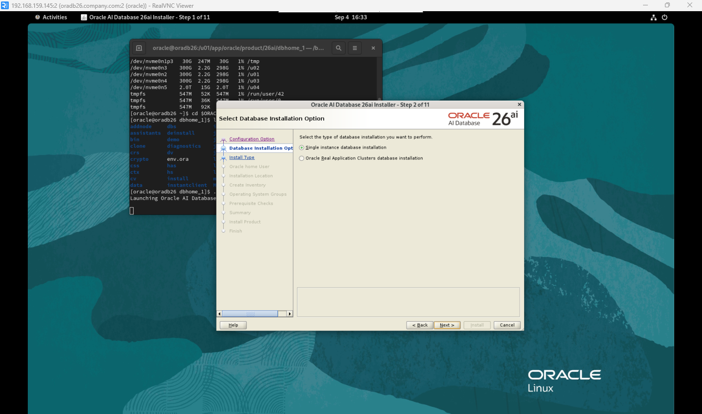

| Option | Description |
|--------|-------------|
| **Single instance database installation** *(select this)* | Standalone database on a single server |
| Oracle Real Application Clusters database installation | Multi-node clustered database |

Select **"Single instance database installation"** and click **"Next"**.

---

### Step 3: Specify Installation Location

This screen shows the **Oracle Base** path, pre-populated from `$ORACLE_BASE`. The step counter now reads "Step 3 of 9" since the edition-selection screen was skipped.


| Field | Value |
|-------|-------|
| **Oracle base** | `/u01/app/oracle` |
| **Software location** | `/u01/app/oracle/product/26ai/dbhome_1` |

Click **"Next"** — no changes required.

---

### Step 4: Create Inventory

On first-time installation on this host, OUI creates the **Oracle Central Inventory**.


| Field | Value |
|-------|-------|
| **Inventory Directory** | `/u01/app/oraInventory` |
| **oraInventory Group Name** | `oinstall` |

Click **"Next"** — no changes required.

---

### Step 5: Privileged Operating System Groups

This screen maps each Oracle system privilege to an OS group.

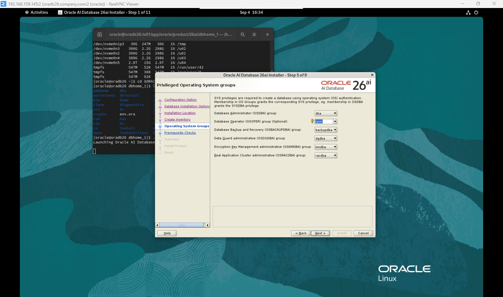

| Privilege | OS Group |
|-----------|----------|
| Database Administrator (OSDBA) | `dba` |
| Database Operator (OSOPER) — Optional | `oper` |
| Database Backup and Recovery (OSBACKUPDBA) | `backupdba` |
| Data Guard administrative (OSDGDBA) | `dgdba` |
| Encryption Key Management administrative (OSKMDBA) | `kmdba` |
| Real Application Cluster administrative (OSRACDBA) | `racdba` |

> **Note:** These groups only need to exist on the OS if selected here; this guide's pre-installation only created `oinstall`, `dba`, and `oper` (see the [Pre-Installation Guide, Part 7](oracle_database_26ai_pre_installation_guide_oraclelinux_9_6.md#part-7--create-oracle-os-groups-and-user)). Leave the unused privilege dropdowns at their defaults — Oracle only requires the groups actually referenced (`dba`, `oper`) to exist.

Click **"Next"**.

---

### Step 6: Root Script Configuration

This screen configures how OUI executes the post-installation root scripts. The step counter changes to "Step 6 of 10" at this point.

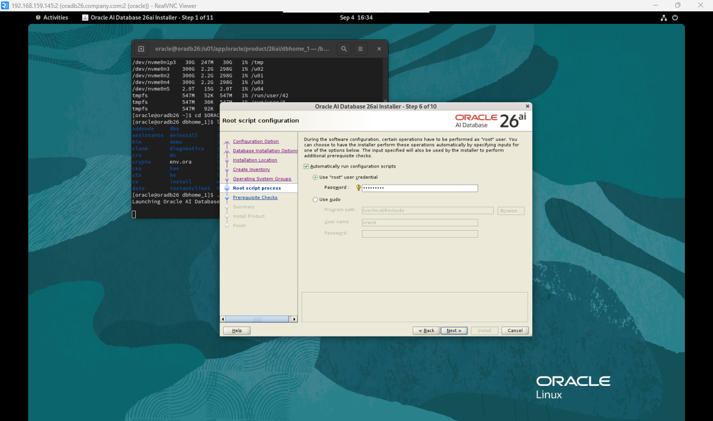

**Configuration:**

- Check **"Automatically run configuration scripts"**
- Select **"Use 'root' user credential"**
- Enter the `root` OS user password in the **Password** field

Click **"Next"**.

---

### Step 7: Perform Prerequisite Checks

OUI verifies that the system meets all Oracle Database installation requirements.

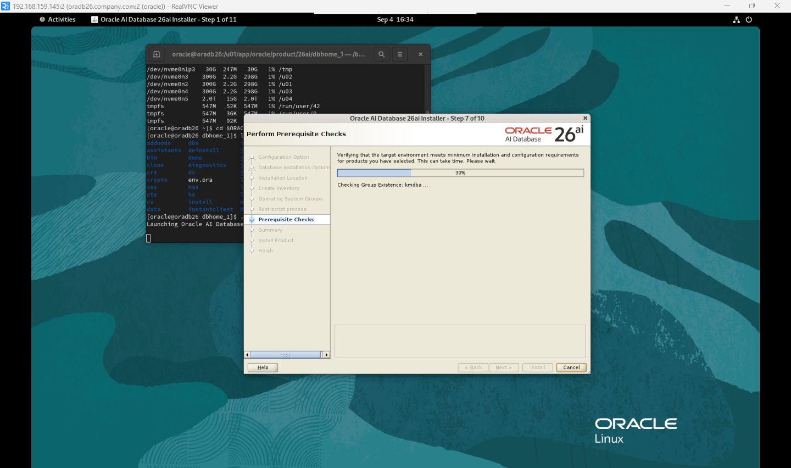

> If any check fails with a **warning**, you can typically proceed by checking "Ignore All". If a check shows a **failure** (not warning), resolve it before continuing.

When all checks pass, click **"Next"**.

---

### Step 8: Summary

Review the complete installation configuration before proceeding.

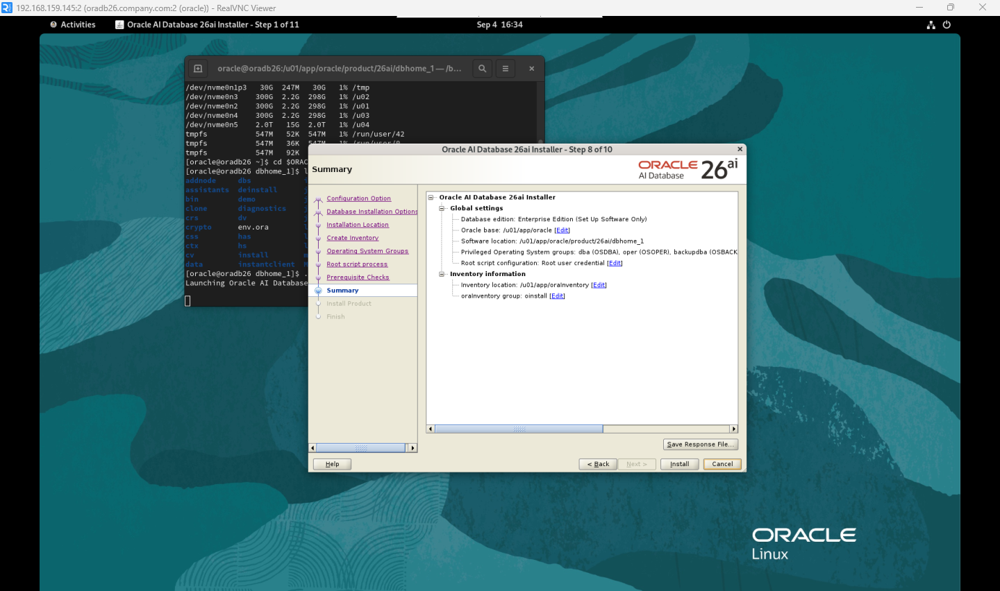

**Key items to verify:**

| Item | Expected Value |
|------|---------------|
| Database edition | Enterprise Edition (Set Up Software Only) |
| Oracle base | `/u01/app/oracle` |
| Software location | `/u01/app/oracle/product/26ai/dbhome_1` |
| Privileged Operating System groups | dba (OSDBA), oper (OSOPER), backupdba (OSBACK...) |
| Root script configuration | Root user credential |
| Inventory location | `/u01/app/oraInventory` |
| oraInventory group | `oinstall` |

If everything is correct, click **"Install"** to begin the installation.

---

### Step 9: Install Product

The installation progress screen shows real-time status as Oracle copies and links the software.

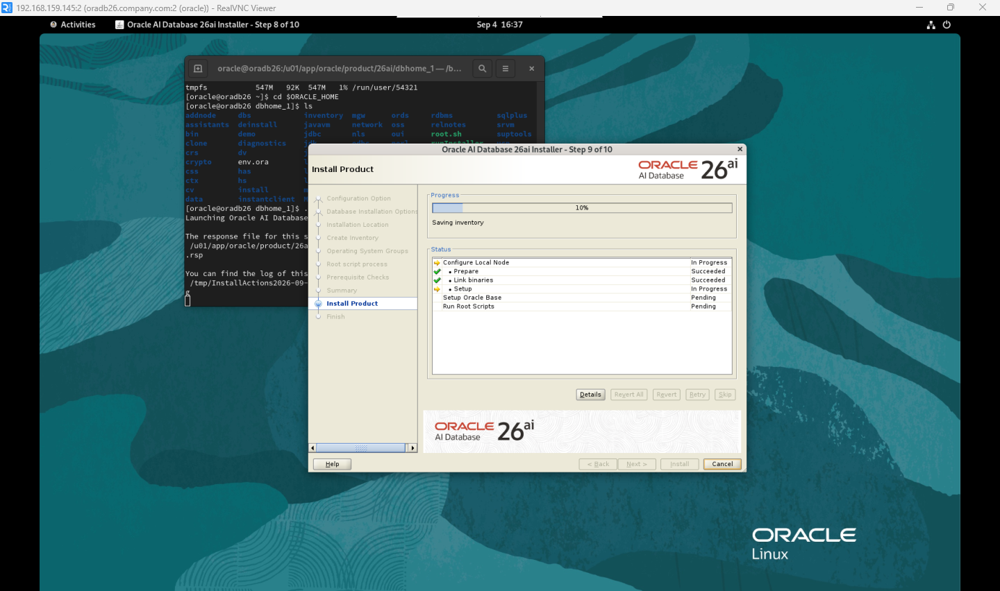

**Status stages shown:**

1. Configure Local Node → Prepare → Link binaries → Setup
2. Setup Oracle Base
3. Run Root Scripts

Partway through, OUI prompts for confirmation before running the root configuration scripts as `root`:

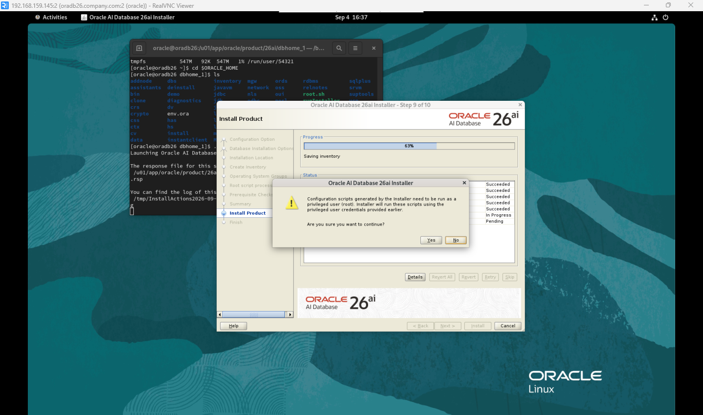

> **"Configuration scripts generated by the Installer need to be run as a privileged user (root). Installer will run these scripts using the privileged user credentials provided earlier. Are you sure you want to continue?"**

Click **"Yes"** to authorize OUI to run `orainstRoot.sh` and `root.sh` as `root`.

---

### Step 10: Finish

When all steps finish, the OUI Finish screen confirms Oracle Database 26ai software has been registered successfully.

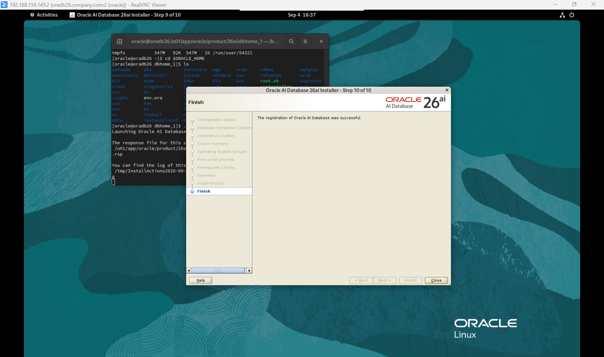

> **"The registration of Oracle AI Database was successful."**

Click **"Close"** to exit the Oracle Universal Installer.

---

## Part 3 — Create Oracle Net Listener (netca)

The **Oracle Net Listener** accepts incoming client connections and routes them to the appropriate database instance. Run netca from the terminal (as the `oracle` user):

```bash
[oracle@oradb26 dbhome_1]$ netca

Oracle Net Services Configuration:
```

**netca — Welcome Screen.** Select **"Listener configuration"** and click **"Next"**.

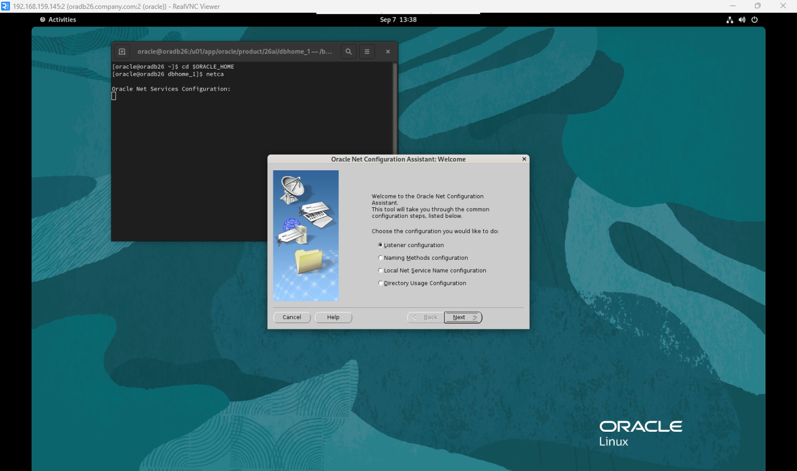

**netca — Listener Configuration, Listener.** Select **"Add"** to create a new listener. Click **"Next"**.


**netca — Listener Name.** Keep the default name `LISTENER`. Click **"Next"**.

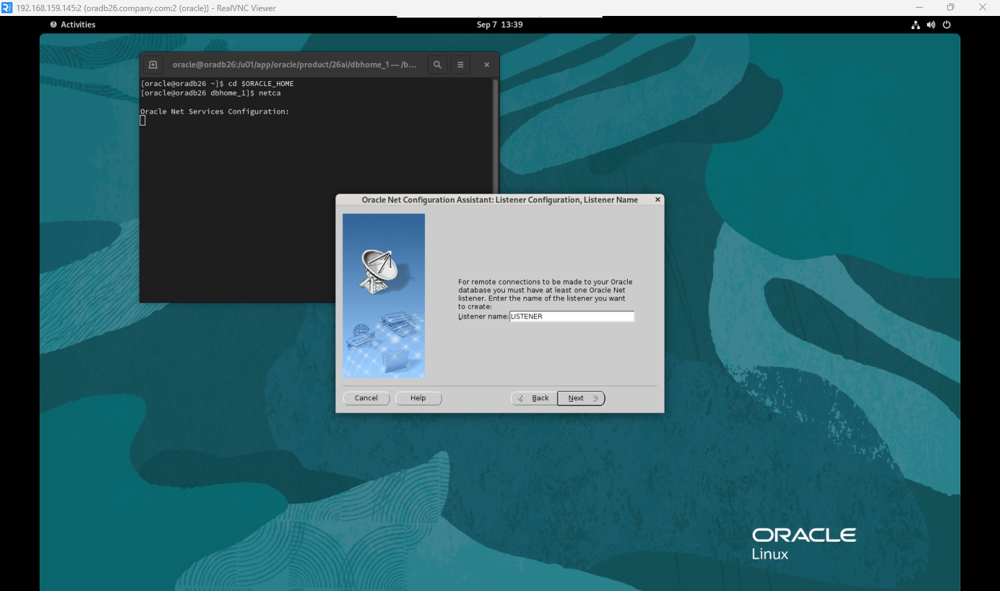

**netca — Select Protocols.** Keep **TCP** as the only selected protocol. Click **"Next"**.

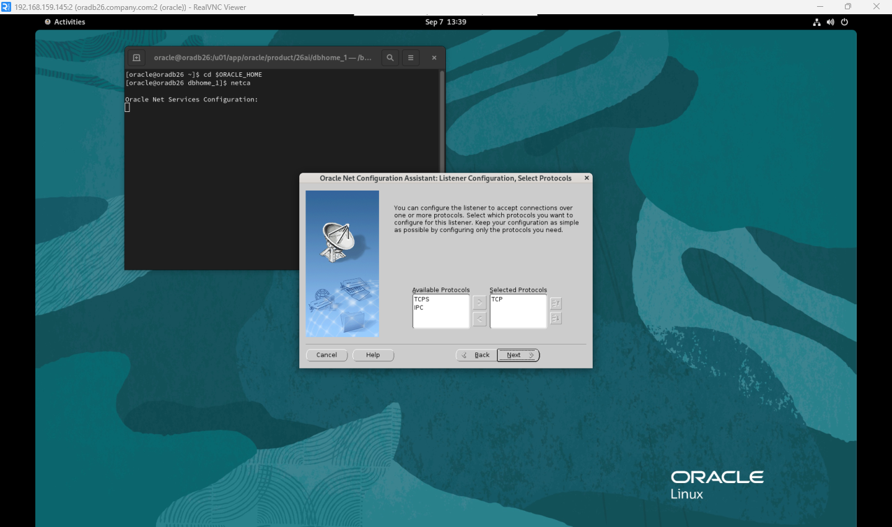

**netca — TCP/IP Protocol.** Select **"Use the standard port number of 1521"**. Click **"Next"**.


**netca — More Listeners?** Select **"No"**. Click **"Next"**.


**netca — Listener Configuration Done.** "Listener configuration complete!" is displayed. Click **"Next"**.


netca returns to the Welcome screen. Click **"Finish"** to close netca.

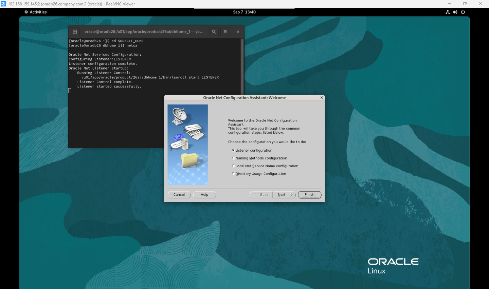

The terminal confirms the listener was created and started successfully:

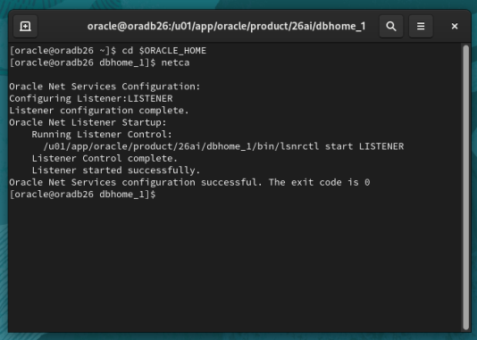

```
Oracle Net Services Configuration:
Configuring Listener:LISTENER
Listener configuration complete.
Oracle Net Listener Startup:
    Running Listener Control:
      /u01/app/oracle/product/26ai/dbhome_1/bin/lsnrctl start LISTENER
    Listener Control complete.
    Listener started successfully.
Oracle Net Services configuration successful. The exit code is 0
[oracle@oradb26 dbhome_1]$
```

> If port 1521 is already occupied by another service on your host, select "Use another port number" in the TCP/IP Protocol screen instead, and update your `tnsnames.ora` and firewall rules accordingly.

---

## Part 4 — Verify Listener Status

After netca completes, verify that the listener is running and accepting connections:

```bash
[oracle@oradb26 dbhome_1]$ lsnrctl status
LSNRCTL for Linux: Version 23.26.1.0.0 - Production on 07-SEP-2026 13:41:40

Copyright (c) 1991, 2026, Oracle.  All rights reserved.

Connecting to (DESCRIPTION=(ADDRESS=(PROTOCOL=TCP)(HOST=oradb26.company.com)(PORT=1521)))
STATUS of the LISTENER
------------------------
Alias                     LISTENER
Version                   TNSLSNR for Linux: Version 23.26.1.0.0 - Production
Start Date                07-SEP-2026 13:40:24
Uptime                    0 days 0 hr. 1 min. 16 sec
Trace Level               off
Security                  ON: Local OS Authentication
SNMP                      OFF
Listener Parameter File   /u01/app/oracle/product/26ai/dbhome_1/network/admin/listener.ora
Listener Log File         /u01/app/oracle/diag/tnslsnr/oradb26/listener/alert/log.xml
Listening Endpoints Summary...
  (DESCRIPTION=(ADDRESS=(PROTOCOL=tcp)(HOST=oradb26.company.com)(PORT=1521)))
  (DESCRIPTION=(ADDRESS=(PROTOCOL=ipc)(KEY=EXTPROC1521)))
The listener supports no services
The command completed successfully
```

> At this point, no database services are registered with the listener yet — the database has not been created. After DBCA creates the database in Part 5, the instance will automatically register its services with the listener.

---

## Part 5 — Create Oracle Database (DBCA)

The **Database Configuration Assistant (DBCA)** creates the **Container Database (CDB)** `orcl26ai` and the first **Pluggable Database (PDB)** `orcl26aipdb1`. Launch DBCA from the terminal:

```bash
[oracle@oradb26 dbhome_1]$ dbca
```

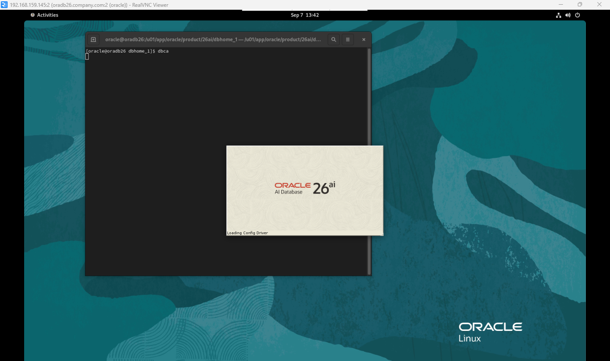

> DBCA on 26ai is also a dynamic wizard — the sidebar lists up to 15 steps, but the exact count depends on the options chosen along the way (for example, "Database Options" and "Data Vault Option" only appear under certain configurations).

---

### Step 1: Select Database Operation


Select **"Create a database"** and click **"Next"**.

---

### Step 2: Select Database Creation Mode

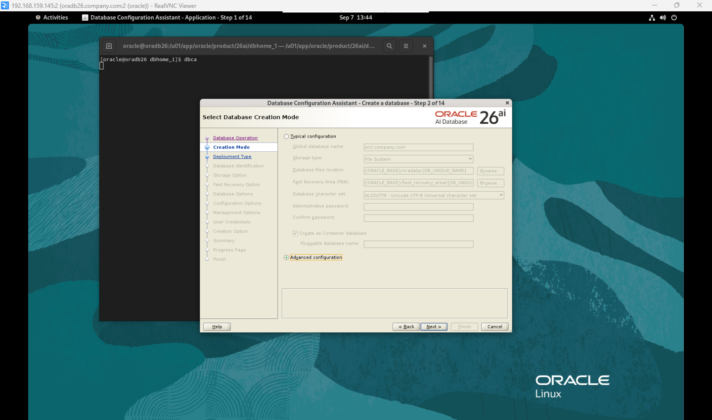

| Mode | Description |
|------|-------------|
| Typical configuration | Creates a database with pre-set defaults — minimal interaction |
| **Advanced configuration** *(select this)* | Full control over all database parameters |

Select **"Advanced configuration"** and click **"Next"**.

---

### Step 3: Select Database Deployment Type

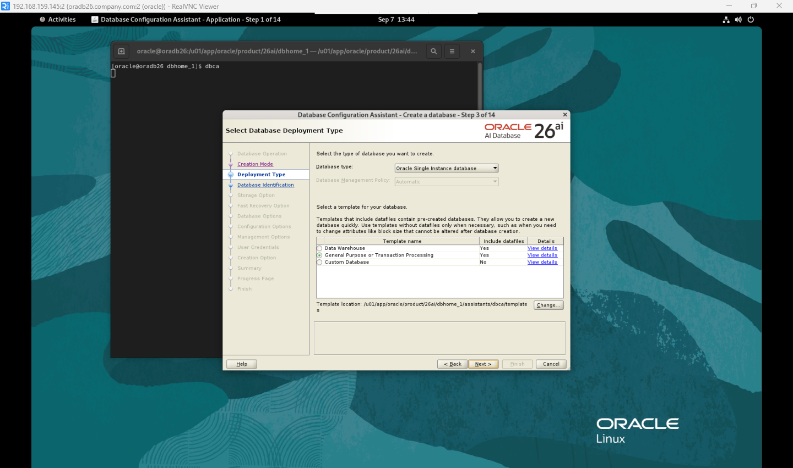

| Field | Value |
|-------|-------|
| **Database type** | Oracle Single Instance database |
| **Database Management Policy** | Automatic |
| **Template** | General Purpose or Transaction Processing |

Click **"Next"**.

---

### Step 4: Specify Database Identification Details

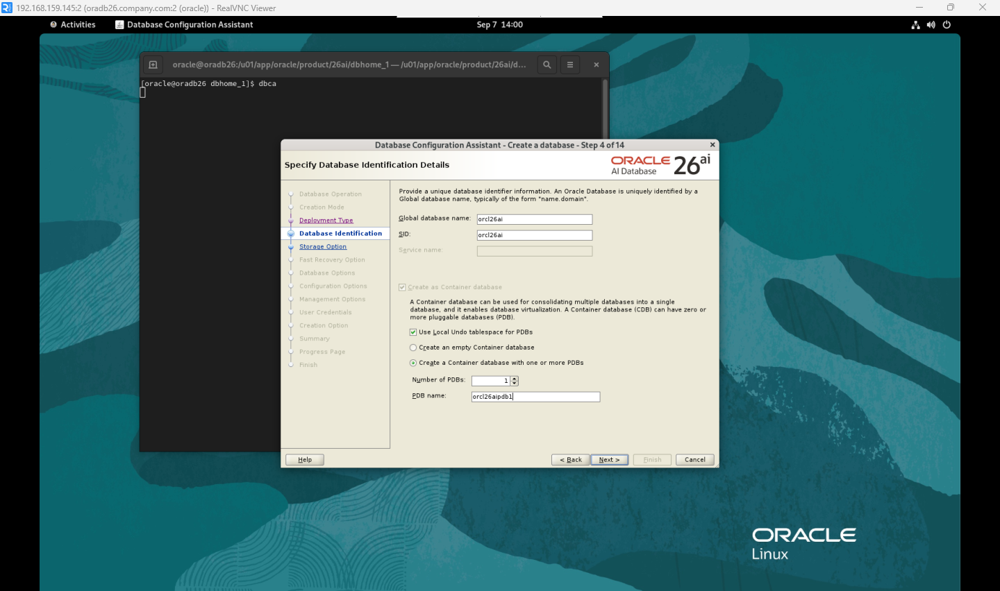

| Field | Value | Description |
|-------|-------|-------------|
| **Global database name** | `orcl26ai` | Unique database identifier |
| **SID** | `orcl26ai` | Instance identifier |
| **Create as Container database** | ✅ Checked | Creates a CDB |
| **Use Local Undo tablespace for PDBs** | ✅ Checked | Each PDB gets its own local undo tablespace (multitenant local undo mode) |
| **Create a Container database with one or more PDBs** | ✅ Selected | |
| **Number of PDBs** | `1` | |
| **PDB name** | `orcl26aipdb1` | |

Click **"Next"**.

---

### Step 5: Select Database Storage Option

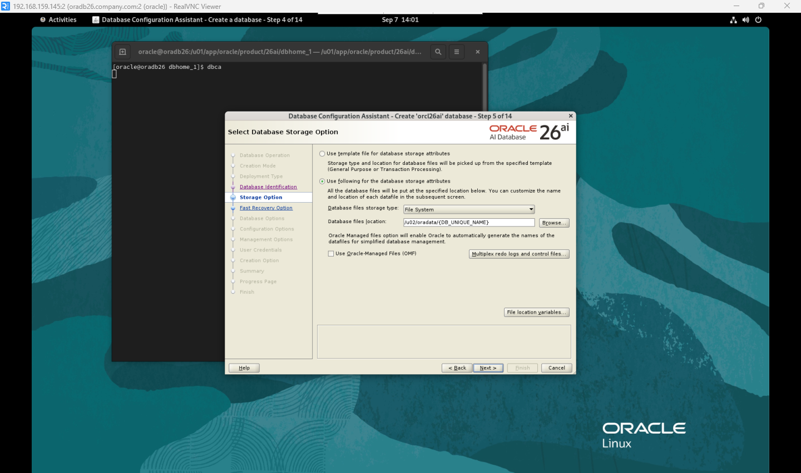

Select **"Use following for the database storage attributes"** and verify the database files location resolves to `/u02/oradata/{DB_UNIQUE_NAME}`. Click **"Next"**.

---

### Step 6: Select Fast Recovery Option

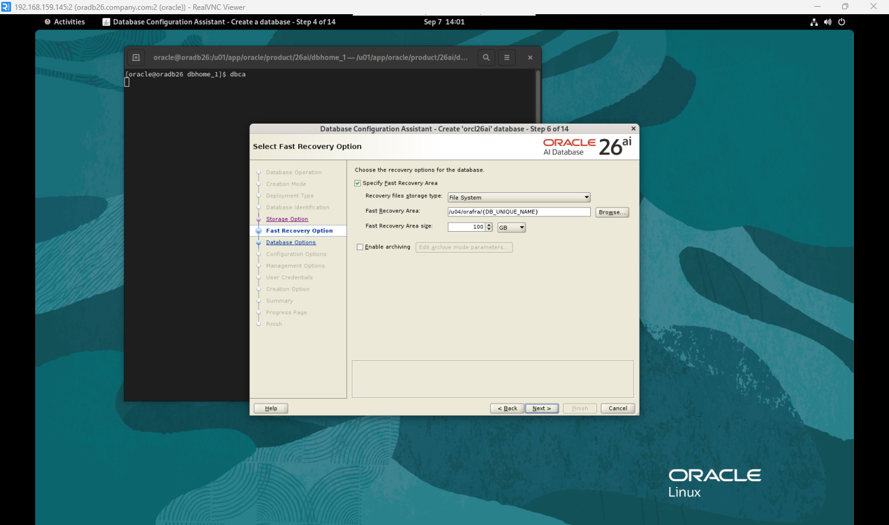

| Field | Value |
|-------|-------|
| **Specify Fast Recovery Area** | ✅ Checked |
| **Fast Recovery Area** | `/u04/orafra/{DB_UNIQUE_NAME}` |
| **Fast Recovery Area size** | `100 GB` |
| **Enable archiving** | ☐ Unchecked |

Click **"Next"**.

> **Archiving left disabled in this run.** Unlike the 19c guide, `ARCHIVELOG` mode was **not** enabled here. For any database intended to hold important data, or where online (hot) RMAN backups and Oracle Data Guard are required, check **"Enable archiving"** on this screen before proceeding.

---

### Step 7: Specify Network Configuration Details

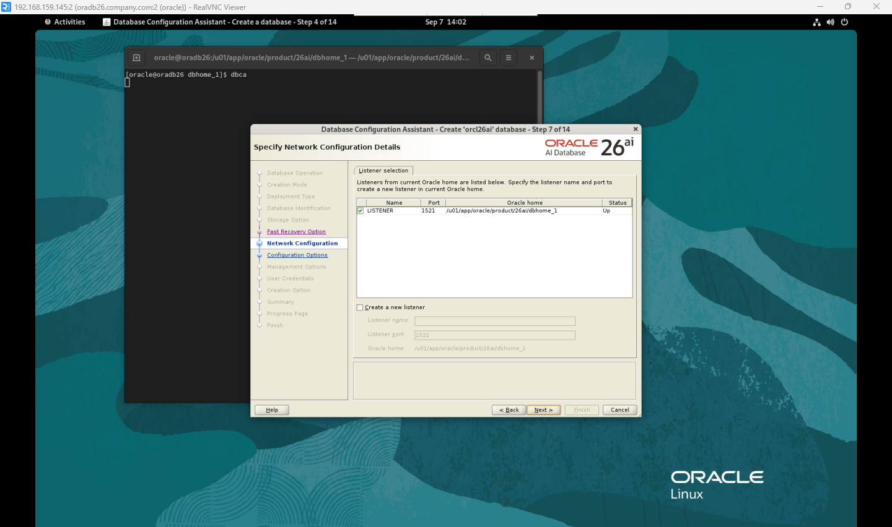

The `LISTENER` created by netca in Part 3 is listed with status **Up** on port **1521**. Ensure it is selected. Click **"Next"**.

---

### Step 8: Select Oracle Data Vault Config Option

The step counter changes to "Step 8 of 15" here — this screen is new compared to the Oracle Database 19c wizard.

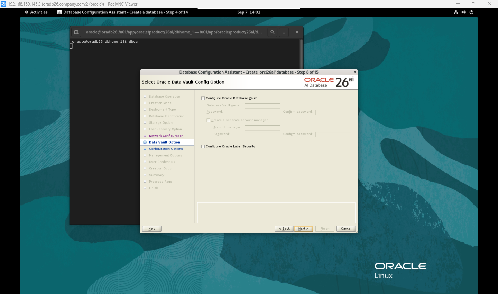

| Option | Description |
|--------|-------------|
| Configure Oracle Database Vault | Restricts privileged (SYSDBA) access to application data via realms — left unchecked for this standard deployment |
| Configure Oracle Label Security | Row-level data classification/labeling — left unchecked for this standard deployment |

Leave both options unchecked and click **"Next"**.

---

### Step 9: Specify Configuration Options

DBCA provides sub-tabs for detailed database configuration: **Memory**, **Sizing**, **Character sets**, and **Connection mode**.


**Tab 1 — Memory:**

| Setting | Value | Description |
|---------|-------|-------------|
| **Use Automatic Shared Memory Management** | ✅ Selected | Oracle automatically manages SGA and PGA allocation |
| **SGA size** | `1638 MB` | |
| **PGA size** | `547 MB` | |

> The **Sizing**, **Character sets**, and **Connection mode** tabs were left at their defaults for this installation (block size 8192 bytes, `AL32UTF8` database character set, and Dedicated Server mode, consistent with Oracle's standard recommendations).

Click **"Next"**.

---

### Step 10: Specify Management Options


| Setting | Value |
|---------|-------|
| **Register with Enterprise Manager (EM) cloud control** | ☐ Unchecked |

No Enterprise Manager Cloud Control repository was registered for this installation. Click **"Next"**.

---

### Step 11: Specify Database User Credentials

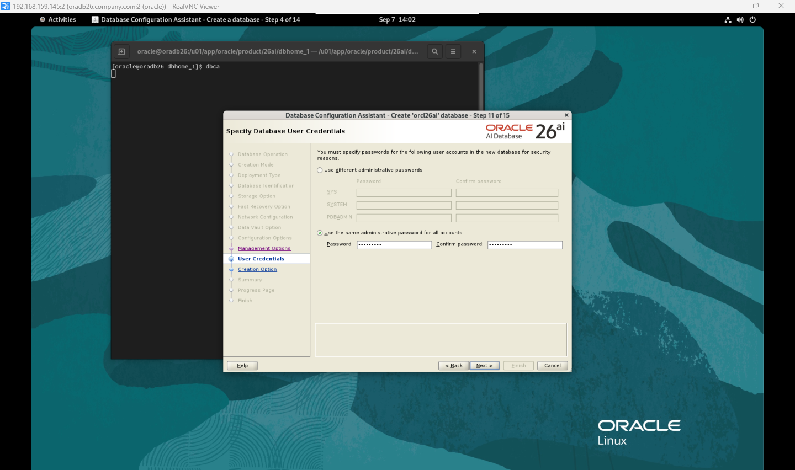

| Option | Description |
|--------|-------------|
| **Use the same administrative password for all accounts** *(selected)* | Sets a single password for SYS, SYSTEM, and PDBADMIN |
| Use different administrative passwords | Individual passwords per account |

Enter a strong password and confirm it. Click **"Next"**.

> **Password requirements:** Minimum 8 characters; must include at least one uppercase letter, one lowercase letter, one digit, and one special character.

---

### Step 12: Select Database Creation Option

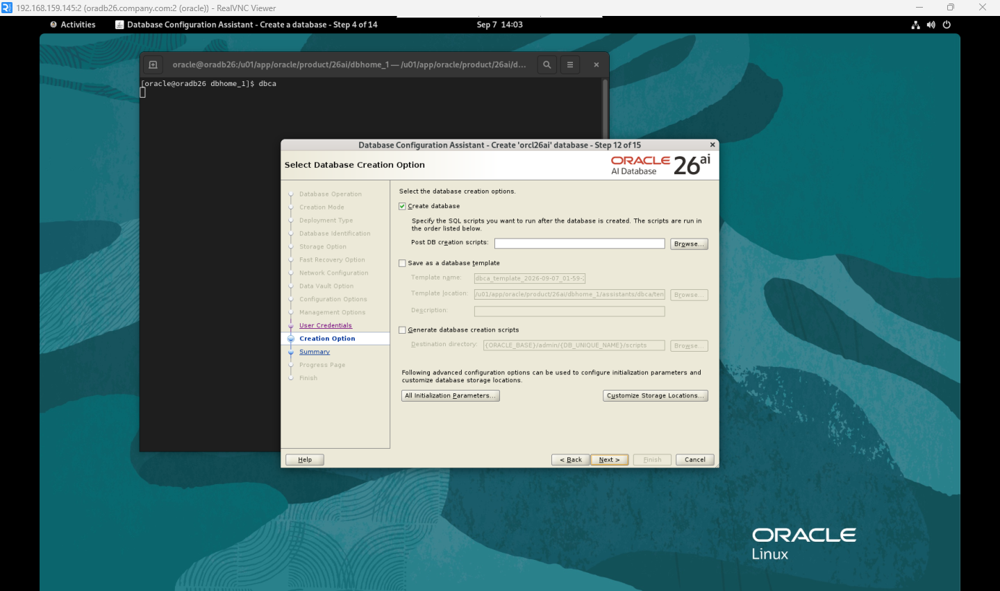

| Option | Description |
|--------|-------------|
| **Create database** *(checked)* | DBCA creates the database immediately after summary confirmation |
| Save as a database template | Not selected |
| Generate database creation scripts | Not selected |

Ensure **"Create database"** is checked and click **"Next"**.

---

### Step 13: Summary

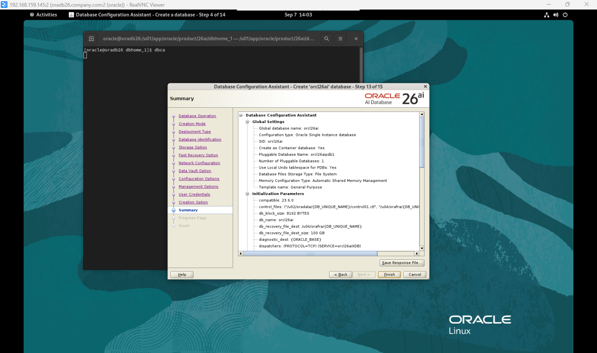

**Pre-creation checklist (from the Global Settings section):**

| Item | Expected Value |
|------|---------------|
| Global database name | `orcl26ai` |
| Configuration type | Oracle Single Instance database |
| SID | `orcl26ai` |
| Create as Container database | Yes |
| Pluggable Database Name | `orcl26aipdb1` |
| Number of Pluggable Databases | 1 |
| Use Local Undo tablespace for PDBs | Yes |
| Database Files Storage Type | File System |
| Memory Configuration Type | Automatic Shared Memory Management |
| Template name | General Purpose |

**Selected initialization parameters (from the Summary detail pane):**

| Parameter | Value |
|-----------|-------|
| `compatible` | `23.6.0` |
| `control_files` | `/u02/oradata/{DB_UNIQUE_NAME}/control01.ctl`, `/u04/orafra/{DB_UNIQUE_NAME}/...` |
| `db_block_size` | `8192 BYTES` |
| `db_name` | `orcl26ai` |
| `db_recovery_file_dest` | `/u04/orafra/{DB_UNIQUE_NAME}` |
| `db_recovery_file_dest_size` | `100 GB` |
| `diagnostic_dest` | `{ORACLE_BASE}` |

Click **"Finish"** to begin database creation.

---

### Step 14: Progress Page

DBCA creates the database in multiple sequential stages.

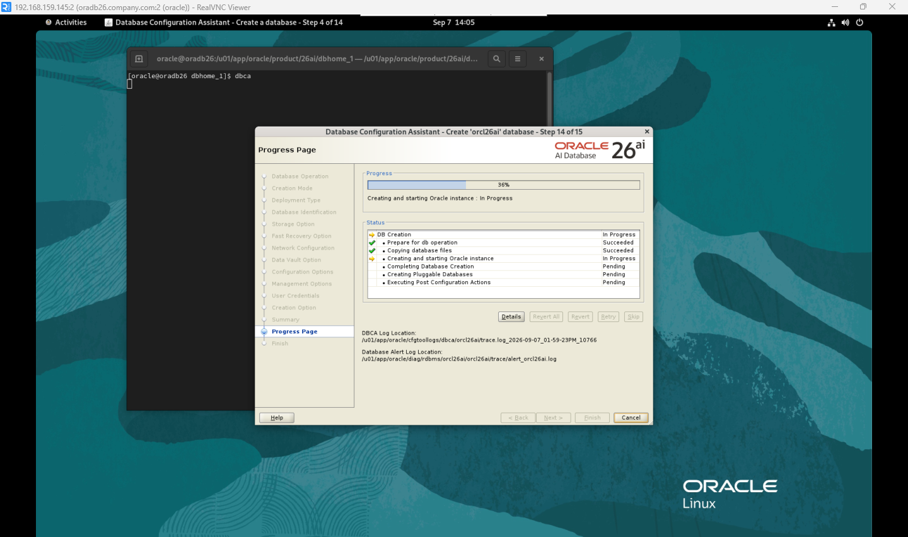

**Creation stages performed by DBCA:**

| Stage | Status (as captured) |
|-------|----------------------|
| Prepare for db operation | Succeeded |
| Copying database files | Succeeded |
| Creating and starting Oracle instance | In Progress |
| Completing Database Creation | Pending |
| Creating Pluggable Databases | Pending |
| Executing Post Configuration Actions | Pending |

| Log | Location |
|-----|----------|
| **DBCA log** | `/u01/app/oracle/cfgtoollogs/dbca/orcl26ai/trace.log_...` |
| **Database alert log** | `/u01/app/oracle/diag/rdbms/orcl26ai/orcl26ai/trace/alert_orcl26ai.log` |

> **Duration:** Database creation can take considerable time depending on VM disk I/O performance — monitor the progress bar and the alert log.

---

### Step 15: Finish

When all stages complete, DBCA displays the finish screen with a summary of the newly created database.

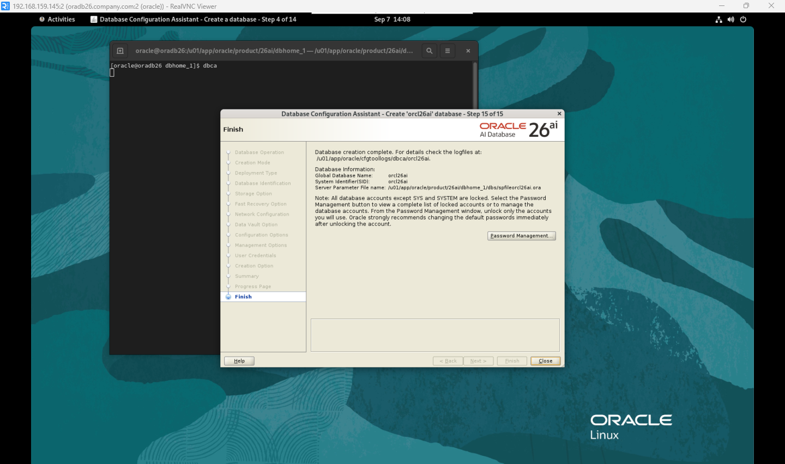

**Database creation results:**

| Item | Value |
|------|-------|
| **Global Database Name** | `orcl26ai` |
| **System Identifier (SID)** | `orcl26ai` |
| **Server Parameter File** | `/u01/app/oracle/product/26ai/dbhome_1/dbs/spfileorcl26ai.ora` |
| **Log files** | `/u01/app/oracle/cfgtoollogs/dbca/orcl26ai` |

> **"All database accounts except SYS and SYSTEM are locked."** Use the **Password Management** button to view the complete list of locked accounts and unlock only the ones you plan to use. Oracle strongly recommends changing the default passwords immediately after unlocking any account.

Click **"Close"** to exit DBCA.

---

## Part 6 — Verify Database Connection and Network Configuration

### 6.1 Verify SQL*Plus Connection

Confirm the `ORACLE_SID` environment variable and connect to the database as SYSDBA:

```bash
[oracle@oradb26 ~]$ echo $ORACLE_SID
orcl26ai
[oracle@oradb26 ~]$ sqlplus / as sysdba

SQL*Plus: Release 23.26.1.0.0 - Production on Mon Sep 7 14:10:22 2026
Version 23.26.1.0.0

Copyright (c) 1982, 2025, Oracle.  All rights reserved.

Connected to:
Oracle AI Database 26ai Enterprise Edition Release 23.26.1.0.0 - Production
Version 23.26.1.0.0

SQL> exit
Disconnected from Oracle AI Database 26ai Enterprise Edition Release 23.26.1.0.0 - Production
Version 23.26.1.0.0
```

**Verification checklist:**

| Check | Expected Result |
|-------|----------------|
| SQL*Plus connects without error | `Connected to: Oracle AI Database 26ai...` |
| Edition | `Enterprise Edition` |
| Version | `23.26.1.0.0` |

---

### 6.2 Review the Generated tnsnames.ora

DBCA and netca automatically generate connection entries in `tnsnames.ora` for the CDB service. Review the file:

```bash
[oracle@oradb26 ~]$ cat $ORACLE_HOME/network/admin/tnsnames.ora
# tnsnames.ora Network Configuration File: /u01/app/oracle/product/26ai/dbhome_1/network/admin/tnsnames.ora
# Generated by Oracle configuration tools.

ORCL26AI =
  (DESCRIPTION =
    (ADDRESS = (PROTOCOL = TCP)(HOST = oradb26.company.com)(PORT = 1521))
    (CONNECT_DATA =
      (SERVER = DEDICATED)
      (SERVICE_NAME = orcl26ai)
    )
  )

LISTENER_ORCL26AI =
  (ADDRESS = (PROTOCOL = TCP)(HOST = oradb26.company.com)(PORT = 1521))
```

> **Note:** Only the CDB service (`ORCL26AI`) is generated automatically. The PDB service (`orcl26aipdb1`) needs its own `tnsnames.ora` entry, added manually in the next step, before client tools can connect to the PDB by alias.

---

### 6.3 Add the PDB Service to tnsnames.ora

Edit the file to add a connection descriptor for the PDB:

```bash
[oracle@oradb26 ~]$ vi $ORACLE_HOME/network/admin/tnsnames.ora
```

Verify the updated file:

```bash
[oracle@oradb26 ~]$ cat $ORACLE_HOME/network/admin/tnsnames.ora
# tnsnames.ora Network Configuration File: /u01/app/oracle/product/26ai/dbhome_1/network/admin/tnsnames.ora
# Generated by Oracle configuration tools.

ORCL26AI =
  (DESCRIPTION =
    (ADDRESS = (PROTOCOL = TCP)(HOST = oradb26.company.com)(PORT = 1521))
    (CONNECT_DATA =
      (SERVER = DEDICATED)
      (SERVICE_NAME = orcl26ai)
    )
  )

ORCL26AIPDB1 =
  (DESCRIPTION =
    (ADDRESS = (PROTOCOL = TCP)(HOST = oradb26.company.com)(PORT = 1521))
    (CONNECT_DATA =
      (SERVER = DEDICATED)
      (SERVICE_NAME = orcl26aipdb1)
    )
  )

LISTENER_ORCL26AI =
  (ADDRESS = (PROTOCOL = TCP)(HOST = oradb26.company.com)(PORT = 1521))
[oracle@oradb26 ~]#
```

| Alias | Service Name | Purpose |
|-------|-------------|---------|
| `ORCL26AI` | `orcl26ai` | Connects to the CDB (root container) |
| `ORCL26AIPDB1` | `orcl26aipdb1` | Connects directly to the `orcl26aipdb1` PDB |

---

### 6.4 Verify Connectivity with tnsping

Test both aliases using `tnsping`:

```bash
[oracle@oradb26 ~]$ tnsping orcl26ai

TNS Ping Utility for Linux: Version 23.26.1.0.0 - Production on 07-SEP-2026 14:14:21

Copyright (c) 1997, 2026, Oracle.  All rights reserved.

Used parameter files:

Used TNSNAMES adapter to resolve the alias
Attempting to contact (DESCRIPTION = (ADDRESS = (PROTOCOL = TCP)(HOST = oradb26.company.com)(PORT = 1521)) (CONNECT_DATA = (SERVER = DEDICATED) (SERVICE_NAME = orcl26ai)))
OK (10 msec)
```

```bash
[oracle@oradb26 ~]$ tnsping orcl26aipdb1

TNS Ping Utility for Linux: Version 23.26.1.0.0 - Production on 07-SEP-2026 14:14:25

Copyright (c) 1997, 2026, Oracle.  All rights reserved.

Used parameter files:

Used TNSNAMES adapter to resolve the alias
Attempting to contact (DESCRIPTION = (ADDRESS = (PROTOCOL = TCP)(HOST = oradb26.company.com)(PORT = 1521)) (CONNECT_DATA = (SERVER = DEDICATED) (SERVICE_NAME = orcl26aipdb1)))
OK (0 msec)
[oracle@oradb26 ~]#
```

Both aliases respond `OK`, confirming the listener correctly resolves and routes connections to both the CDB and the PDB.

---

## Summary of Installation

| Category | Item | Value |
|----------|------|-------|
| **Software** | Oracle Database Version | 26ai (23.26.1.0.0) |
| **Software** | Edition | Enterprise Edition |
| **Software** | Oracle Home | `/u01/app/oracle/product/26ai/dbhome_1` |
| **Software** | Oracle Base | `/u01/app/oracle` |
| **Software** | Oracle Inventory | `/u01/app/oraInventory` |
| **Database** | Global DB Name | `orcl26ai` |
| **Database** | Oracle SID | `orcl26ai` |
| **Database** | Type | Container Database (CDB) |
| **Database** | PDB Name | `orcl26aipdb1` |
| **Database** | Local Undo for PDBs | Enabled |
| **Database** | Archive Mode | Not enabled (see [Step 6](#step-6-select-fast-recovery-option)) |
| **Storage** | Data Files | `/u02/oradata` |
| **Storage** | Fast Recovery Area | `/u04/orafra` (100 GB) |
| **Network** | Listener Name | `LISTENER` |
| **Network** | Listener Port | `1521` |
| **Network** | `tnsnames.ora` aliases | `ORCL26AI` (CDB), `ORCL26AIPDB1` (PDB) |
| **Security** | Data Vault / Label Security | Not configured |
| **Management** | EM Cloud Control | Not registered |

---

## Next Steps

Oracle Database 26ai is now installed and the initial database is created. Proceed to the post-installation phase:

| Stage | Document | Status | Description |
|-------|----------|--------|-------------|
| **1** | [Oracle Linux 9.6 OS Installation Guide](https://github.com/seeomkus/linux-installation/blob/main/oraclelinux-9-for-oracle-database/oraclelinux_9_6_os_installation_guide.md) | ✅ Complete | Operating system installation |
| **2** | [Oracle Database 26ai Pre-Installation Guide](oracle_database_26ai_pre_installation_guide_oraclelinux_9_6.md) | ✅ Complete | OS pre-configuration |
| **3** | **Oracle Database 26ai Installation Guide** *(this document)* | ✅ Complete | Software installation and database creation |
| **4** | [Oracle Database 26ai Post-Installation Guide](oracle_database_26ai_post_installation_guide_oraclelinux_9_6.md) | ✅ Complete | Auto-start via systemd, PDB persistence, initial RMAN backup |

**Recommended post-installation tasks:**

1. Configure database auto-startup on system boot via `/etc/oratab` and `dbstart`/`dbshut` scripts
2. Verify all PDB services are registered with the listener: `lsnrctl services`
3. Open the PDB and save its open state: `ALTER PLUGGABLE DATABASE orcl26aipdb1 OPEN; ALTER PLUGGABLE DATABASE orcl26aipdb1 SAVE STATE;`
4. Decide whether `ARCHIVELOG` mode should be enabled for this environment, and enable it if RMAN online backups or Data Guard are planned
5. Run an initial RMAN backup to establish a recovery baseline
6. Review and adjust `init.ora` parameters (memory, processes, undo) for your workload

---

## References

### 1. Oracle Database 26ai — Official Documentation

| Document | URL |
|----------|-----|
| **Oracle Database Installation Guide for Linux** | https://docs.oracle.com/en/database/oracle/oracle-database/ |
| **Oracle Universal Installer Concepts Guide** | https://docs.oracle.com/en/database/oracle/oracle-database/ |
| **Oracle DBCA Guide** | https://docs.oracle.com/en/database/oracle/oracle-database/ |
| **Oracle Net Services Administrator's Guide** | https://docs.oracle.com/en/database/oracle/oracle-database/ |
| **My Oracle Support (MOS)** | https://support.oracle.com |

### 2. Oracle Database Administration

| Document | URL |
|----------|-----|
| **Oracle Multitenant Administrator's Guide (CDB/PDB)** | https://docs.oracle.com/en/database/oracle/oracle-database/ |
| **Oracle Database Administrator's Guide** | https://docs.oracle.com/en/database/oracle/oracle-database/ |
| **Oracle Database Backup and Recovery (RMAN)** | https://docs.oracle.com/en/database/oracle/oracle-database/ |
| **Oracle Database Vault Administrator's Guide** | https://docs.oracle.com/en/database/oracle/oracle-database/ |

### 3. Supporting Tools

| Tool | Purpose | URL |
|------|---------|-----|
| **RealVNC Viewer** | VNC client — access GNOME desktop for OUI and DBCA | https://www.realvnc.com/en/connect/download/viewer/ |
| **PuTTY** | SSH terminal access | https://www.putty.org/ |
| **WinSCP** | SFTP/SCP file transfer — upload the Oracle installer archive | https://winscp.net/ |
| **MobaXterm** | All-in-one SSH + SFTP + X11 forwarding | https://mobaxterm.mobatek.net/ |
