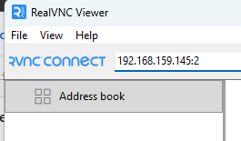
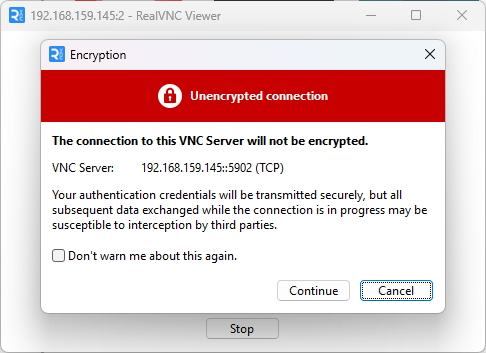
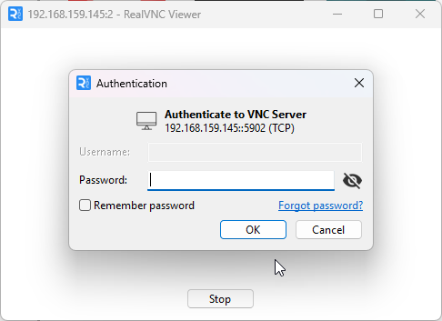

# Oracle Database 26ai Pre-Installation Guide — Oracle Linux 9.6

> **Platform:** Oracle Linux 9.6 on VMware Workstation 16.0.0 | **Purpose:** System preparation before Oracle Database 26ai (AI) installation

| | |
|---|---|
| **Document** | Pre-Installation Guide |
| **OS Version** | Oracle Linux 9.6 |
| **Platform** | VMware Workstation 16.0.0 |
| **Oracle Version** | Oracle Database 26ai |
| **Kernel** | Oracle Linux 9.6 default kernel (UEK or RHCK) |
| **Architecture** | x86-64 |

---

## Table of Contents

1. [Overview](#1-overview)
2. [Prerequisites](#2-prerequisites)
   - [2.1 System Assumptions](#21-system-assumptions)
   - [2.2 Server Storage Layout](#22-server-storage-layout)
3. [Part 1 — Verify Network and Hostname Configuration](#part-1--verify-network-and-hostname-configuration)
   - [1.1 Configure /etc/hosts](#11-configure-etchosts)
   - [1.2 Verify Hostname Resolution](#12-verify-hostname-resolution)
   - [1.3 Verify the System Hostname](#13-verify-the-system-hostname)
4. [Part 2 — Install the Oracle Preinstallation Package (Automatic Setup)](#part-2--install-the-oracle-preinstallation-package-automatic-setup)
5. [Part 3 — Disable SELinux](#part-3--disable-selinux)
6. [Part 4 — Verify Kernel Parameters](#part-4--verify-kernel-parameters)
7. [Part 5 — Verify OS Resource Limits](#part-5--verify-os-resource-limits)
8. [Part 6 — Install Complete Oracle Package Dependencies (Detailed Method)](#part-6--install-complete-oracle-package-dependencies-detailed-method)
9. [Part 7 — Create Oracle OS Groups and User](#part-7--create-oracle-os-groups-and-user)
10. [Part 8 — Disable Firewall](#part-8--disable-firewall)
11. [Part 9 — Update Operating System and Reboot](#part-9--update-operating-system-and-reboot)
12. [Part 10 — Storage Configuration](#part-10--storage-configuration)
    - [10.1 Verify Current Disk Layout](#101-verify-current-disk-layout)
    - [10.2 Create Mount Points](#102-create-mount-points)
    - [10.3 Format Additional Filesystems (XFS)](#103-format-additional-filesystems-xfs)
    - [10.4 Mount Filesystems](#104-mount-filesystems)
    - [10.5 Retrieve Disk UUIDs](#105-retrieve-disk-uuids)
    - [10.6 Configure /etc/fstab for Persistent Mounts](#106-configure-etcfstab-for-persistent-mounts)
    - [10.7 Verify Final Storage Layout](#107-verify-final-storage-layout)
13. [Part 11 — Create Oracle Directory Structure](#part-11--create-oracle-directory-structure)
14. [Part 12 — Set Directory Permissions and Ownership](#part-12--set-directory-permissions-and-ownership)
15. [Part 13 — Configure Oracle Environment Variables](#part-13--configure-oracle-environment-variables)
16. [Part 14 — Create Oracle Startup and Shutdown Scripts](#part-14--create-oracle-startup-and-shutdown-scripts)
17. [Part 15 — Install and Configure VNC Server](#part-15--install-and-configure-vnc-server)
18. [Summary of Pre-Installation Configurations](#summary-of-pre-installation-configurations)
19. [Next Steps](#next-steps)
20. [References](#references)

---

## 1. Overview

This guide provides detailed, step-by-step instructions for preparing an **Oracle Linux 9.6** system to host **Oracle Database 26ai**. All steps described in this document must be completed **before** running the Oracle Universal Installer (OUI).

The pre-installation phase covers:

- Verifying network and hostname configuration
- Installing OS packages and libraries via the Oracle preinstallation package (automatic setup)
- Disabling SELinux and the system firewall
- Verifying kernel parameters and OS resource limits
- Preparing and mounting dedicated storage volumes
- Creating the Oracle OS user, groups, and directory structure
- Setting up Oracle environment variables and automation scripts
- Installing and configuring a VNC Server for graphical installer access

> **Important:** All commands in this guide must be executed as the **`root`** user unless explicitly stated otherwise. Always verify the output of each step before proceeding to the next.

> **What's different for 26ai?** Starting with recent Oracle Database releases, Oracle publishes a dedicated **preinstallation RPM package** (`oracle-ai-database-preinstall-26ai`) that automatically configures kernel parameters, OS resource limits, the required OS groups/user, and most OS package dependencies in a single command. This guide still walks through every step individually — as in the Oracle Database 19c series — so that each configuration item can be verified and understood, but the underlying mechanism (automatic package vs. manual editing) is called out where it differs from the 19c guide.

---

## 2. Prerequisites

### 2.1 System Assumptions

This guide assumes the following conditions are already in place before starting:

| Item | Status |
|------|--------|
| Oracle Linux 9.6 installed and booted successfully | ✅ Complete — see [Oracle Linux 9.6 OS Installation Guide](https://github.com/seeomkus/linux-installation/blob/main/oraclelinux-9-for-oracle-database/oraclelinux_9_6_os_installation_guide.md) |
| Network interface configured with IP `192.168.159.145/24` | ✅ Complete |
| Hostname set to `oradb26.company.com` | ✅ Complete |
| Internet connectivity available for `dnf` package installation | ✅ Verified |
| Logged in to the server as `root` | Required |

---

### 2.2 Server Storage Layout

This server is equipped with **five NVMe disks**. The first disk (`nvme0n1`) was partitioned during OS installation. The four remaining raw disks are reserved exclusively for Oracle Database storage.

| Device | Size | Purpose | Mount Point |
|--------|------|---------|-------------|
| `nvme0n1` | 300 GB | OS disk — partitioned during OS installation | `/`, `/boot`, `/home`, `/tmp`, `[SWAP]` |
| `nvme0n2` | 300 GB | Oracle software and binaries | `/u01` |
| `nvme0n3` | 300 GB | Oracle database data files | `/u02` |
| `nvme0n4` | 300 GB | Oracle database index files | `/u03` |
| `nvme0n5` | 2 TB | Oracle FRA, dumps, and installer staging | `/u04` |

> **Storage separation rationale:** Distributing Oracle software, data files, index files, and recovery area across separate physical volumes follows Oracle best practices. It isolates I/O workloads, prevents a full data disk from impacting software or recovery operations, and simplifies capacity management.

---

## Part 1 — Verify Network and Hostname Configuration

Oracle Database requires a fully resolvable hostname before installation. This section confirms `/etc/hosts` and the system hostname are configured correctly.

### 1.1 Configure /etc/hosts

View the current `/etc/hosts` file:

```bash
[root@oradb26 ~]# cat /etc/hosts
127.0.0.1   localhost localhost.localdomain localhost4 localhost4.localdomain4
::1         localhost localhost.localdomain localhost6 localhost6.localdomain6
```

Edit the file to add the server's FQDN and short hostname:

```bash
[root@oradb26 ~]# vi /etc/hosts
```

Verify the updated file:

```bash
[root@oradb26 ~]# cat /etc/hosts
127.0.0.1   localhost localhost.localdomain localhost4 localhost4.localdomain4
192.168.159.145 oradb26.company.com oradb26
[root@oradb26 ~]#
```

---

### 1.2 Verify Hostname Resolution

Ping the short hostname to confirm local resolution via `/etc/hosts`:

```bash
[root@oradb26 ~]# ping oradb26
PING oradb26.company.com (192.168.159.145) 56(84) bytes of data.
64 bytes from oradb26.company.com (192.168.159.145): icmp_seq=1 ttl=64 time=0.058 ms
64 bytes from oradb26.company.com (192.168.159.145): icmp_seq=2 ttl=64 time=0.100 ms
64 bytes from oradb26.company.com (192.168.159.145): icmp_seq=3 ttl=64 time=0.093 ms
64 bytes from oradb26.company.com (192.168.159.145): icmp_seq=4 ttl=64 time=0.093 ms
^C
--- oradb26.company.com ping statistics ---
4 packets transmitted, 4 received, 0% packet loss, time 3066ms
rtt min/avg/max/mdev = 0.058/0.086/0.100/0.016 ms
```

Ping the fully qualified domain name (FQDN) as well:

```bash
[root@oradb26 ~]# ping oradb26.company.com
PING oradb26.company.com (192.168.159.145) 56(84) bytes of data.
64 bytes from oradb26.company.com (192.168.159.145): icmp_seq=1 ttl=64 time=0.046 ms
64 bytes from oradb26.company.com (192.168.159.145): icmp_seq=2 ttl=64 time=0.065 ms
64 bytes from oradb26.company.com (192.168.159.145): icmp_seq=3 ttl=64 time=0.103 ms
64 bytes from oradb26.company.com (192.168.159.145): icmp_seq=4 ttl=64 time=0.089 ms
^C
--- oradb26.company.com ping statistics ---
4 packets transmitted, 4 received, 0% packet loss, time 3069ms
rtt min/avg/max/mdev = 0.046/0.075/0.103/0.021 ms
```

> Both the short hostname and the FQDN must resolve successfully before proceeding. Oracle Net Services and the DBCA database creation wizard rely on correct hostname resolution.

---

### 1.3 Verify the System Hostname

```bash
[root@oradb26 ~]# cat /etc/hostname
oradb26.company.com
```

Confirm the value matches the FQDN entered in `/etc/hosts`.

---

## Part 2 — Install the Oracle Preinstallation Package (Automatic Setup)

Oracle Database 26ai provides a dedicated preinstallation RPM package for Oracle Linux 9 that automatically configures the kernel parameters, OS resource limits, required OS groups/user, and most of the OS package dependencies needed by the Oracle Universal Installer.

```bash
dnf install -y oracle-ai-database-preinstall-26ai
```

Update the system after the preinstallation package completes:

```bash
dnf update -y
```

> **Why the automatic setup?** Unlike the manual, per-package approach used for Oracle Database 19c on AlmaLinux 8 (see [Part 6](#part-6--install-complete-oracle-package-dependencies-detailed-method) for the equivalent detailed method), Oracle now ships a single preinstallation package for Oracle Linux that performs the kernel parameter, resource limit, and OS group/user configuration automatically. The remaining parts of this guide **verify** that these values were applied correctly, rather than manually editing each configuration file from scratch.

---

## Part 3 — Disable SELinux

**SELinux (Security-Enhanced Linux)** enforces mandatory access control policies over processes, files, and system calls. While important for production security hardening, SELinux in `enforcing` mode blocks Oracle Database installation scripts and runtime IPC mechanisms.

### Step 1: View the Current SELinux Configuration

```bash
[root@oradb26 ~]# cat /etc/selinux/config
```

**Relevant output:**

```
# This file controls the state of SELinux on the system.
# SELINUX= can take one of these three values:
#     enforcing - SELinux security policy is enforced.
#     permissive - SELinux prints warnings instead of enforcing.
#     disabled - No SELinux policy is loaded.
# See also:
# https://docs.oracle.com/en/operating-systems/oracle-linux/selinux/selinux-SettingSELinuxModes.html
#
# NOTE: In earlier Oracle Linux kernel builds, SELINUX=disabled would also
# fully disable SELinux during boot. If you need a system with SELinux
# fully disabled instead of SELinux running with no policy loaded, you
# need to pass selinux=0 to the kernel command line. You can use grubby
# to persistently set the bootloader to boot with selinux=0:
#
#    grubby --update-kernel ALL --args selinux=0
#
# To revert back to SELinux enabled:
#
#    grubby --update-kernel ALL --remove-args selinux
#
SELINUX=enforcing
# SELINUXTYPE= can take one of these three values:
#     targeted - Targeted processes are protected,
#     minimum - Modification of targeted policy. Only selected processes are protected.
#     mls - Multi Level Security protection.
SELINUXTYPE=targeted
```

### Step 2: Edit the SELinux Configuration

Open the file for editing:

```bash
[root@oradb26 ~]# vi /etc/selinux/config
```

Change `SELINUX=enforcing` to `SELINUX=permissive`:

```
SELINUX=permissive
SELINUXTYPE=targeted
```

> **Vi quick reference:** Press `i` to enter insert mode → make the change → press `Esc` → type `:wq` → press `Enter` to save and exit.

### Step 3: Verify the Configuration File

```bash
[root@oradb26 ~]# cat /etc/selinux/config
```

**Expected output (after change):**

```
# This file controls the state of SELinux on the system.
# SELINUX= can take one of these three values:
#     enforcing - SELinux security policy is enforced.
#     permissive - SELinux prints warnings instead of enforcing.
#     disabled - No SELinux policy is loaded.
# See also:
# https://docs.oracle.com/en/operating-systems/oracle-linux/selinux/selinux-SettingSELinuxModes.html
#
# NOTE: In earlier Oracle Linux kernel builds, SELINUX=disabled would also
# fully disable SELinux during boot. If you need a system with SELinux
# fully disabled instead of SELinux running with no policy loaded, you
# need to pass selinux=0 to the kernel command line. You can use grubby
# to persistently set the bootloader to boot with selinux=0:
#
#    grubby --update-kernel ALL --args selinux=0
#
# To revert back to SELinux enabled:
#
#    grubby --update-kernel ALL --remove-args selinux
#
SELINUX=permissive
# SELINUXTYPE= can take one of these three values:
#     targeted - Targeted processes are protected,
#     minimum - Modification of targeted policy. Only selected processes are protected.
#     mls - Multi Level Security protection.
SELINUXTYPE=targeted
[root@oradb26 ~]#
```

Confirm the file now shows `SELINUX=permissive`.

### Step 4: Apply Permissive Mode Immediately (No Reboot Required)

```bash
[root@oradb26 ~]# setenforce Permissive
[root@oradb26 ~]#
```

This switches SELinux to `permissive` mode for the **current session** without rebooting. The value in the config file takes full effect after the next reboot.

> **Why permissive instead of disabled?** On Oracle Linux 9, Oracle's own guidance for the preinstallation package recommends running with SELinux in `permissive` mode rather than fully `disabled`. In `permissive` mode, SELinux logs policy violations instead of blocking them, which keeps the SELinux subsystem active (useful for troubleshooting and future hardening) while still allowing the Oracle Database installer and runtime IPC mechanisms — shared memory segments, semaphore arrays, and message queues — to operate without being blocked.
>
> SELinux can be switched back to `enforcing` after Oracle Database is successfully installed and validated, using Oracle-specific SELinux policy modules if compliance requirements mandate it.

---

## Part 4 — Verify Kernel Parameters

Oracle Database relies on kernel parameters to support large shared memory segments, semaphore arrays, asynchronous I/O, and sufficient network buffer sizes. On Oracle Linux 9, these values are written to `/etc/sysctl.d/` automatically by the `oracle-ai-database-preinstall-26ai` package installed in [Part 2](#part-2--install-the-oracle-preinstallation-package-automatic-setup). This section verifies the values were applied to the running kernel.

### Step 1: Verify the Applied Kernel Parameters

```bash
[root@oradb26 ~]# /sbin/sysctl -p
```

**Expected output:**

```
fs.file-max = 6815744
kernel.sem = 250 32000 100 128
kernel.shmmni = 4096
kernel.shmall = 1073741824
kernel.shmmax = 4398046511104
kernel.panic_on_oops = 1
net.core.rmem_default = 262144
net.core.rmem_max = 4194304
net.core.wmem_default = 262144
net.core.wmem_max = 1048576
net.ipv4.conf.all.rp_filter = 2
net.ipv4.conf.default.rp_filter = 2
fs.aio-max-nr = 1048576
vm.hugetlb_shm_group = 54321
kernel.panic = 10
net.ipv4.ip_local_port_range = 9000 65535
```

> **`sysctl -p`** reads the sysctl configuration files (including the ones written under `/etc/sysctl.d/` by the preinstallation package) and applies all values to the running kernel. Because the values are stored in configuration files, they are automatically re-applied on every system reboot.

### Kernel Parameter Reference

| Parameter | Value | Purpose |
|-----------|-------|---------|
| `fs.file-max` | 6,815,744 | Maximum number of open file descriptors the kernel can allocate system-wide |
| `kernel.sem` | 250 32000 100 128 | Semaphore limits: SEMMSL (max per array), SEMMNS (max total), SEMOPM (max ops/call), SEMMNI (max arrays) — Oracle uses semaphores for inter-process coordination |
| `kernel.shmmni` | 4,096 | Maximum number of shared memory segments system-wide |
| `kernel.shmall` | 1,073,741,824 | Total shared memory available in 4 KB pages (~4 TB addressable) |
| `kernel.shmmax` | 4,398,046,511,104 | Maximum size of a single shared memory segment (~4 TB) — Oracle SGA is allocated as one segment |
| `kernel.panic_on_oops` | 1 | Forces a kernel panic and reboot on kernel oops — prevents silent data corruption |
| `net.core.rmem_default` | 262,144 | Default socket receive buffer size: 256 KB |
| `net.core.rmem_max` | 4,194,304 | Maximum socket receive buffer size: 4 MB |
| `net.core.wmem_default` | 262,144 | Default socket send buffer size: 256 KB |
| `net.core.wmem_max` | 1,048,576 | Maximum socket send buffer size: 1 MB |
| `net.ipv4.conf.all.rp_filter` | 2 | Loose reverse path filtering — prevents packet drops on systems with multiple network paths |
| `net.ipv4.conf.default.rp_filter` | 2 | Applies loose reverse path filtering to all new network interfaces |
| `fs.aio-max-nr` | 1,048,576 | Maximum concurrent asynchronous I/O requests — Oracle uses AIO for high-throughput direct I/O to data files |
| `vm.hugetlb_shm_group` | 54321 | GID (`oinstall`) permitted to allocate System V shared memory segments backed by HugePages |
| `kernel.panic` | 10 | Seconds to wait before automatically rebooting after a kernel panic |
| `net.ipv4.ip_local_port_range` | 9000–65535 | Ephemeral port range for outbound connections — Oracle client-server and inter-process connections use this range |

> **New in the 26ai preinstallation package:** `vm.hugetlb_shm_group` and `kernel.panic` are added automatically by `oracle-ai-database-preinstall-26ai` and were not part of the manual kernel parameter block used in the Oracle 19c series. The ephemeral port range upper bound is also slightly wider (`65535` instead of `65500`).

---

## Part 5 — Verify OS Resource Limits

Linux enforces per-user resource limits through the **PAM (Pluggable Authentication Module)** limits facility. Oracle Database processes — particularly the server processes, background processes, and shared memory allocator — require limits that exceed the default system values. On Oracle Linux 9, these are written automatically to `/etc/security/limits.d/oracle-ai-database-preinstall-26ai.conf` by the preinstallation package installed in [Part 2](#part-2--install-the-oracle-preinstallation-package-automatic-setup).

### Step 1: Verify the Applied Resource Limits

```bash
[root@oradb26 ~]# cat /etc/security/limits.d/oracle-ai-database-preinstall-26ai.conf
```

**Expected output:**

```
# oracle-ai-database-preinstall-26ai setting for nofile soft limit is 1024
oracle   soft   nofile    1024

# oracle-ai-database-preinstall-26ai setting for nofile hard limit is 65536
oracle   hard   nofile    65536

# oracle-ai-database-preinstall-26ai setting for nproc soft limit is 16384
# refer orabug15971421 for more info.
oracle   soft   nproc    16384

# oracle-ai-database-preinstall-26ai setting for nproc hard limit is 16384
oracle   hard   nproc    16384

# oracle-ai-database-preinstall-26ai setting for stack soft limit is 10240KB
oracle   soft   stack    10240

# oracle-ai-database-preinstall-26ai setting for stack hard limit is 32768KB
oracle   hard   stack    32768

# oracle-ai-database-preinstall-26ai setting for memlock hard limit is maximum of 128GB on x86_64 or 3GB on x86 OR 90 % of RAM
oracle   hard   memlock    134217728

# oracle-ai-database-preinstall-26ai setting for memlock soft limit is maximum of 128GB on x86_64 or 3GB on x86 OR 90% of RAM
oracle   soft   memlock    134217728

# oracle-ai-database-preinstall-26ai setting for data soft limit is 'unlimited'
oracle   soft   data    unlimited

# oracle-ai-database-preinstall-26ai setting for data hard limit is 'unlimited'
oracle   hard   data    unlimited
```

### Resource Limits Reference

| Parameter | Soft Limit | Hard Limit | Unit | Purpose |
|-----------|-----------|-----------|------|---------|
| `nofile` | 1,024 | 65,536 | file descriptors | Maximum open file descriptors per Oracle process — Oracle opens many data files, redo logs, trace files, and network sockets simultaneously |
| `nproc` | 16,384 | 16,384 | processes | Maximum number of processes/threads the `oracle` user can create — Oracle spawns many server and background processes |
| `stack` | 10,240 | 32,768 | KB | Per-thread stack size — Oracle requires a minimum of 10 MB stack per thread |
| `memlock` | 134,217,728 | 134,217,728 | KB | Amount of memory lockable in RAM — enables Oracle HugePages support; the high value is a ceiling, not a reservation |
| `data` | unlimited | unlimited | — | Maximum data segment size per process — Oracle's SGA and PGA allocations must not be capped |

> **File-based vs. manual editing:** On Oracle Linux 9, this file is generated and owned by the `oracle-ai-database-preinstall-26ai` RPM package (`/etc/security/limits.d/oracle-ai-database-preinstall-26ai.conf`), instead of being manually appended to `/etc/security/limits.conf` as in the 19c series. Do not manually edit this file — reinstalling or updating the preinstallation package will overwrite manual changes. If custom values are required, add them to a separate file under `/etc/security/limits.d/`.
>
> **These limits take effect at the start of the next login session.** After completing all pre-installation steps and before running the Oracle installer, log out and log back in as the `oracle` user to ensure the limits are active. You can verify with:
> ```bash
> $ ulimit -a
> ```

---

## Part 6 — Install Complete Oracle Package Dependencies (Detailed Method)

Although the preinstallation package in [Part 2](#part-2--install-the-oracle-preinstallation-package-automatic-setup) already installs most required OS packages, this section installs and verifies each Oracle-required package individually. This approach is recommended when you need to confirm package availability one by one, or when troubleshooting missing library errors during the Oracle installer preflight checks.

```bash
dnf install -y bc
dnf install -y binutils
dnf install -y compat-openssl10
dnf install -y elfutils-libelf
dnf install -y glibc
dnf install -y glibc-devel
dnf install -y ksh
dnf install -y libaio
dnf install -y libXrender
dnf install -y libX11
dnf install -y libXau
dnf install -y libXi
dnf install -y libXtst
dnf install -y libgcc
dnf install -y libnsl
dnf install -y libstdc++
dnf install -y libxcb
dnf install -y libibverbs
dnf install -y libasan
dnf install -y liblsan
dnf install -y make
dnf install -y policycoreutils
dnf install -y policycoreutils-python-utils
dnf install -y smartmontools
dnf install -y sysstat

# Additional packages.
dnf install -y ipmiutil
dnf install -y libnsl2
dnf install -y libnsl2-devel
dnf install -y libvirt-libs
dnf install -y net-tools
dnf install -y nfs-utils

# Added by me.
dnf install -y unixODBC
```

### Package Purpose Reference

| Package | Purpose |
|---------|---------|
| `bc` | Command-line arbitrary precision calculator — used by Oracle shell installation scripts |
| `binutils` | Binary utilities (`ld`, `as`, `objdump`) — required for Oracle binary linking during installation and OPatch |
| `compat-openssl10` | OpenSSL 1.0 compatibility libraries (`libssl.so.10`, `libcrypto.so.10`) — kept for compatibility with legacy OpenSSL-linked utilities, consistent with prior Oracle release practices |
| `elfutils-libelf` | Library for reading and writing ELF binary format — Oracle inspects its own shared libraries at install time |
| `glibc` | GNU C Library (64-bit) — the fundamental C runtime library; all Oracle binaries link against it |
| `glibc-devel` | Development headers and static libraries for glibc — required for Oracle's final link steps |
| `ksh` | Korn Shell — Oracle installation and management scripts (`dbstart`, `dbshut`, `oraenv`) are written in ksh |
| `libaio` | Linux Asynchronous I/O library — Oracle uses AIO for direct I/O to data files, bypassing the page cache for maximum throughput |
| `libXrender` | X Rendering Extension library — required by Oracle's Swing-based GUI components |
| `libX11` | Core X11 protocol client library — base dependency for all Oracle GUI windows |
| `libXau` | X11 authorization library — required for X display authentication |
| `libXi` | X Input Extension library — enables mouse/keyboard input in Oracle GUI |
| `libXtst` | X Test Extension library — required by Oracle's Java GUI for event handling |
| `libgcc` | GCC runtime library — Oracle C++ shared objects depend on this |
| `libnsl` | Network Services Library — Oracle's network layer |
| `libstdc++` | C++ Standard Library — Oracle C++ binaries link against it |
| `libxcb` | X protocol C-language Binding library — low-level X11 communication used by GUI components |
| `libibverbs` | InfiniBand/RDMA verbs library — enables optimized RDMA-based network interconnect options |
| `libasan` | GCC Address Sanitizer runtime library — required by diagnostic/instrumented Oracle binaries |
| `liblsan` | GCC Leak Sanitizer runtime library — required by diagnostic/instrumented Oracle binaries |
| `make` | Build automation tool — used during Oracle home configuration and OPatch operations |
| `policycoreutils` | Core SELinux policy utilities — required for SELinux policy management on Oracle Linux 9 |
| `policycoreutils-python-utils` | Python-based SELinux management utilities (`semanage`, etc.) |
| `smartmontools` | Hard disk self-monitoring (`smartctl`) — Oracle uses for storage diagnostics and health checks |
| `sysstat` | System statistics utilities (`iostat`, `sar`, `mpstat`) — used by Oracle performance monitoring and AWR storage analysis |
| `ipmiutil` | IPMI hardware management utility — server hardware health monitoring |
| `libnsl2` | Modern NIS/TIRPC library — newer glibc replacement for legacy NSL functions |
| `libnsl2-devel` | Development headers for `libnsl2` |
| `libvirt-libs` | libvirt client libraries — used by diagnostic utilities on virtualized hosts |
| `net-tools` | Legacy network utilities (`ifconfig`, `netstat`, `route`) — used by Oracle configuration and diagnostic scripts |
| `nfs-utils` | NFS client and server utilities — required when Oracle shared storage uses NFS-mounted file systems |
| `unixODBC` | UNIX ODBC driver manager — Oracle Heterogeneous Services and external data connectivity rely on ODBC |

---

## Part 7 — Create Oracle OS Groups and User

Oracle Database uses dedicated Linux OS groups for **privilege separation**. Each group maps to a specific Oracle system privilege, allowing fine-grained control over who can perform which administrative operations on the database. The preinstallation package in [Part 2](#part-2--install-the-oracle-preinstallation-package-automatic-setup) already creates the `oinstall` group and the `oracle` user; the commands below confirm/re-apply the exact group and user configuration used throughout this guide.

### Step 1: Create Oracle OS Groups

```bash
groupadd -g 54321 oinstall
groupadd -g 54322 dba
groupadd -g 54323 oper
#groupadd -g 54324 backupdba
#groupadd -g 54325 dgdba
#groupadd -g 54326 kmdba
#groupadd -g 54327 asmdba
#groupadd -g 54328 asmoper
#groupadd -g 54329 asmadmin
#groupadd -g 54330 racdba
```

### Oracle Group Reference

| Group | GID | Oracle Privilege | Purpose |
|-------|-----|-----------------|---------|
| `oinstall` | 54321 | Oracle Inventory | Primary group for the `oracle` user — controls ownership of the Oracle Central Inventory and installation directories |
| `dba` | 54322 | SYSDBA | Full database administration — connect as SYSDBA, startup/shutdown, create/drop databases |
| `oper` | 54323 | SYSOPER | Limited DBA rights — startup/shutdown and basic maintenance without access to user data |

> **Only the minimum groups are created for this standalone deployment.** The additional Oracle privilege groups (`backupdba`, `dgdba`, `kmdba`, `asmdba`, `asmoper`, `asmadmin`, `racdba`) are left commented out because this server is a single-instance database without ASM, Data Guard, TDE key management, or RAC. They can be created later if those features are enabled.
>
> **GID range 54321–54330** is a widely-used Oracle convention. These values are chosen to avoid conflicts with standard Linux system GIDs (typically < 1000) and general-purpose user GIDs (1000–9999).

---

### Step 2: Create the Oracle OS User

```bash
useradd -u 54321 -g oinstall -G dba,oper oracle
```

| Option | Value | Meaning |
|--------|-------|---------|
| `-u 54321` | UID 54321 | Assigns a fixed, explicit UID to the oracle user for consistency |
| `-g oinstall` | Primary group | `oinstall` is the primary group — all Oracle-installed files will be group-owned by `oinstall` |
| `-G dba,oper` | Supplementary groups | Grants the `oracle` user SYSDBA and SYSOPER database privileges via OS group membership |

---

### Step 3: Set the Oracle User Password

```bash
passwd oracle
```

Enter and confirm a strong password when prompted. The OS password for the `oracle` user is required for:
- SSH login as `oracle` directly
- VNC session authentication (configured in Part 15)
- Switching to the `oracle` user via `su - oracle`

---

## Part 8 — Disable Firewall

The Linux firewall (`firewalld`) blocks all inbound TCP/IP connections that are not explicitly permitted. During Oracle Database installation and initial configuration, it is necessary to disable the firewall to prevent it from blocking Oracle Net listener traffic (default port 1521) and other database communication.

```bash
# systemctl stop firewalld
# systemctl disable firewalld
# systemctl status firewalld
```

> **Production recommendation:** After Oracle Database is installed and validated, re-enable `firewalld` and add specific rules to permit only the required ports:
>
> | Port | Protocol | Service |
> |------|----------|---------|
> | 1521 | TCP | Oracle Net Listener (SQL*Net) |
> | 5500 | TCP | Oracle Enterprise Manager Express (HTTPS) |
>
> Permanently disabling the firewall is acceptable only in isolated development and test environments.

---

## Part 9 — Update Operating System and Reboot

The `dnf update -y` performed alongside the preinstallation package in [Part 2](#part-2--install-the-oracle-preinstallation-package-automatic-setup) already brings all installed OS packages to the latest available versions. Reboot the system now to apply any kernel updates and to ensure the `SELINUX=permissive` setting from [Part 3](#part-3--disable-selinux) takes full effect:

```bash
# reboot now
```

Wait for the server to fully restart, then log back in as `root` before continuing with Part 10.

---

## Part 10 — Storage Configuration

Oracle Database 26ai requires dedicated, purpose-built storage volumes for its software installation, data files, index files, and recovery area. This section formats the four additional NVMe disks and integrates them into the OS so they are automatically available after each reboot.

---

### 10.1 Verify Current Disk Layout

Confirm that all five NVMe disks are recognized by the OS:

```bash
[root@oradb26 ~]# lsblk
```

**Expected output:**

```
NAME        MAJ:MIN RM  SIZE RO TYPE MOUNTPOINTS
sr0          11:0    1 1024M  0 rom
nvme0n1     259:0    0  300G  0 disk
├─nvme0n1p1 259:1    0    1G  0 part /boot
├─nvme0n1p2 259:2    0   50G  0 part /home
├─nvme0n1p3 259:3    0   30G  0 part /tmp
├─nvme0n1p4 259:4    0    1K  0 part
├─nvme0n1p5 259:5    0   12G  0 part [SWAP]
└─nvme0n1p6 259:6    0  207G  0 part /
nvme0n2     259:7    0  300G  0 disk
nvme0n3     259:8    0  300G  0 disk
nvme0n4     259:9    0  300G  0 disk
nvme0n5     259:10   0    2T  0 disk
[root@oradb26 ~]#
```

Verify that `nvme0n2`, `nvme0n3`, `nvme0n4`, and `nvme0n5` appear as raw unpartitioned disks with no active mountpoint.

---

### 10.2 Create Mount Points

Create the four top-level directory mount points for the Oracle storage volumes:

```bash
[root@oradb26 ~]# mkdir /u01 /u02 /u03 /u04
```

| Mount Point | Oracle Role |
|-------------|------------|
| `/u01` | Oracle Base (`$ORACLE_BASE`) and Oracle Home (`$ORACLE_HOME`) |
| `/u02` | Oracle data files (`$DATA_DIR`) |
| `/u03` | Oracle data and index tablespace files |
| `/u04` | Flash Recovery Area (FRA), diagnostic dumps, and installer staging |

---

### 10.3 Format Additional Filesystems (XFS)

Format each of the four additional NVMe disks with the **XFS** filesystem. XFS is the default and recommended filesystem for Oracle Linux 9. It provides:
- High performance for large sequential and random I/O typical of database workloads
- Support for very large files and filesystems
- Online filesystem growing (no unmount needed to extend)
- Journal-based recovery that minimizes downtime after a crash

> **Warning:** This operation **permanently destroys all existing data** on the target disks. Double-check the device names from the `lsblk` output before proceeding.

```bash
[root@oradb26 ~]# mkfs.xfs /dev/nvme0n2
[root@oradb26 ~]# mkfs.xfs /dev/nvme0n3
[root@oradb26 ~]# mkfs.xfs /dev/nvme0n4
[root@oradb26 ~]# mkfs.xfs /dev/nvme0n5
```

**Sample output for `/dev/nvme0n2`:**

```
meta-data=/dev/nvme0n2           isize=512    agcount=4, agsize=19660800 blks
         =                       sectsz=512   attr=2, projid32bit=1
         =                       crc=1        finobt=1, sparse=1, rmapbt=0
         =                       reflink=1    bigtime=1 inobtcount=1 nrext64=0
         =                       exchange=0   metadir=0
data     =                       bsize=4096   blocks=78643200, imaxpct=25
         =                       sunit=0      swidth=0 blks
naming   =version 2              bsize=4096   ascii-ci=0, ftype=1, parent=0
log      =internal log           bsize=4096   blocks=38400, version=2
         =                       sectsz=512   sunit=0 blks, lazy-count=1
realtime =none                   extsz=4096   blocks=0, rtextents=0
         =                       rgcount=0    rgsize=0 extents
         =                       zoned=0      start=0 reserved=0
```

`/dev/nvme0n3` and `/dev/nvme0n4` (300 GB each) produce identical output to `/dev/nvme0n2`. `/dev/nvme0n5` (2 TB) produces a larger allocation group:

```
meta-data=/dev/nvme0n5           isize=512    agcount=4, agsize=134217728 blks
         =                       sectsz=512   attr=2, projid32bit=1
         =                       crc=1        finobt=1, sparse=1, rmapbt=0
         =                       reflink=1    bigtime=1 inobtcount=1 nrext64=0
         =                       exchange=0   metadir=0
data     =                       bsize=4096   blocks=536870912, imaxpct=5
         =                       sunit=0      swidth=0 blks
naming   =version 2              bsize=4096   ascii-ci=0, ftype=1, parent=0
log      =internal log           bsize=4096   blocks=262144, version=2
         =                       sectsz=512   sunit=0 blks, lazy-count=1
realtime =none                   extsz=4096   blocks=0, rtextents=0
         =                       rgcount=0    rgsize=0 extents
         =                       zoned=0      start=0 reserved=0
[root@oradb26 ~]#
```

---

### 10.4 Mount Filesystems

Mount each newly formatted disk to its corresponding mount point:

```bash
[root@oradb26 ~]# mount /dev/nvme0n2 /u01
[root@oradb26 ~]# mount /dev/nvme0n3 /u02
[root@oradb26 ~]# mount /dev/nvme0n4 /u03
[root@oradb26 ~]# mount /dev/nvme0n5 /u04
[root@oradb26 ~]# df -h
Filesystem      Size  Used Avail Use% Mounted on
devtmpfs        4.0M     0  4.0M   0% /dev
tmpfs           2.7G     0  2.7G   0% /dev/shm
tmpfs           1.1G  9.4M  1.1G   1% /run
/dev/nvme0n1p6  207G  9.7G  198G   5% /
/dev/nvme0n1p1  960M  614M  347M  64% /boot
/dev/nvme0n1p2   50G  398M   50G   1% /home
/dev/nvme0n1p3   30G  247M   30G   1% /tmp
tmpfs           547M   52K  547M   1% /run/user/42
tmpfs           547M   36K  547M   1% /run/user/0
/dev/nvme0n2    300G  2.2G  298G   1% /u01
/dev/nvme0n3    300G  2.2G  298G   1% /u02
/dev/nvme0n4    300G  2.2G  298G   1% /u03
/dev/nvme0n5    2.0T   15G  2.0T   1% /u04
[root@oradb26 ~]#
```

> These mounts are **temporary** — they exist only for the current boot session. The disks must be registered in `/etc/fstab` (Step 10.6) to remount automatically after every reboot.

---

### 10.5 Retrieve Disk UUIDs

**UUIDs (Universally Unique Identifiers)** are stable filesystem identifiers assigned when a filesystem is created. Unlike device names (e.g., `/dev/nvme0n2`), UUIDs do not change if the hardware slot order changes or a disk is replaced. Always use UUIDs in `/etc/fstab` for reliable, reboot-persistent mounts.

```bash
[root@oradb26 ~]# blkid /dev/nvme0n2
/dev/nvme0n2: UUID="c8b87353-9875-4ccb-b647-05d9ee0d9865" TYPE="xfs"
[root@oradb26 ~]# blkid /dev/nvme0n3
/dev/nvme0n3: UUID="9ebfe1a2-7fe4-4e7c-adc4-8f92bde86c7b" TYPE="xfs"
[root@oradb26 ~]# blkid /dev/nvme0n4
/dev/nvme0n4: UUID="c4d85f15-9b66-4792-9ad4-f42448a6db03" TYPE="xfs"
[root@oradb26 ~]# blkid /dev/nvme0n5
/dev/nvme0n5: UUID="92541c82-ff44-43dc-a40b-c83ced49fdb0" TYPE="xfs"
[root@oradb26 ~]#
```

> **Record these UUID values carefully** — they are required in the next step.

---

### 10.6 Configure /etc/fstab for Persistent Mounts

`/etc/fstab` is the system table that defines which filesystems the OS mounts automatically at boot time. Add the four Oracle disk entries using the UUIDs retrieved in the previous step.

View the current fstab (OS partitions only):

```bash
[root@oradb26 ~]# cat /etc/fstab
```

**Current state:**

```
#
# /etc/fstab
# Created by anaconda on Fri Sep  4 04:25:19 2026
#
# Accessible filesystems, by reference, are maintained under '/dev/disk/'.
# See man pages fstab(5), findfs(8), mount(8) and/or blkid(8) for more info.
#
# After editing this file, run 'systemctl daemon-reload' to update systemd
# units generated from this file.
#
UUID=6b4b20bf-3f3c-404e-888c-a4a6bab30a72 /                       xfs     defaults        0 0
UUID=a871fa01-5b44-4536-b865-ed15e5d3f23c /boot                   xfs     defaults        0 0
UUID=0ce1e0d0-0887-4565-afdc-09e0df1155de /home                   xfs     defaults        0 0
UUID=2d121fd0-d1fe-4f17-8aee-a15bb0de1333 /tmp                    xfs     defaults        0 0
UUID=62016840-25a1-4869-b567-e0dc216f58f3 none                    swap    defaults        0 0
```

Open the file for editing:

```bash
[root@oradb26 ~]# vi /etc/fstab
```

Append the four Oracle disk entries at the end, using the UUIDs from your `blkid` output:

```
UUID=c8b87353-9875-4ccb-b647-05d9ee0d9865 /u01                   xfs     defaults        0 0
UUID=9ebfe1a2-7fe4-4e7c-adc4-8f92bde86c7b /u02                   xfs     defaults        0 0
UUID=c4d85f15-9b66-4792-9ad4-f42448a6db03 /u03                   xfs     defaults        0 0
UUID=92541c82-ff44-43dc-a40b-c83ced49fdb0 /u04                   xfs     defaults        0 0
```

> **Replace the UUID values above with the actual UUIDs from your system's `blkid` output.** Using incorrect UUIDs will cause a boot failure or failed mounts.

Verify the updated fstab:

```bash
[root@oradb26 ~]# cat /etc/fstab
```

Test that all fstab entries are valid without rebooting:

```bash
[root@oradb26 ~]# mount -a
```

If `mount -a` completes without errors, all entries in `/etc/fstab` are correct.

---

### 10.7 Verify Final Storage Layout

Confirm all Oracle volumes are mounted and the expected disk space is available:

```bash
[root@oradb26 ~]# df -h
Filesystem      Size  Used Avail Use% Mounted on
devtmpfs        4.0M     0  4.0M   0% /dev
tmpfs           2.7G     0  2.7G   0% /dev/shm
tmpfs           1.1G  9.4M  1.1G   1% /run
/dev/nvme0n1p6  207G  9.7G  198G   5% /
/dev/nvme0n1p1  960M  614M  347M  64% /boot
/dev/nvme0n1p2   50G  398M   50G   1% /home
/dev/nvme0n1p3   30G  247M   30G   1% /tmp
tmpfs           547M   52K  547M   1% /run/user/42
tmpfs           547M   36K  547M   1% /run/user/0
/dev/nvme0n2    300G  2.2G  298G   1% /u01
/dev/nvme0n3    300G  2.2G  298G   1% /u02
/dev/nvme0n4    300G  2.2G  298G   1% /u03
/dev/nvme0n5    2.0T   15G  2.0T   1% /u04
[root@oradb26 ~]#
```

Verify available physical memory (the Oracle installer checks minimum RAM):

```bash
[root@oradb26 ~]# free -h
              total        used        free      shared  buff/cache   available
Mem:           5.3Gi       844Mi       4.3Gi        15Mi       514Mi       4.5Gi
Swap:           11Gi          0B        11Gi
[root@oradb26 ~]#
```

The reboot performed in [Part 9](#part-9--update-operating-system-and-reboot) is also confirmed to have kept all four Oracle volumes mounted automatically via `/etc/fstab`:

```bash
[root@oradb26 ~]# reboot now
```

```bash
[root@oradb26 ~]# df -h
Filesystem      Size  Used Avail Use% Mounted on
devtmpfs        4.0M     0  4.0M   0% /dev
tmpfs           2.7G     0  2.7G   0% /dev/shm
tmpfs           1.1G  9.4M  1.1G   1% /run
/dev/nvme0n1p6  207G  9.7G  198G   5% /
/dev/nvme0n1p1  960M  614M  347M  64% /boot
/dev/nvme0n1p2   50G  398M   50G   1% /home
/dev/nvme0n1p3   30G  247M   30G   1% /tmp
/dev/nvme0n3    300G  2.2G  298G   1% /u02
/dev/nvme0n2    300G  2.2G  298G   1% /u01
/dev/nvme0n4    300G  2.2G  298G   1% /u03
/dev/nvme0n5    2.0T   15G  2.0T   1% /u04
tmpfs           547M   52K  547M   1% /run/user/42
tmpfs           547M   36K  547M   1% /run/user/0
[root@oradb26 ~]#
```

---

## Part 11 — Create Oracle Directory Structure

Create the complete directory hierarchy that Oracle Database 26ai will use for software installation, database files, recovery, diagnostics, and installer staging.

```bash
[root@oradb26 ~]# mkdir -p /u01/app/oracle/product/26ai/dbhome_1
[root@oradb26 ~]# mkdir -p /u02/oradata
[root@oradb26 ~]# mkdir -p /u03/oradata
[root@oradb26 ~]# mkdir -p /u03/oraindx
[root@oradb26 ~]# mkdir -p /u04/orafra
[root@oradb26 ~]# mkdir -p /u04/dump
[root@oradb26 ~]# mkdir -p /u04/installer
[root@oradb26 ~]# mkdir /home/oracle/scripts
```

### Oracle Directory Reference

| Directory | Environment Variable | Purpose |
|-----------|---------------------|---------|
| `/u01/app/oracle` | `$ORACLE_BASE` | Oracle Base — root of all Oracle software and configuration on this host |
| `/u01/app/oracle/product/26ai/dbhome_1` | `$ORACLE_HOME` | Oracle Home — the actual Oracle 26ai software installation directory |
| `/u01/app/oraInventory` | `$ORA_INVENTORY` | Oracle Central Inventory — automatically created by the installer; records all Oracle products on this system |
| `/u02/oradata` | `$DATA_DIR` | Oracle database data files, control files, and online redo log files |
| `/u03/oradata` | — | Additional data file location on a separate physical disk |
| `/u03/oraindx` | — | Oracle index tablespace files — separating indexes from data on a different physical disk improves read I/O throughput |
| `/u04/orafra` | — | Flash Recovery Area (FRA) — stores RMAN backups, archived redo logs, flashback logs, and control file autobackups |
| `/u04/dump` | — | Oracle diagnostic destination — alert log, trace files, and ADR (Automatic Diagnostic Repository) dumps |
| `/u04/installer` | — | Upload and extract the Oracle 26ai installation archive here before running OUI |
| `/home/oracle/scripts` | — | Oracle environment script (`setEnv.sh`) and database automation scripts |

---

## Part 12 — Set Directory Permissions and Ownership

All Oracle directories must be owned by the `oracle` user with group `oinstall`. Incorrect ownership or permissions is one of the most frequent causes of Oracle installation failures and access errors.

```bash
[root@oradb26 ~]# chown -R oracle:oinstall /u01 /u02 /u03 /u04
[root@oradb26 ~]# chmod -R 775 /u01 /u02 /u03 /u04
```

### Permission Detail

| Command | Effect |
|---------|--------|
| `chown -R oracle:oinstall /u01 /u02 /u03 /u04` | Recursively transfers ownership: user = `oracle`, group = `oinstall`, for all Oracle volumes and their subdirectories |
| `chmod -R 775 /u01 /u02 /u03 /u04` | Sets permissions: owner (rwx), group (rwx), others (r-x) — group write access allows `oinstall` group members to work in these directories |

> **Verify ownership after setting permissions:**
> ```bash
> # ls -ld /u01 /u02 /u03 /u04
> ```

---

## Part 13 — Configure Oracle Environment Variables

The Oracle environment configuration script (`setEnv.sh`) centralizes all critical environment variables required by Oracle processes, utilities, and automation scripts. It is sourced by the `oracle` user's `.bash_profile` on every login, ensuring all Oracle commands and paths are always available in any session.

### Step 1: Create setEnv.sh

```bash
cat > /home/oracle/scripts/setEnv.sh <<EOF
# Oracle Settings
export TMP=/tmp
export TMPDIR=\$TMP

export ORACLE_HOSTNAME=oradb26.company.com
export ORACLE_UNQNAME=orcl26ai
export ORACLE_BASE=/u01/app/oracle
export ORACLE_HOME=\$ORACLE_BASE/product/26ai/dbhome_1
export ORA_INVENTORY=/u01/app/oraInventory
export ORACLE_SID=orcl26ai
export PDB_NAME=orcl26aipdb1
export DATA_DIR=/u02/oradata

export PATH=/usr/sbin:/usr/local/bin:\$PATH
export PATH=\$ORACLE_HOME/bin:\$PATH

export LD_LIBRARY_PATH=\$ORACLE_HOME/lib:/lib:/usr/lib
export CLASSPATH=\$ORACLE_HOME/jlib:\$ORACLE_HOME/rdbms/jlib
EOF
```

### Step 2: Source setEnv.sh from Oracle's Login Profile

```bash
[root@oradb26 ~]# echo ". /home/oracle/scripts/setEnv.sh" >> /home/oracle/.bash_profile
```

This appends a source command to `/home/oracle/.bash_profile`. The script is executed automatically every time the `oracle` user starts a login shell — whether via SSH, VNC, or `su - oracle`.

### Environment Variable Reference

| Variable | Value | Purpose |
|----------|-------|---------|
| `TMP` / `TMPDIR` | `/tmp` | Temporary working directory — Oracle installer and processes use this for staging files |
| `ORACLE_HOSTNAME` | `oradb26.company.com` | FQDN of the database server — used by the Oracle Listener and database connection descriptors |
| `ORACLE_UNQNAME` | `orcl26ai` | Oracle Database unique name — used by Oracle Enterprise Manager and Oracle Data Guard configurations |
| `ORACLE_BASE` | `/u01/app/oracle` | Root of Oracle software installation — all Oracle products and log files are located relative to this path |
| `ORACLE_HOME` | `/u01/app/oracle/product/26ai/dbhome_1` | Oracle 26ai Home directory — contains all Oracle binaries, libraries, and configuration files |
| `ORA_INVENTORY` | `/u01/app/oraInventory` | Oracle Central Inventory location — the installer writes to this directory to track installed Oracle products |
| `ORACLE_SID` | `orcl26ai` | Oracle System Identifier — the unique name for the Container Database (CDB) instance on this host |
| `PDB_NAME` | `orcl26aipdb1` | Pluggable Database name — the first PDB to be created inside the CDB during database configuration |
| `DATA_DIR` | `/u02/oradata` | Storage path for Oracle data files — passed to DBCA during database creation |
| `PATH` | `...$ORACLE_HOME/bin:...` | Ensures Oracle executables (`sqlplus`, `rman`, `lsnrctl`, `dbca`, `emctl`) are accessible without full paths |
| `LD_LIBRARY_PATH` | `$ORACLE_HOME/lib:/lib:/usr/lib` | Shared library search path — Oracle binaries look here for their dynamic libraries at runtime |
| `CLASSPATH` | `$ORACLE_HOME/jlib:$ORACLE_HOME/rdbms/jlib` | Java class path — used by Oracle Java-based components and utilities |

---

## Part 14 — Create Oracle Startup and Shutdown Scripts

These scripts automate Oracle Database startup and shutdown. They use the Oracle utilities `dbstart` and `dbshut`, which read the `/etc/oratab` file to determine which databases to start or stop.

### Step 1: Create start_all.sh

```bash
[root@oradb26 ~]# cat > /home/oracle/scripts/start_all.sh <<EOF
#!/bin/bash
. /home/oracle/scripts/setEnv.sh

export ORAENV_ASK=NO
. oraenv
export ORAENV_ASK=YES

dbstart \$ORACLE_HOME
EOF
```

### Step 2: Create stop_all.sh

```bash
[root@oradb26 ~]# cat > /home/oracle/scripts/stop_all.sh <<EOF
#!/bin/bash
. /home/oracle/scripts/setEnv.sh

export ORAENV_ASK=NO
. oraenv
export ORAENV_ASK=YES

dbshut \$ORACLE_HOME
EOF
```

### Step 3: Set Execute Permissions

```bash
[root@oradb26 ~]# chown -R oracle:oinstall /home/oracle/scripts
[root@oradb26 ~]# chmod u+x /home/oracle/scripts/*.sh
```

### Script Reference

| Script | Usage | Description |
|--------|-------|-------------|
| `setEnv.sh` | `. /home/oracle/scripts/setEnv.sh` | Sources all Oracle environment variables — must be loaded before any Oracle command |
| `start_all.sh` | `$ /home/oracle/scripts/start_all.sh` | Starts the Oracle Listener and all database instances listed in `/etc/oratab` with the autostart flag set to `Y` |
| `stop_all.sh` | `$ /home/oracle/scripts/stop_all.sh` | Gracefully shuts down all Oracle instances and the listener |

> These scripts are intended for use **after** Oracle Database is installed and a database instance has been created. They have no effect at this pre-installation stage.

---

## Part 15 — Install and Configure VNC Server

Oracle Universal Installer (OUI) is a Java-based graphical application. To run it interactively on a remote headless server, a **VNC Server** provides a virtual GNOME desktop that can be accessed from any VNC client on the network.

This guide uses **TigerVNC**, the VNC server included in the Oracle Linux 9 repositories. The Oracle user's VNC session is configured on **display `:2`** (TCP port **5902**).

---

### Step 1: Install TigerVNC Server

```bash
yum install -y tigervnc-server
yum install -y tigervnc-server-module
```

---

### Step 2: Set Password for Oracle User

Ensure the `oracle` OS user has a password set before initializing the VNC session (already set in [Part 7](#part-7--create-oracle-os-groups-and-user)).

---

### Step 3: Initialize VNC Session for Oracle User

Switch to the `oracle` user and start `vncserver` for the first time to initialize the VNC configuration and password:

```bash
# su - oracle
$ vncserver
$ exit
```

When `vncserver` runs for the first time, it prompts you to create a **VNC password**. This password authenticates VNC client connections and is **separate** from the OS login password.

---

### Step 4: Configure VNC User Mapping

Map VNC display `:2` to the `oracle` OS user:

```bash
[root@oradb26 ~]# cat /etc/tigervnc/vncserver.users
# TigerVNC user assignment
#
# This file assigns users to specific VNC display numbers.
# The syntax is <display>=<username>. E.g.:
#
# :2=andrew
# :3=lisa
```

```bash
[root@oradb26 ~]# vi /etc/tigervnc/vncserver.users
```

Add the following line:

```
:2=oracle
```

Verify:

```bash
[root@oradb26 ~]# cat /etc/tigervnc/vncserver.users
# TigerVNC user assignment
#
# This file assigns users to specific VNC display numbers.
# The syntax is <display>=<username>. E.g.:
#
# :2=andrew
# :3=lisa
:2=oracle
[root@oradb26 ~]#
```

> **Display-to-port mapping:** VNC display numbers map to TCP ports as `5900 + display number`.
> Display `:1` = port 5901, display `:2` = port **5902**, and so on.
> Display `:1` is typically reserved for the `root` or first desktop user. Display `:2` is used here for `oracle` to avoid conflicts.

---

### Step 5: Configure VNC Display Settings

```bash
[root@oradb26 ~]# cat /etc/tigervnc/vncserver-config-defaults
## Default settings for VNC servers started by the vncserver service
#
# Any settings given here will override the builtin defaults, but can
# also be overriden by ~/.config/tigervnc/config and vncserver-config-mandatory.
#
# See HOWTO.md and the following manpages for more details:
#     vncsession(8) Xvnc(1)
#
# Several common settings are shown below. Uncomment and modify to your
# liking.

# session=gnome
# securitytypes=vncauth,tlsvnc
# geometry=2000x1200
# localhost
# alwaysshared

# Default to GNOME session
# Note: change this only when you know what are you doing
session=gnome
```

```bash
[root@oradb26 ~]# vi /etc/tigervnc/vncserver-config-defaults
```

Set the virtual desktop resolution and session type:

```
geometry=1920x1080
session=gnome
```

Verify:

```bash
[root@oradb26 ~]# cat /etc/tigervnc/vncserver-config-defaults
## Default settings for VNC servers started by the vncserver service
#
# Any settings given here will override the builtin defaults, but can
# also be overriden by ~/.config/tigervnc/config and vncserver-config-mandatory.
#
# See HOWTO.md and the following manpages for more details:
#     vncsession(8) Xvnc(1)
#
# Several common settings are shown below. Uncomment and modify to your
# liking.

# session=gnome
# securitytypes=vncauth,tlsvnc
# geometry=2000x1200
# localhost
# alwaysshared

# Default to GNOME session
# Note: change this only when you know what are you doing
geometry=1920x1080
session=gnome
[root@oradb26 ~]#
```

| Setting | Value | Reason |
|---------|-------|--------|
| `geometry` | `1920x1080` | Virtual desktop resolution — set to match your client screen for the best Oracle Installer experience |
| `session` | `gnome` | Starts a full GNOME desktop session — required to run Oracle Universal Installer and DBCA graphically |

---

### Step 6: Enable and Start the VNC Service

Reload systemd unit files and enable the VNC service for display `:2`:

```bash
[root@oradb26 ~]# systemctl daemon-reload
[root@oradb26 ~]# systemctl enable --now vncserver@:2.service
Created symlink /etc/systemd/system/multi-user.target.wants/vncserver@:2.service → /usr/lib/systemd/system/vncserver@.service.
[root@oradb26 ~]# systemctl status vncserver@:2.service
● vncserver@:2.service - Remote desktop service (VNC)
     Loaded: loaded (/usr/lib/systemd/system/vncserver@.service; enabled; preset: disabled)
     Active: active (running) since Fri 2026-09-04 16:08:56 WIB; 6s ago
    Process: 10148 ExecStartPre=/usr/libexec/vncsession-restore :2 (code=exited, status=0/SUCCESS)
    Process: 10159 ExecStart=/usr/libexec/vncsession-start :2 (code=exited, status=0/SUCCESS)
   Main PID: 10166 (vncsession)
      Tasks: 0 (limit: 34557)
     Memory: 1.2M (peak: 4.0M)
        CPU: 56ms
     CGroup: /system.slice/system-vncserver.slice/vncserver@:2.service
             ‣ 10166 /usr/sbin/vncsession oracle :2

Sep 04 16:08:55 oradb26.company.com systemd[1]: Starting Remote desktop service (VNC)...
Sep 04 16:08:56 oradb26.company.com systemd[1]: Started Remote desktop service (VNC).
```

If the service needs to be restarted after configuration changes:

```bash
[root@oradb26 ~]# systemctl stop vncserver@:2.service
[root@oradb26 ~]# systemctl start vncserver@:2.service
[root@oradb26 ~]# systemctl status vncserver@:2.service
● vncserver@:2.service - Remote desktop service (VNC)
     Loaded: loaded (/usr/lib/systemd/system/vncserver@.service; enabled; preset: disabled)
     Active: active (running) since Fri 2026-09-04 16:09:11 WIB; 6s ago
    Process: 10917 ExecStartPre=/usr/libexec/vncsession-restore :2 (code=exited, status=0/SUCCESS)
    Process: 10928 ExecStart=/usr/libexec/vncsession-start :2 (code=exited, status=0/SUCCESS)
   Main PID: 10935 (vncsession)
      Tasks: 0 (limit: 34557)
     Memory: 1.2M (peak: 4.0M)
        CPU: 55ms
     CGroup: /system.slice/system-vncserver.slice/vncserver@:2.service
             ‣ 10935 /usr/sbin/vncsession oracle :2

Sep 04 16:09:11 oradb26.company.com systemd[1]: Starting Remote desktop service (VNC)...
Sep 04 16:09:11 oradb26.company.com systemd[1]: Started Remote desktop service (VNC).
[root@oradb26 ~]#
```

> **`vncsession` wrapper:** Oracle Linux 9's TigerVNC service uses the newer `vncsession`/`vncsession-start`/`vncsession-restore` process model instead of launching a raw `Xvnc` process directly, as seen on AlmaLinux 8. Functionally it serves the same purpose — starting an isolated GNOME desktop session bound to display `:2` for the `oracle` user.

---

### Step 7: Connect Using RealVNC Viewer

From your client machine (Windows, macOS, or Linux), open **RealVNC Viewer** to connect to the virtual desktop.

---

**7.1 — Open RealVNC Viewer and Enter the Server Address**

In the address bar at the top of RealVNC Viewer, type the server IP address followed by the display number:

```
192.168.159.145:2
```

Then press **Enter** or click **Connect**.



---

**7.2 — Accept the Unencrypted Connection Warning**

RealVNC Viewer displays an encryption warning because TigerVNC uses unencrypted connections by default. Click **"Continue"** to proceed.



> **Security note:** For production environments, encrypt VNC traffic by tunneling it through SSH:
> ```
> ssh -L 5902:localhost:5902 root@192.168.159.145
> ```
> Then connect RealVNC Viewer to `localhost:2` instead. For an isolated development/lab environment, proceeding without encryption is acceptable.

---

**7.3 — Authenticate to the VNC Server**

RealVNC Viewer prompts for the VNC session password created in Step 3. Enter the password and click **"OK"**.



---

**7.4 — GNOME Desktop Ready**

Unlike AlmaLinux 8's GNOME Initial Setup wizard, Oracle Linux 9's default GNOME session connects directly to a ready-to-use desktop — no first-login wizard steps are required. The Oracle Linux desktop and the **Activities** menu are immediately available.


The VNC session for the `oracle` user is now fully operational. This virtual desktop will be used to run the Oracle Universal Installer in the next stage.

---

## Summary of Pre-Installation Configurations

| Category | Item | Configured Value / Status |
|----------|------|--------------------------|
| **Hostname** | FQDN | `oradb26.company.com` (`192.168.159.145`) |
| **Preinstallation** | Package | `oracle-ai-database-preinstall-26ai` (automatic setup) |
| **SELinux** | Mode | `permissive` — set in `/etc/selinux/config` |
| **Firewall** | `firewalld` | Stopped and disabled |
| **Kernel** | `fs.file-max` | 6,815,744 |
| **Kernel** | `kernel.shmmax` | 4,398,046,511,104 bytes (~4 TB) |
| **Kernel** | `kernel.shmall` | 1,073,741,824 pages |
| **Kernel** | `kernel.sem` | 250 32000 100 128 |
| **Kernel** | `fs.aio-max-nr` | 1,048,576 |
| **Kernel** | `vm.hugetlb_shm_group` | 54321 |
| **Kernel** | `kernel.panic` | 10 |
| **Kernel** | `net.ipv4.ip_local_port_range` | 9000–65535 |
| **Resource Limits** | `oracle` open files (hard) | 65,536 |
| **Resource Limits** | `oracle` max processes (hard) | 16,384 |
| **Resource Limits** | `oracle` stack size | soft 10 MB / hard 32 MB |
| **Resource Limits** | `oracle` memlock | 134,217,728 KB (soft & hard) |
| **Resource Limits** | `oracle` data segment | unlimited |
| **OS Groups** | Created | `oinstall` (54321), `dba` (54322), `oper` (54323) |
| **OS User** | `oracle` | UID 54321 — primary: `oinstall`, supplementary: `dba`, `oper` |
| **Storage** | `/u01` (Oracle software) | 300 GB XFS — `/dev/nvme0n2` |
| **Storage** | `/u02` (Data files) | 300 GB XFS — `/dev/nvme0n3` |
| **Storage** | `/u03` (Data/Index files) | 300 GB XFS — `/dev/nvme0n4` |
| **Storage** | `/u04` (FRA, installer staging) | 2 TB XFS — `/dev/nvme0n5` |
| **Directories** | `$ORACLE_BASE` | `/u01/app/oracle` |
| **Directories** | `$ORACLE_HOME` | `/u01/app/oracle/product/26ai/dbhome_1` |
| **Directories** | `$DATA_DIR` | `/u02/oradata` |
| **Directories** | FRA | `/u04/orafra` |
| **Directories** | Installer staging | `/u04/installer` |
| **Environment** | `$ORACLE_SID` | `orcl26ai` |
| **Environment** | `$PDB_NAME` | `orcl26aipdb1` |
| **Environment** | `setEnv.sh` | `/home/oracle/scripts/setEnv.sh` — sourced from `.bash_profile` |
| **Scripts** | `start_all.sh` | `/home/oracle/scripts/start_all.sh` |
| **Scripts** | `stop_all.sh` | `/home/oracle/scripts/stop_all.sh` |
| **VNC Server** | Package | TigerVNC (`tigervnc-server`) |
| **VNC Server** | Display / Port | `:2` / TCP 5902 |
| **VNC Server** | User mapping | `:2 = oracle` |
| **VNC Server** | Resolution | 1920×1080 |
| **VNC Server** | Session type | GNOME |

---

## Next Steps

The Oracle Linux 9.6 server is now fully prepared for Oracle Database 26ai installation. Proceed to the next stage in the following sequence:

| Stage | Document | Status | Description |
|-------|----------|--------|-------------|
| **1** | [Oracle Linux 9.6 OS Installation Guide](https://github.com/seeomkus/linux-installation/blob/main/oraclelinux-9-for-oracle-database/oraclelinux_9_6_os_installation_guide.md) | ✅ Complete | Operating system installed, network configured, hostname set |
| **2** | **Pre-Installation Guide** *(this document)* | ✅ Complete | Network/hostname verification, OS packages, kernel, storage, Oracle user, VNC Server configured |
| **3** | [Oracle Database 26ai Installation Guide](oracle_database_26ai_installation_guide_oraclelinux_9_6.md) | ✅ Complete | Upload installer archive to `/u04/installer/`, run OUI, netca listener, DBCA database creation |
| **4** | [Oracle Database 26ai Post-Installation Guide](oracle_database_26ai_post_installation_guide_oraclelinux_9_6.md) | ✅ Complete | Auto-start via systemd, PDB persistence, initial RMAN backup |

**Before running the Oracle installer:**

1. Upload the Oracle Database 26ai installation archive to the server's installer staging directory:
   ```
   Target: /u04/installer/
   ```
   Use WinSCP, SFTP, or `scp` to transfer the file.

2. Set correct ownership after upload:
   ```bash
   # chown oracle:oinstall /u04/installer/<installer_file>
   ```

3. Connect to the server via **RealVNC Viewer** at `192.168.159.145:2` and log in as the `oracle` user.

4. Open a terminal in the GNOME desktop and extract the installer into `$ORACLE_HOME`.

5. Launch Oracle Universal Installer:
   ```bash
   $ $ORACLE_HOME/runInstaller
   ```

---

## References

### 1. Oracle Database 26ai — Official Documentation

| Document | URL |
|----------|-----|
| **Oracle Database Installation Guide for Linux** | https://docs.oracle.com/en/database/oracle/oracle-database/ |
| **Oracle Preinstallation RPM (Oracle Linux)** | https://docs.oracle.com/en/operating-systems/oracle-linux/ |
| **Oracle Database Software Downloads** | https://www.oracle.com/database/technologies/oracle-database-software-downloads.html |
| **My Oracle Support (MOS)** | https://support.oracle.com |

### 2. Oracle Linux 9 — Related Documentation

| Document | URL |
|----------|-----|
| **Oracle Linux Documentation** | https://docs.oracle.com/en/operating-systems/oracle-linux/ |
| **Oracle Linux 9 Release Notes** | https://docs.oracle.com/en/operating-systems/oracle-linux/9/relnotes9.6/ |
| **Oracle Linux SELinux Guide** | https://docs.oracle.com/en/operating-systems/oracle-linux/selinux/ |
| **Oracle Linux Downloads** | https://yum.oracle.com/oracle-linux-isos.html |

### 3. Supporting Tools

| Tool | Purpose | Download URL |
|------|---------|-------------|
| **RealVNC Viewer** | VNC client — connect to the server's virtual GNOME desktop for Oracle Installer GUI | https://www.realvnc.com/en/connect/download/viewer/ |
| **PuTTY** | SSH client — remote terminal access to the Linux server from Windows | https://www.putty.org/ |
| **WinSCP** | SFTP/SCP file transfer — upload Oracle installer archive from Windows to server | https://winscp.net/ |
| **MobaXterm** | All-in-one terminal with SSH, SFTP, and X11 forwarding | https://mobaxterm.mobatek.net/ |
| **7-Zip** | File archiver — verify and inspect archive integrity on Windows | https://www.7-zip.org/ |
